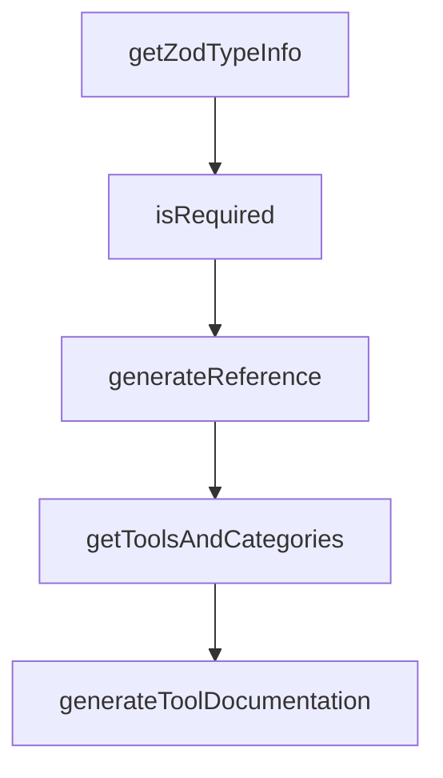

# Chapter 3: Client Integrations and Setup Patterns

Welcome to **Chapter 3: Client Integrations and Setup Patterns**. In this part of **Chrome DevTools MCP Tutorial: Browser Automation and Debugging for Coding Agents**, you will build an intuitive mental model first, then move into concrete implementation details and practical production tradeoffs.


This chapter covers integration patterns across coding clients and IDEs.

## Learning Goals

- configure client-specific MCP formats correctly
- select global vs project-scoped setup patterns
- handle browser URL and startup-time tuning
- reduce client configuration drift

## Integration Tips

- prefer latest package version for compatibility
- document one canonical config per client class
- use explicit startup timeout overrides when needed

## Source References

- [Chrome DevTools MCP README: Client Configurations](https://github.com/ChromeDevTools/chrome-devtools-mcp/blob/main/README.md)
- [Codex MCP Configuration Guide](https://github.com/openai/codex/blob/main/docs/config.md#connecting-to-mcp-servers)
- [VS Code MCP Docs](https://code.visualstudio.com/docs/copilot/chat/mcp-servers#_add-an-mcp-server)

## Summary

You now have stable setup patterns for multi-client Chrome DevTools MCP usage.

Next: [Chapter 4: Automation Tooling: Input and Navigation](04-automation-tooling-input-and-navigation.md)

## Source Code Walkthrough

### `scripts/generate-docs.ts`

The `getZodTypeInfo` function in [`scripts/generate-docs.ts`](https://github.com/ChromeDevTools/chrome-devtools-mcp/blob/HEAD/scripts/generate-docs.ts) handles a key part of this chapter's functionality:

```ts

// Helper to convert Zod schema to JSON schema-like object for docs
function getZodTypeInfo(schema: ZodSchema): TypeInfo {
  let description = schema.description;
  let def = schema._def;
  let defaultValue: unknown;

  // Unwrap optional/default/effects
  while (
    def.typeName === 'ZodOptional' ||
    def.typeName === 'ZodDefault' ||
    def.typeName === 'ZodEffects'
  ) {
    if (def.typeName === 'ZodDefault' && def.defaultValue) {
      defaultValue = def.defaultValue();
    }
    const next = def.innerType || def.schema;
    if (!next) {
      break;
    }
    schema = next;
    def = schema._def;
    if (!description && schema.description) {
      description = schema.description;
    }
  }

  const result: TypeInfo = {type: 'unknown'};
  if (description) {
    result.description = description;
  }
  if (defaultValue !== undefined) {
```

This function is important because it defines how Chrome DevTools MCP Tutorial: Browser Automation and Debugging for Coding Agents implements the patterns covered in this chapter.

### `scripts/generate-docs.ts`

The `isRequired` function in [`scripts/generate-docs.ts`](https://github.com/ChromeDevTools/chrome-devtools-mcp/blob/HEAD/scripts/generate-docs.ts) handles a key part of this chapter's functionality:

```ts
}

function isRequired(schema: ZodSchema): boolean {
  let def = schema._def;
  while (def.typeName === 'ZodEffects') {
    if (!def.schema) {
      break;
    }
    schema = def.schema;
    def = schema._def;
  }
  return def.typeName !== 'ZodOptional' && def.typeName !== 'ZodDefault';
}

async function generateReference(
  title: string,
  outputPath: string,
  toolsWithAnnotations: ToolWithAnnotations[],
  categories: Record<string, ToolWithAnnotations[]>,
  sortedCategories: string[],
  serverArgs: string[],
) {
  console.log(`Found ${toolsWithAnnotations.length} tools`);

  // Generate markdown documentation
  let markdown = `<!-- AUTO GENERATED DO NOT EDIT - run 'npm run gen' to update-->

# ${title} (~${(await measureServer(serverArgs)).tokenCount} cl100k_base tokens)

`;
  // Generate table of contents
  for (const category of sortedCategories) {
```

This function is important because it defines how Chrome DevTools MCP Tutorial: Browser Automation and Debugging for Coding Agents implements the patterns covered in this chapter.

### `scripts/generate-docs.ts`

The `generateReference` function in [`scripts/generate-docs.ts`](https://github.com/ChromeDevTools/chrome-devtools-mcp/blob/HEAD/scripts/generate-docs.ts) handles a key part of this chapter's functionality:

```ts
}

async function generateReference(
  title: string,
  outputPath: string,
  toolsWithAnnotations: ToolWithAnnotations[],
  categories: Record<string, ToolWithAnnotations[]>,
  sortedCategories: string[],
  serverArgs: string[],
) {
  console.log(`Found ${toolsWithAnnotations.length} tools`);

  // Generate markdown documentation
  let markdown = `<!-- AUTO GENERATED DO NOT EDIT - run 'npm run gen' to update-->

# ${title} (~${(await measureServer(serverArgs)).tokenCount} cl100k_base tokens)

`;
  // Generate table of contents
  for (const category of sortedCategories) {
    const categoryTools = categories[category];
    const categoryName = labels[category];
    const anchorName = categoryName.toLowerCase().replace(/\s+/g, '-');
    markdown += `- **[${categoryName}](#${anchorName})** (${categoryTools.length} tools)\n`;

    // Sort tools within category for TOC
    categoryTools.sort((a: Tool, b: Tool) => a.name.localeCompare(b.name));
    for (const tool of categoryTools) {
      // Generate proper markdown anchor link: backticks are removed, keep underscores, lowercase
      const anchorLink = tool.name.toLowerCase();
      markdown += `  - [\`${tool.name}\`](#${anchorLink})\n`;
    }
```

This function is important because it defines how Chrome DevTools MCP Tutorial: Browser Automation and Debugging for Coding Agents implements the patterns covered in this chapter.

### `scripts/generate-docs.ts`

The `getToolsAndCategories` function in [`scripts/generate-docs.ts`](https://github.com/ChromeDevTools/chrome-devtools-mcp/blob/HEAD/scripts/generate-docs.ts) handles a key part of this chapter's functionality:

```ts

// eslint-disable-next-line @typescript-eslint/no-explicit-any
function getToolsAndCategories(tools: any) {
  // Convert ToolDefinitions to ToolWithAnnotations
  const toolsWithAnnotations: ToolWithAnnotations[] = tools
    .filter(tool => {
      if (!tool.annotations.conditions) {
        return true;
      }

      // Only include unconditional tools.
      return tool.annotations.conditions.length === 0;
    })
    .map(tool => {
      const properties: Record<string, TypeInfo> = {};
      const required: string[] = [];

      for (const [key, schema] of Object.entries(
        tool.schema as unknown as Record<string, ZodSchema>,
      )) {
        const info = getZodTypeInfo(schema);
        properties[key] = info;
        if (isRequired(schema)) {
          required.push(key);
        }
      }

      return {
        name: tool.name,
        description: tool.description,
        inputSchema: {
          type: 'object',
```

This function is important because it defines how Chrome DevTools MCP Tutorial: Browser Automation and Debugging for Coding Agents implements the patterns covered in this chapter.


## How These Components Connect


