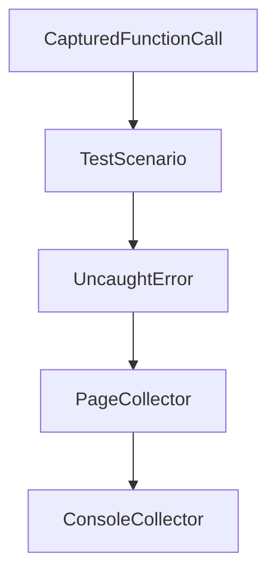

# Chapter 3: Client Integrations and Setup Patterns

Welcome to **Chapter 3: Client Integrations and Setup Patterns**. In this part of **Chrome DevTools MCP Tutorial: Browser Automation and Debugging for Coding Agents**, you will build an intuitive mental model first, then move into concrete implementation details and practical production tradeoffs.


This chapter covers integration patterns across coding clients and IDEs.

## Learning Goals

- configure client-specific MCP formats correctly
- select global vs project-scoped setup patterns
- handle browser URL and startup-time tuning
- reduce client configuration drift

## Integration Tips

- prefer latest package version for compatibility
- document one canonical config per client class
- use explicit startup timeout overrides when needed

## Source References

- [Chrome DevTools MCP README: Client Configurations](https://github.com/ChromeDevTools/chrome-devtools-mcp/blob/main/README.md)
- [Codex MCP Configuration Guide](https://github.com/openai/codex/blob/main/docs/config.md#connecting-to-mcp-servers)
- [VS Code MCP Docs](https://code.visualstudio.com/docs/copilot/chat/mcp-servers#_add-an-mcp-server)

## Summary

You now have stable setup patterns for multi-client Chrome DevTools MCP usage.

Next: [Chapter 4: Automation Tooling: Input and Navigation](04-automation-tooling-input-and-navigation.md)

## Depth Expansion Playbook

## Source Code Walkthrough

### `scripts/eval_gemini.ts`

The `CapturedFunctionCall` interface in [`scripts/eval_gemini.ts`](https://github.com/ChromeDevTools/chrome-devtools-mcp/blob/HEAD/scripts/eval_gemini.ts) handles a key part of this chapter's functionality:

```ts

// Define schema for our test scenarios
export interface CapturedFunctionCall {
  name: string;
  args: Record<string, unknown>;
}

export interface TestScenario {
  prompt: string;
  maxTurns: number;
  expectations: (calls: CapturedFunctionCall[]) => void;
  htmlRoute?: {
    path: string;
    htmlContent: string;
  };
  /** Extra CLI flags passed to the MCP server (e.g. '--experimental-page-id-routing'). */
  serverArgs?: string[];
}

async function loadScenario(scenarioPath: string): Promise<TestScenario> {
  const module = await import(pathToFileURL(scenarioPath).href);
  if (!module.scenario) {
    throw new Error(
      `Scenario file ${scenarioPath} does not export a 'scenario' object.`,
    );
  }
  return module.scenario;
}

async function runSingleScenario(
  scenarioPath: string,
  apiKey: string,
```

This interface is important because it defines how Chrome DevTools MCP Tutorial: Browser Automation and Debugging for Coding Agents implements the patterns covered in this chapter.

### `scripts/eval_gemini.ts`

The `TestScenario` interface in [`scripts/eval_gemini.ts`](https://github.com/ChromeDevTools/chrome-devtools-mcp/blob/HEAD/scripts/eval_gemini.ts) handles a key part of this chapter's functionality:

```ts
}

export interface TestScenario {
  prompt: string;
  maxTurns: number;
  expectations: (calls: CapturedFunctionCall[]) => void;
  htmlRoute?: {
    path: string;
    htmlContent: string;
  };
  /** Extra CLI flags passed to the MCP server (e.g. '--experimental-page-id-routing'). */
  serverArgs?: string[];
}

async function loadScenario(scenarioPath: string): Promise<TestScenario> {
  const module = await import(pathToFileURL(scenarioPath).href);
  if (!module.scenario) {
    throw new Error(
      `Scenario file ${scenarioPath} does not export a 'scenario' object.`,
    );
  }
  return module.scenario;
}

async function runSingleScenario(
  scenarioPath: string,
  apiKey: string,
  server: TestServer,
  modelId: string,
  debug: boolean,
  includeSkill: boolean,
): Promise<void> {
```

This interface is important because it defines how Chrome DevTools MCP Tutorial: Browser Automation and Debugging for Coding Agents implements the patterns covered in this chapter.

### `src/PageCollector.ts`

The `UncaughtError` class in [`src/PageCollector.ts`](https://github.com/ChromeDevTools/chrome-devtools-mcp/blob/HEAD/src/PageCollector.ts) handles a key part of this chapter's functionality:

```ts
} from './third_party/index.js';

export class UncaughtError {
  readonly details: Protocol.Runtime.ExceptionDetails;
  readonly targetId: string;

  constructor(details: Protocol.Runtime.ExceptionDetails, targetId: string) {
    this.details = details;
    this.targetId = targetId;
  }
}

interface PageEvents extends PuppeteerPageEvents {
  issue: DevTools.AggregatedIssue;
  uncaughtError: UncaughtError;
}

export type ListenerMap<EventMap extends PageEvents = PageEvents> = {
  [K in keyof EventMap]?: (event: EventMap[K]) => void;
};

function createIdGenerator() {
  let i = 1;
  return () => {
    if (i === Number.MAX_SAFE_INTEGER) {
      i = 0;
    }
    return i++;
  };
}

export const stableIdSymbol = Symbol('stableIdSymbol');
```

This class is important because it defines how Chrome DevTools MCP Tutorial: Browser Automation and Debugging for Coding Agents implements the patterns covered in this chapter.

### `src/PageCollector.ts`

The `PageCollector` class in [`src/PageCollector.ts`](https://github.com/ChromeDevTools/chrome-devtools-mcp/blob/HEAD/src/PageCollector.ts) handles a key part of this chapter's functionality:

```ts
};

export class PageCollector<T> {
  #browser: Browser;
  #listenersInitializer: (
    collector: (item: T) => void,
  ) => ListenerMap<PageEvents>;
  #listeners = new WeakMap<Page, ListenerMap>();
  protected maxNavigationSaved = 3;

  /**
   * This maps a Page to a list of navigations with a sub-list
   * of all collected resources.
   * The newer navigations come first.
   */
  protected storage = new WeakMap<Page, Array<Array<WithSymbolId<T>>>>();

  constructor(
    browser: Browser,
    listeners: (collector: (item: T) => void) => ListenerMap<PageEvents>,
  ) {
    this.#browser = browser;
    this.#listenersInitializer = listeners;
  }

  async init(pages: Page[]) {
    for (const page of pages) {
      this.addPage(page);
    }

    this.#browser.on('targetcreated', this.#onTargetCreated);
    this.#browser.on('targetdestroyed', this.#onTargetDestroyed);
```

This class is important because it defines how Chrome DevTools MCP Tutorial: Browser Automation and Debugging for Coding Agents implements the patterns covered in this chapter.


## How These Components Connect


