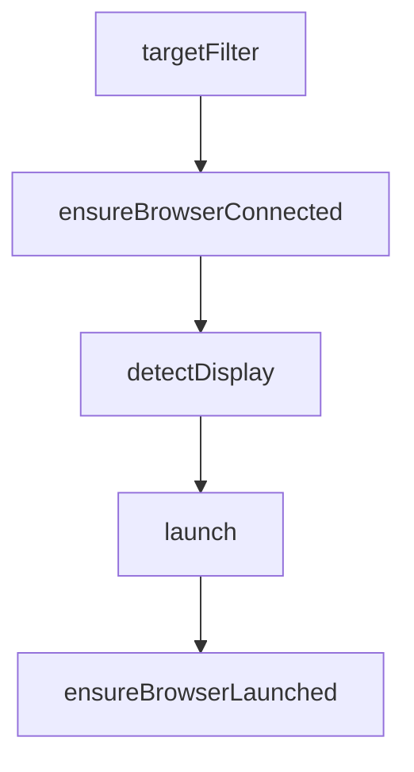

# Chapter 4: Automation Tooling: Input and Navigation

Welcome to **Chapter 4: Automation Tooling: Input and Navigation**. In this part of **Chrome DevTools MCP Tutorial: Browser Automation and Debugging for Coding Agents**, you will build an intuitive mental model first, then move into concrete implementation details and practical production tradeoffs.


This chapter maps the core automation toolset used in browser control loops.

## Learning Goals

- use input tools (`click`, `fill`, `press_key`) effectively
- manage page lifecycle and navigation safely
- sequence tool calls for deterministic outcomes
- capture snapshots when state verification is needed

## Tooling Strategy

- keep actions small and verifiable
- read snapshots before destructive inputs
- use explicit waits and page selection to avoid race conditions

## Source References

- [Tool Reference: Input Tools](https://github.com/ChromeDevTools/chrome-devtools-mcp/blob/main/docs/tool-reference.md#input-automation)
- [Tool Reference: Navigation Tools](https://github.com/ChromeDevTools/chrome-devtools-mcp/blob/main/docs/tool-reference.md#navigation-automation)

## Summary

You now have a repeatable automation pattern for browser interactions.

Next: [Chapter 5: Performance and Debugging Workflows](05-performance-and-debugging-workflows.md)

## Depth Expansion Playbook

## Source Code Walkthrough

### `src/browser.ts`

The `targetFilter` function in [`src/browser.ts`](https://github.com/ChromeDevTools/chrome-devtools-mcp/blob/HEAD/src/browser.ts) handles a key part of this chapter's functionality:

```ts
  }

  return function targetFilter(target: Target): boolean {
    if (target.url() === 'chrome://newtab/') {
      return true;
    }
    // Could be the only page opened in the browser.
    if (target.url().startsWith('chrome://inspect')) {
      return true;
    }
    for (const prefix of ignoredPrefixes) {
      if (target.url().startsWith(prefix)) {
        return false;
      }
    }
    return true;
  };
}

export async function ensureBrowserConnected(options: {
  browserURL?: string;
  wsEndpoint?: string;
  wsHeaders?: Record<string, string>;
  devtools: boolean;
  channel?: Channel;
  userDataDir?: string;
  enableExtensions?: boolean;
}) {
  const {channel, enableExtensions} = options;
  if (browser?.connected) {
    return browser;
  }
```

This function is important because it defines how Chrome DevTools MCP Tutorial: Browser Automation and Debugging for Coding Agents implements the patterns covered in this chapter.

### `src/browser.ts`

The `ensureBrowserConnected` function in [`src/browser.ts`](https://github.com/ChromeDevTools/chrome-devtools-mcp/blob/HEAD/src/browser.ts) handles a key part of this chapter's functionality:

```ts
}

export async function ensureBrowserConnected(options: {
  browserURL?: string;
  wsEndpoint?: string;
  wsHeaders?: Record<string, string>;
  devtools: boolean;
  channel?: Channel;
  userDataDir?: string;
  enableExtensions?: boolean;
}) {
  const {channel, enableExtensions} = options;
  if (browser?.connected) {
    return browser;
  }

  const connectOptions: Parameters<typeof puppeteer.connect>[0] = {
    targetFilter: makeTargetFilter(enableExtensions),
    defaultViewport: null,
    handleDevToolsAsPage: true,
  };

  let autoConnect = false;
  if (options.wsEndpoint) {
    connectOptions.browserWSEndpoint = options.wsEndpoint;
    if (options.wsHeaders) {
      connectOptions.headers = options.wsHeaders;
    }
  } else if (options.browserURL) {
    connectOptions.browserURL = options.browserURL;
  } else if (channel || options.userDataDir) {
    const userDataDir = options.userDataDir;
```

This function is important because it defines how Chrome DevTools MCP Tutorial: Browser Automation and Debugging for Coding Agents implements the patterns covered in this chapter.

### `src/browser.ts`

The `detectDisplay` function in [`src/browser.ts`](https://github.com/ChromeDevTools/chrome-devtools-mcp/blob/HEAD/src/browser.ts) handles a key part of this chapter's functionality:

```ts
}

export function detectDisplay(): void {
  // Only detect display on Linux/UNIX.
  if (os.platform() === 'win32' || os.platform() === 'darwin') {
    return;
  }
  if (!process.env['DISPLAY']) {
    try {
      const result = execSync(
        `ps -u $(id -u) -o pid= | xargs -I{} cat /proc/{}/environ 2>/dev/null | tr '\\0' '\\n' | grep -m1 '^DISPLAY=' | cut -d= -f2`,
      );
      const display = result.toString('utf8').trim();
      process.env['DISPLAY'] = display;
    } catch {
      // no-op
    }
  }
}

export async function launch(options: McpLaunchOptions): Promise<Browser> {
  const {channel, executablePath, headless, isolated} = options;
  const profileDirName =
    channel && channel !== 'stable'
      ? `chrome-profile-${channel}`
      : 'chrome-profile';

  let userDataDir = options.userDataDir;
  if (!isolated && !userDataDir) {
    userDataDir = path.join(
      os.homedir(),
      '.cache',
```

This function is important because it defines how Chrome DevTools MCP Tutorial: Browser Automation and Debugging for Coding Agents implements the patterns covered in this chapter.

### `src/browser.ts`

The `launch` function in [`src/browser.ts`](https://github.com/ChromeDevTools/chrome-devtools-mcp/blob/HEAD/src/browser.ts) handles a key part of this chapter's functionality:

```ts
}

export async function launch(options: McpLaunchOptions): Promise<Browser> {
  const {channel, executablePath, headless, isolated} = options;
  const profileDirName =
    channel && channel !== 'stable'
      ? `chrome-profile-${channel}`
      : 'chrome-profile';

  let userDataDir = options.userDataDir;
  if (!isolated && !userDataDir) {
    userDataDir = path.join(
      os.homedir(),
      '.cache',
      options.viaCli ? 'chrome-devtools-mcp-cli' : 'chrome-devtools-mcp',
      profileDirName,
    );
    await fs.promises.mkdir(userDataDir, {
      recursive: true,
    });
  }

  const args: LaunchOptions['args'] = [
    ...(options.chromeArgs ?? []),
    '--hide-crash-restore-bubble',
  ];
  const ignoreDefaultArgs: LaunchOptions['ignoreDefaultArgs'] =
    options.ignoreDefaultChromeArgs ?? false;

  if (headless) {
    args.push('--screen-info={3840x2160}');
  }
```

This function is important because it defines how Chrome DevTools MCP Tutorial: Browser Automation and Debugging for Coding Agents implements the patterns covered in this chapter.


## How These Components Connect


