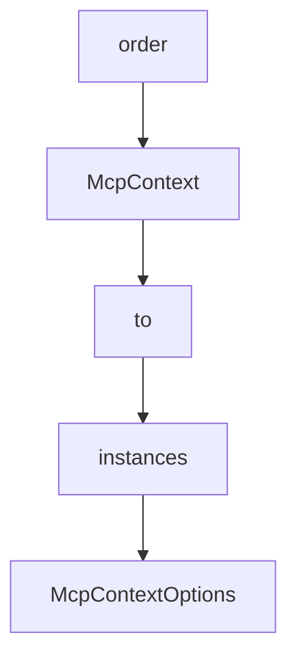

# Chapter 4: Automation Tooling: Input and Navigation

Welcome to **Chapter 4: Automation Tooling: Input and Navigation**. In this part of **Chrome DevTools MCP Tutorial: Browser Automation and Debugging for Coding Agents**, you will build an intuitive mental model first, then move into concrete implementation details and practical production tradeoffs.


This chapter maps the core automation toolset used in browser control loops.

## Learning Goals

- use input tools (`click`, `fill`, `press_key`) effectively
- manage page lifecycle and navigation safely
- sequence tool calls for deterministic outcomes
- capture snapshots when state verification is needed

## Tooling Strategy

- keep actions small and verifiable
- read snapshots before destructive inputs
- use explicit waits and page selection to avoid race conditions

## Source References

- [Tool Reference: Input Tools](https://github.com/ChromeDevTools/chrome-devtools-mcp/blob/main/docs/tool-reference.md#input-automation)
- [Tool Reference: Navigation Tools](https://github.com/ChromeDevTools/chrome-devtools-mcp/blob/main/docs/tool-reference.md#navigation-automation)

## Summary

You now have a repeatable automation pattern for browser interactions.

Next: [Chapter 5: Performance and Debugging Workflows](05-performance-and-debugging-workflows.md)

## Source Code Walkthrough

### `scripts/generate-docs.ts`

The `order` interface in [`scripts/generate-docs.ts`](https://github.com/ChromeDevTools/chrome-devtools-mcp/blob/HEAD/scripts/generate-docs.ts) handles a key part of this chapter's functionality:

```ts
  });

  // Sort categories using the enum order
  const categoryOrder = Object.values(ToolCategory);
  const sortedCategories = Object.keys(categories).sort((a, b) => {
    const aIndex = categoryOrder.indexOf(a);
    const bIndex = categoryOrder.indexOf(b);
    // Put known categories first, unknown categories last
    if (aIndex === -1 && bIndex === -1) {
      return a.localeCompare(b);
    }
    if (aIndex === -1) {
      return 1;
    }
    if (bIndex === -1) {
      return -1;
    }
    return aIndex - bIndex;
  });
  return {toolsWithAnnotations, categories, sortedCategories};
}

async function generateToolDocumentation(): Promise<void> {
  try {
    console.log('Generating tool documentation from definitions...');

    {
      const {toolsWithAnnotations, categories, sortedCategories} =
        getToolsAndCategories(createTools({slim: false} as ParsedArguments));
      await generateReference(
        'Chrome DevTools MCP Tool Reference',
        OUTPUT_PATH,
```

This interface is important because it defines how Chrome DevTools MCP Tutorial: Browser Automation and Debugging for Coding Agents implements the patterns covered in this chapter.

### `src/McpContext.ts`

The `McpContext` class in [`src/McpContext.ts`](https://github.com/ChromeDevTools/chrome-devtools-mcp/blob/HEAD/src/McpContext.ts) handles a key part of this chapter's functionality:

```ts
import {getNetworkMultiplierFromString} from './WaitForHelper.js';

interface McpContextOptions {
  // Whether the DevTools windows are exposed as pages for debugging of DevTools.
  experimentalDevToolsDebugging: boolean;
  // Whether all page-like targets are exposed as pages.
  experimentalIncludeAllPages?: boolean;
  // Whether CrUX data should be fetched.
  performanceCrux: boolean;
}

const DEFAULT_TIMEOUT = 5_000;
const NAVIGATION_TIMEOUT = 10_000;

export class McpContext implements Context {
  browser: Browser;
  logger: Debugger;

  // Maps LLM-provided isolatedContext name → Puppeteer BrowserContext.
  #isolatedContexts = new Map<string, BrowserContext>();
  // Auto-generated name counter for when no name is provided.
  #nextIsolatedContextId = 1;

  #pages: Page[] = [];
  #extensionServiceWorkers: ExtensionServiceWorker[] = [];

  #mcpPages = new Map<Page, McpPage>();
  #selectedPage?: McpPage;
  #networkCollector: NetworkCollector;
  #consoleCollector: ConsoleCollector;
  #devtoolsUniverseManager: UniverseManager;
  #extensionRegistry = new ExtensionRegistry();
```

This class is important because it defines how Chrome DevTools MCP Tutorial: Browser Automation and Debugging for Coding Agents implements the patterns covered in this chapter.

### `src/McpContext.ts`

The `to` class in [`src/McpContext.ts`](https://github.com/ChromeDevTools/chrome-devtools-mcp/blob/HEAD/src/McpContext.ts) handles a key part of this chapter's functionality:

```ts
import path from 'node:path';

import type {TargetUniverse} from './DevtoolsUtils.js';
import {UniverseManager} from './DevtoolsUtils.js';
import {McpPage} from './McpPage.js';
import {
  NetworkCollector,
  ConsoleCollector,
  type ListenerMap,
  type UncaughtError,
} from './PageCollector.js';
import type {DevTools} from './third_party/index.js';
import type {
  Browser,
  BrowserContext,
  ConsoleMessage,
  Debugger,
  HTTPRequest,
  Page,
  ScreenRecorder,
  SerializedAXNode,
  Viewport,
  Target,
} from './third_party/index.js';
import {Locator} from './third_party/index.js';
import {PredefinedNetworkConditions} from './third_party/index.js';
import {listPages} from './tools/pages.js';
import {CLOSE_PAGE_ERROR} from './tools/ToolDefinition.js';
import type {Context, DevToolsData} from './tools/ToolDefinition.js';
import type {TraceResult} from './trace-processing/parse.js';
import type {
  EmulationSettings,
```

This class is important because it defines how Chrome DevTools MCP Tutorial: Browser Automation and Debugging for Coding Agents implements the patterns covered in this chapter.

### `src/McpContext.ts`

The `instances` class in [`src/McpContext.ts`](https://github.com/ChromeDevTools/chrome-devtools-mcp/blob/HEAD/src/McpContext.ts) handles a key part of this chapter's functionality:

```ts
    logger: Debugger,
    opts: McpContextOptions,
    /* Let tests use unbundled Locator class to avoid overly strict checks within puppeteer that fail when mixing bundled and unbundled class instances */
    locatorClass: typeof Locator = Locator,
  ) {
    const context = new McpContext(browser, logger, opts, locatorClass);
    await context.#init();
    return context;
  }

  resolveCdpRequestId(page: McpPage, cdpRequestId: string): number | undefined {
    if (!cdpRequestId) {
      this.logger('no network request');
      return;
    }
    const request = this.#networkCollector.find(page.pptrPage, request => {
      // @ts-expect-error id is internal.
      return request.id === cdpRequestId;
    });
    if (!request) {
      this.logger('no network request for ' + cdpRequestId);
      return;
    }
    return this.#networkCollector.getIdForResource(request);
  }

  resolveCdpElementId(
    page: McpPage,
    cdpBackendNodeId: number,
  ): string | undefined {
    if (!cdpBackendNodeId) {
      this.logger('no cdpBackendNodeId');
```

This class is important because it defines how Chrome DevTools MCP Tutorial: Browser Automation and Debugging for Coding Agents implements the patterns covered in this chapter.


## How These Components Connect


