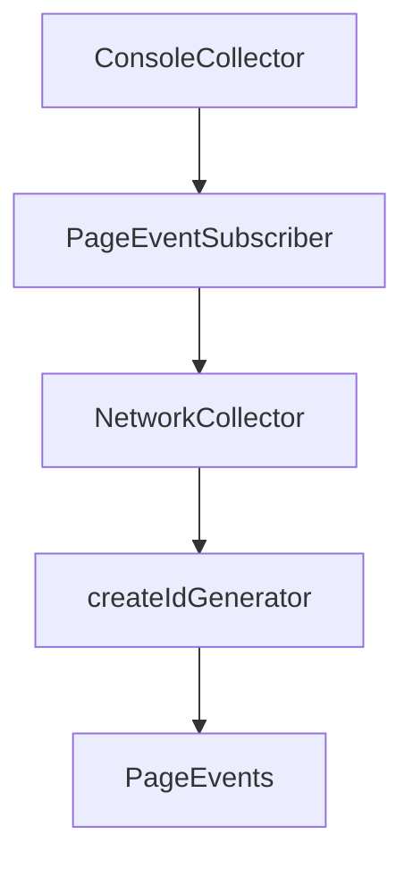

# Chapter 5: Performance and Debugging Workflows

Welcome to **Chapter 5: Performance and Debugging Workflows**. In this part of **Chrome DevTools MCP Tutorial: Browser Automation and Debugging for Coding Agents**, you will build an intuitive mental model first, then move into concrete implementation details and practical production tradeoffs.


This chapter shows how to diagnose performance and runtime problems with MCP tooling.

## Learning Goals

- collect traces and inspect performance insights
- analyze network and console signals
- use snapshots/screenshots for reproducible debugging
- triage frontend regressions quickly

## Workflow Pattern

1. navigate to target page and stabilize state
2. run performance trace and insight analysis
3. inspect network and console anomalies
4. apply fixes and re-run trace for confirmation

## Source References

- [Tool Reference: Performance Tools](https://github.com/ChromeDevTools/chrome-devtools-mcp/blob/main/docs/tool-reference.md#performance)
- [Tool Reference: Debugging Tools](https://github.com/ChromeDevTools/chrome-devtools-mcp/blob/main/docs/tool-reference.md#debugging)
- [Chrome DevTools Documentation](https://developer.chrome.com/docs/devtools/)

## Summary

You now have an end-to-end debugging and performance analysis workflow.

Next: [Chapter 6: Troubleshooting and Reliability Hardening](06-troubleshooting-and-reliability-hardening.md)

## Source Code Walkthrough

### `src/PageCollector.ts`

The `ConsoleCollector` class in [`src/PageCollector.ts`](https://github.com/ChromeDevTools/chrome-devtools-mcp/blob/HEAD/src/PageCollector.ts) handles a key part of this chapter's functionality:

```ts
}

export class ConsoleCollector extends PageCollector<
  ConsoleMessage | Error | DevTools.AggregatedIssue | UncaughtError
> {
  #subscribedPages = new WeakMap<Page, PageEventSubscriber>();

  override addPage(page: Page): void {
    super.addPage(page);
    if (!this.#subscribedPages.has(page)) {
      const subscriber = new PageEventSubscriber(page);
      this.#subscribedPages.set(page, subscriber);
      void subscriber.subscribe();
    }
  }

  protected override cleanupPageDestroyed(page: Page): void {
    super.cleanupPageDestroyed(page);
    this.#subscribedPages.get(page)?.unsubscribe();
    this.#subscribedPages.delete(page);
  }
}

class PageEventSubscriber {
  #issueManager = new FakeIssuesManager();
  #issueAggregator = new DevTools.IssueAggregator(this.#issueManager);
  #seenKeys = new Set<string>();
  #seenIssues = new Set<DevTools.AggregatedIssue>();
  #page: Page;
  #session: CDPSession;
  #targetId: string;

```

This class is important because it defines how Chrome DevTools MCP Tutorial: Browser Automation and Debugging for Coding Agents implements the patterns covered in this chapter.

### `src/PageCollector.ts`

The `PageEventSubscriber` class in [`src/PageCollector.ts`](https://github.com/ChromeDevTools/chrome-devtools-mcp/blob/HEAD/src/PageCollector.ts) handles a key part of this chapter's functionality:

```ts
  ConsoleMessage | Error | DevTools.AggregatedIssue | UncaughtError
> {
  #subscribedPages = new WeakMap<Page, PageEventSubscriber>();

  override addPage(page: Page): void {
    super.addPage(page);
    if (!this.#subscribedPages.has(page)) {
      const subscriber = new PageEventSubscriber(page);
      this.#subscribedPages.set(page, subscriber);
      void subscriber.subscribe();
    }
  }

  protected override cleanupPageDestroyed(page: Page): void {
    super.cleanupPageDestroyed(page);
    this.#subscribedPages.get(page)?.unsubscribe();
    this.#subscribedPages.delete(page);
  }
}

class PageEventSubscriber {
  #issueManager = new FakeIssuesManager();
  #issueAggregator = new DevTools.IssueAggregator(this.#issueManager);
  #seenKeys = new Set<string>();
  #seenIssues = new Set<DevTools.AggregatedIssue>();
  #page: Page;
  #session: CDPSession;
  #targetId: string;

  constructor(page: Page) {
    this.#page = page;
    // @ts-expect-error use existing CDP client (internal Puppeteer API).
```

This class is important because it defines how Chrome DevTools MCP Tutorial: Browser Automation and Debugging for Coding Agents implements the patterns covered in this chapter.

### `src/PageCollector.ts`

The `NetworkCollector` class in [`src/PageCollector.ts`](https://github.com/ChromeDevTools/chrome-devtools-mcp/blob/HEAD/src/PageCollector.ts) handles a key part of this chapter's functionality:

```ts
}

export class NetworkCollector extends PageCollector<HTTPRequest> {
  constructor(
    browser: Browser,
    listeners: (
      collector: (item: HTTPRequest) => void,
    ) => ListenerMap<PageEvents> = collect => {
      return {
        request: req => {
          collect(req);
        },
      } as ListenerMap;
    },
  ) {
    super(browser, listeners);
  }
  override splitAfterNavigation(page: Page) {
    const navigations = this.storage.get(page) ?? [];
    if (!navigations) {
      return;
    }

    const requests = navigations[0];

    const lastRequestIdx = requests.findLastIndex(request => {
      return request.frame() === page.mainFrame()
        ? request.isNavigationRequest()
        : false;
    });

    // Keep all requests since the last navigation request including that
```

This class is important because it defines how Chrome DevTools MCP Tutorial: Browser Automation and Debugging for Coding Agents implements the patterns covered in this chapter.

### `src/PageCollector.ts`

The `createIdGenerator` function in [`src/PageCollector.ts`](https://github.com/ChromeDevTools/chrome-devtools-mcp/blob/HEAD/src/PageCollector.ts) handles a key part of this chapter's functionality:

```ts
};

function createIdGenerator() {
  let i = 1;
  return () => {
    if (i === Number.MAX_SAFE_INTEGER) {
      i = 0;
    }
    return i++;
  };
}

export const stableIdSymbol = Symbol('stableIdSymbol');
type WithSymbolId<T> = T & {
  [stableIdSymbol]?: number;
};

export class PageCollector<T> {
  #browser: Browser;
  #listenersInitializer: (
    collector: (item: T) => void,
  ) => ListenerMap<PageEvents>;
  #listeners = new WeakMap<Page, ListenerMap>();
  protected maxNavigationSaved = 3;

  /**
   * This maps a Page to a list of navigations with a sub-list
   * of all collected resources.
   * The newer navigations come first.
   */
  protected storage = new WeakMap<Page, Array<Array<WithSymbolId<T>>>>();

```

This function is important because it defines how Chrome DevTools MCP Tutorial: Browser Automation and Debugging for Coding Agents implements the patterns covered in this chapter.


## How These Components Connect


