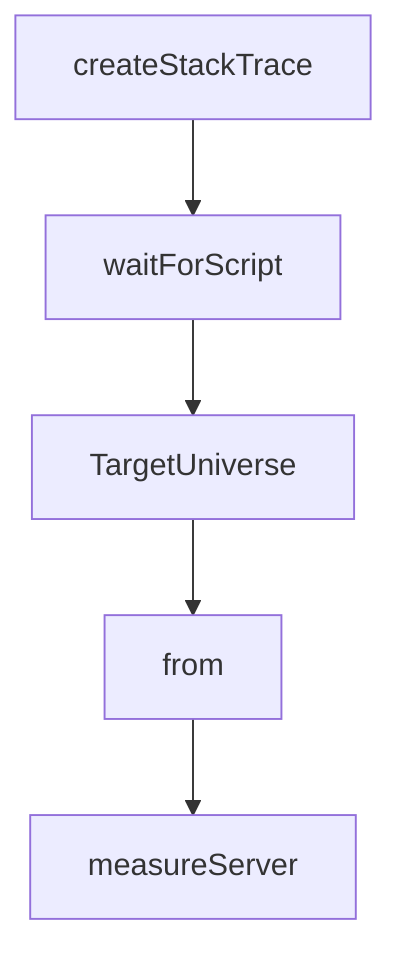

# Chapter 5: Performance and Debugging Workflows

Welcome to **Chapter 5: Performance and Debugging Workflows**. In this part of **Chrome DevTools MCP Tutorial: Browser Automation and Debugging for Coding Agents**, you will build an intuitive mental model first, then move into concrete implementation details and practical production tradeoffs.


This chapter shows how to diagnose performance and runtime problems with MCP tooling.

## Learning Goals

- collect traces and inspect performance insights
- analyze network and console signals
- use snapshots/screenshots for reproducible debugging
- triage frontend regressions quickly

## Workflow Pattern

1. navigate to target page and stabilize state
2. run performance trace and insight analysis
3. inspect network and console anomalies
4. apply fixes and re-run trace for confirmation

## Source References

- [Tool Reference: Performance Tools](https://github.com/ChromeDevTools/chrome-devtools-mcp/blob/main/docs/tool-reference.md#performance)
- [Tool Reference: Debugging Tools](https://github.com/ChromeDevTools/chrome-devtools-mcp/blob/main/docs/tool-reference.md#debugging)
- [Chrome DevTools Documentation](https://developer.chrome.com/docs/devtools/)

## Summary

You now have an end-to-end debugging and performance analysis workflow.

Next: [Chapter 6: Troubleshooting and Reliability Hardening](06-troubleshooting-and-reliability-hardening.md)

## Depth Expansion Playbook

## Source Code Walkthrough

### `src/DevtoolsUtils.ts`

The `createStackTrace` function in [`src/DevtoolsUtils.ts`](https://github.com/ChromeDevTools/chrome-devtools-mcp/blob/HEAD/src/DevtoolsUtils.ts) handles a key part of this chapter's functionality:

```ts
    } else if (opts.details.stackTrace) {
      try {
        stackTrace = await createStackTrace(
          opts.devTools,
          opts.details.stackTrace,
          opts.targetId,
        );
      } catch {
        // ignore
      }
    }

    // TODO: Turn opts.details.exception into a JSHandle and retrieve the 'cause' property.
    //       If its an Error, recursively create a SymbolizedError.
    let cause: SymbolizedError | undefined;
    if (opts.resolvedCauseForTesting) {
      cause = opts.resolvedCauseForTesting;
    } else if (opts.details.exception) {
      try {
        const causeRemoteObj = await SymbolizedError.#lookupCause(
          opts.devTools,
          opts.details.exception,
          opts.targetId,
        );
        if (causeRemoteObj) {
          cause = await SymbolizedError.fromError({
            devTools: opts.devTools,
            error: causeRemoteObj,
            targetId: opts.targetId,
          });
        }
      } catch {
```

This function is important because it defines how Chrome DevTools MCP Tutorial: Browser Automation and Debugging for Coding Agents implements the patterns covered in this chapter.

### `src/DevtoolsUtils.ts`

The `waitForScript` function in [`src/DevtoolsUtils.ts`](https://github.com/ChromeDevTools/chrome-devtools-mcp/blob/HEAD/src/DevtoolsUtils.ts) handles a key part of this chapter's functionality:

```ts
  await Promise.all(
    [...scriptIds].map(id =>
      waitForScript(model, id, signal)
        .then(script =>
          model.sourceMapManager().sourceMapForClientPromise(script),
        )
        .catch(),
    ),
  );

  const binding = devTools.universe.context.get(
    DevTools.DebuggerWorkspaceBinding,
  );
  // DevTools uses branded types for ScriptId and others. Casting the puppeteer protocol type to the DevTools protocol type is safe.
  return binding.createStackTraceFromProtocolRuntime(
    rawStackTrace as Parameters<
      DevTools.DebuggerWorkspaceBinding['createStackTraceFromProtocolRuntime']
    >[0],
    target,
  );
}

// Waits indefinitely for the script so pair it with Promise.race.
async function waitForScript(
  model: DevTools.DebuggerModel,
  scriptId: Protocol.Runtime.ScriptId,
  signal: AbortSignal,
) {
  while (true) {
    if (signal.aborted) {
      throw signal.reason;
    }
```

This function is important because it defines how Chrome DevTools MCP Tutorial: Browser Automation and Debugging for Coding Agents implements the patterns covered in this chapter.

### `src/DevtoolsUtils.ts`

The `TargetUniverse` interface in [`src/DevtoolsUtils.ts`](https://github.com/ChromeDevTools/chrome-devtools-mcp/blob/HEAD/src/DevtoolsUtils.ts) handles a key part of this chapter's functionality:

```ts
});

export interface TargetUniverse {
  /** The DevTools target corresponding to the puppeteer Page */
  target: DevTools.Target;
  universe: DevTools.Foundation.Universe.Universe;
}
export type TargetUniverseFactoryFn = (page: Page) => Promise<TargetUniverse>;

export class UniverseManager {
  readonly #browser: Browser;
  readonly #createUniverseFor: TargetUniverseFactoryFn;
  readonly #universes = new WeakMap<Page, TargetUniverse>();

  /** Guard access to #universes so we don't create unnecessary universes */
  readonly #mutex = new Mutex();

  constructor(
    browser: Browser,
    factory: TargetUniverseFactoryFn = DEFAULT_FACTORY,
  ) {
    this.#browser = browser;
    this.#createUniverseFor = factory;
  }

  async init(pages: Page[]) {
    try {
      await this.#mutex.acquire();
      const promises = [];
      for (const page of pages) {
        promises.push(
          this.#createUniverseFor(page).then(targetUniverse =>
```

This interface is important because it defines how Chrome DevTools MCP Tutorial: Browser Automation and Debugging for Coding Agents implements the patterns covered in this chapter.

### `src/DevtoolsUtils.ts`

The `from` interface in [`src/DevtoolsUtils.ts`](https://github.com/ChromeDevTools/chrome-devtools-mcp/blob/HEAD/src/DevtoolsUtils.ts) handles a key part of this chapter's functionality:

```ts
 */

import {PuppeteerDevToolsConnection} from './DevToolsConnectionAdapter.js';
import {Mutex} from './Mutex.js';
import {DevTools} from './third_party/index.js';
import type {
  Browser,
  ConsoleMessage,
  Page,
  Protocol,
  Target as PuppeteerTarget,
} from './third_party/index.js';

/**
 * A mock implementation of an issues manager that only implements the methods
 * that are actually used by the IssuesAggregator
 */
export class FakeIssuesManager extends DevTools.Common.ObjectWrapper
  .ObjectWrapper<DevTools.IssuesManagerEventTypes> {
  issues(): DevTools.Issue[] {
    return [];
  }
}

// DevTools CDP errors can get noisy.
DevTools.ProtocolClient.InspectorBackend.test.suppressRequestErrors = true;

DevTools.I18n.DevToolsLocale.DevToolsLocale.instance({
  create: true,
  data: {
    navigatorLanguage: 'en-US',
    settingLanguage: 'en-US',
```

This interface is important because it defines how Chrome DevTools MCP Tutorial: Browser Automation and Debugging for Coding Agents implements the patterns covered in this chapter.


## How These Components Connect


