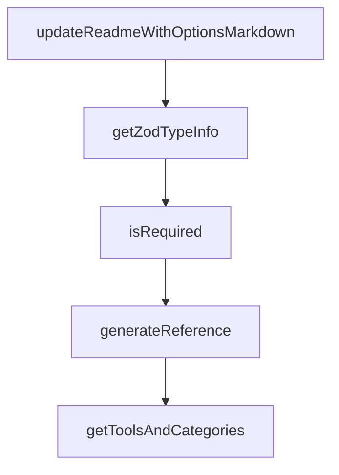

# Chapter 6: Troubleshooting and Reliability Hardening

Welcome to **Chapter 6: Troubleshooting and Reliability Hardening**. In this part of **Chrome DevTools MCP Tutorial: Browser Automation and Debugging for Coding Agents**, you will build an intuitive mental model first, then move into concrete implementation details and practical production tradeoffs.


This chapter covers common failures and how to stabilize browser-MCP sessions.

## Learning Goals

- diagnose startup and module-resolution failures
- handle browser crash/target-closed scenarios
- use debug logs effectively
- harden runtime settings for consistency

## Troubleshooting Baseline

- run `--help` and local server startup checks
- enable verbose logs with `DEBUG=*`
- validate Node and Chrome version constraints
- isolate host/VM networking issues for remote debugging

## Source References

- [Troubleshooting Guide](https://github.com/ChromeDevTools/chrome-devtools-mcp/blob/main/docs/troubleshooting.md)
- [README Requirements Section](https://github.com/ChromeDevTools/chrome-devtools-mcp/blob/main/README.md#requirements)

## Summary

You now have a practical reliability playbook for Chrome DevTools MCP operations.

Next: [Chapter 7: Development, Evaluation, and Contribution](07-development-evaluation-and-contribution.md)

## Depth Expansion Playbook

## Source Code Walkthrough

### `scripts/generate-docs.ts`

The `updateReadmeWithOptionsMarkdown` function in [`scripts/generate-docs.ts`](https://github.com/ChromeDevTools/chrome-devtools-mcp/blob/HEAD/scripts/generate-docs.ts) handles a key part of this chapter's functionality:

```ts
}

function updateReadmeWithOptionsMarkdown(optionsMarkdown: string): void {
  const readmeContent = fs.readFileSync(README_PATH, 'utf8');

  const beginMarker = '<!-- BEGIN AUTO GENERATED OPTIONS -->';
  const endMarker = '<!-- END AUTO GENERATED OPTIONS -->';

  const beginIndex = readmeContent.indexOf(beginMarker);
  const endIndex = readmeContent.indexOf(endMarker);

  if (beginIndex === -1 || endIndex === -1) {
    console.warn('Could not find auto-generated options markers in README.md');
    return;
  }

  const before = readmeContent.substring(0, beginIndex + beginMarker.length);
  const after = readmeContent.substring(endIndex);

  const updatedContent = before + '\n\n' + optionsMarkdown + '\n\n' + after;

  fs.writeFileSync(README_PATH, updatedContent);
  console.log('Updated README.md with options markdown');
}

// Helper to convert Zod schema to JSON schema-like object for docs
function getZodTypeInfo(schema: ZodSchema): TypeInfo {
  let description = schema.description;
  let def = schema._def;
  let defaultValue: unknown;

  // Unwrap optional/default/effects
```

This function is important because it defines how Chrome DevTools MCP Tutorial: Browser Automation and Debugging for Coding Agents implements the patterns covered in this chapter.

### `scripts/generate-docs.ts`

The `getZodTypeInfo` function in [`scripts/generate-docs.ts`](https://github.com/ChromeDevTools/chrome-devtools-mcp/blob/HEAD/scripts/generate-docs.ts) handles a key part of this chapter's functionality:

```ts

// Helper to convert Zod schema to JSON schema-like object for docs
function getZodTypeInfo(schema: ZodSchema): TypeInfo {
  let description = schema.description;
  let def = schema._def;
  let defaultValue: unknown;

  // Unwrap optional/default/effects
  while (
    def.typeName === 'ZodOptional' ||
    def.typeName === 'ZodDefault' ||
    def.typeName === 'ZodEffects'
  ) {
    if (def.typeName === 'ZodDefault' && def.defaultValue) {
      defaultValue = def.defaultValue();
    }
    const next = def.innerType || def.schema;
    if (!next) {
      break;
    }
    schema = next;
    def = schema._def;
    if (!description && schema.description) {
      description = schema.description;
    }
  }

  const result: TypeInfo = {type: 'unknown'};
  if (description) {
    result.description = description;
  }
  if (defaultValue !== undefined) {
```

This function is important because it defines how Chrome DevTools MCP Tutorial: Browser Automation and Debugging for Coding Agents implements the patterns covered in this chapter.

### `scripts/generate-docs.ts`

The `isRequired` function in [`scripts/generate-docs.ts`](https://github.com/ChromeDevTools/chrome-devtools-mcp/blob/HEAD/scripts/generate-docs.ts) handles a key part of this chapter's functionality:

```ts
}

function isRequired(schema: ZodSchema): boolean {
  let def = schema._def;
  while (def.typeName === 'ZodEffects') {
    if (!def.schema) {
      break;
    }
    schema = def.schema;
    def = schema._def;
  }
  return def.typeName !== 'ZodOptional' && def.typeName !== 'ZodDefault';
}

async function generateReference(
  title: string,
  outputPath: string,
  toolsWithAnnotations: ToolWithAnnotations[],
  categories: Record<string, ToolWithAnnotations[]>,
  sortedCategories: string[],
  serverArgs: string[],
) {
  console.log(`Found ${toolsWithAnnotations.length} tools`);

  // Generate markdown documentation
  let markdown = `<!-- AUTO GENERATED DO NOT EDIT - run 'npm run gen' to update-->

# ${title} (~${(await measureServer(serverArgs)).tokenCount} cl100k_base tokens)

`;
  // Generate table of contents
  for (const category of sortedCategories) {
```

This function is important because it defines how Chrome DevTools MCP Tutorial: Browser Automation and Debugging for Coding Agents implements the patterns covered in this chapter.

### `scripts/generate-docs.ts`

The `generateReference` function in [`scripts/generate-docs.ts`](https://github.com/ChromeDevTools/chrome-devtools-mcp/blob/HEAD/scripts/generate-docs.ts) handles a key part of this chapter's functionality:

```ts
}

async function generateReference(
  title: string,
  outputPath: string,
  toolsWithAnnotations: ToolWithAnnotations[],
  categories: Record<string, ToolWithAnnotations[]>,
  sortedCategories: string[],
  serverArgs: string[],
) {
  console.log(`Found ${toolsWithAnnotations.length} tools`);

  // Generate markdown documentation
  let markdown = `<!-- AUTO GENERATED DO NOT EDIT - run 'npm run gen' to update-->

# ${title} (~${(await measureServer(serverArgs)).tokenCount} cl100k_base tokens)

`;
  // Generate table of contents
  for (const category of sortedCategories) {
    const categoryTools = categories[category];
    const categoryName = labels[category];
    const anchorName = categoryName.toLowerCase().replace(/\s+/g, '-');
    markdown += `- **[${categoryName}](#${anchorName})** (${categoryTools.length} tools)\n`;

    // Sort tools within category for TOC
    categoryTools.sort((a: Tool, b: Tool) => a.name.localeCompare(b.name));
    for (const tool of categoryTools) {
      // Generate proper markdown anchor link: backticks are removed, keep underscores, lowercase
      const anchorLink = tool.name.toLowerCase();
      markdown += `  - [\`${tool.name}\`](#${anchorLink})\n`;
    }
```

This function is important because it defines how Chrome DevTools MCP Tutorial: Browser Automation and Debugging for Coding Agents implements the patterns covered in this chapter.


## How These Components Connect


