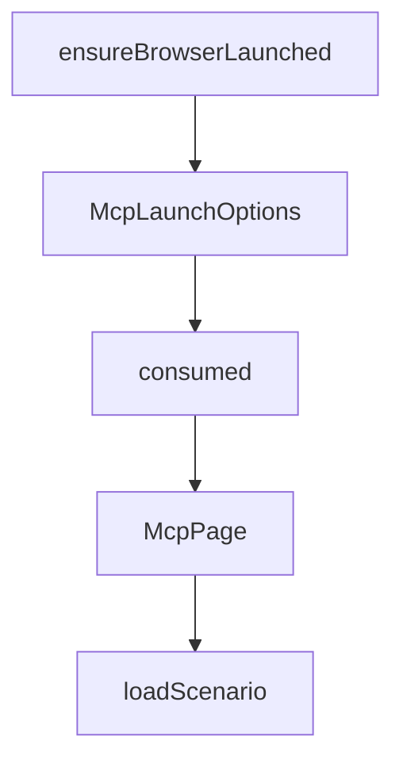

# Chapter 6: Troubleshooting and Reliability Hardening

Welcome to **Chapter 6: Troubleshooting and Reliability Hardening**. In this part of **Chrome DevTools MCP Tutorial: Browser Automation and Debugging for Coding Agents**, you will build an intuitive mental model first, then move into concrete implementation details and practical production tradeoffs.


This chapter covers common failures and how to stabilize browser-MCP sessions.

## Learning Goals

- diagnose startup and module-resolution failures
- handle browser crash/target-closed scenarios
- use debug logs effectively
- harden runtime settings for consistency

## Troubleshooting Baseline

- run `--help` and local server startup checks
- enable verbose logs with `DEBUG=*`
- validate Node and Chrome version constraints
- isolate host/VM networking issues for remote debugging

## Source References

- [Troubleshooting Guide](https://github.com/ChromeDevTools/chrome-devtools-mcp/blob/main/docs/troubleshooting.md)
- [README Requirements Section](https://github.com/ChromeDevTools/chrome-devtools-mcp/blob/main/README.md#requirements)

## Summary

You now have a practical reliability playbook for Chrome DevTools MCP operations.

Next: [Chapter 7: Development, Evaluation, and Contribution](07-development-evaluation-and-contribution.md)

## Source Code Walkthrough

### `src/browser.ts`

The `ensureBrowserLaunched` function in [`src/browser.ts`](https://github.com/ChromeDevTools/chrome-devtools-mcp/blob/HEAD/src/browser.ts) handles a key part of this chapter's functionality:

```ts
}

export async function ensureBrowserLaunched(
  options: McpLaunchOptions,
): Promise<Browser> {
  if (browser?.connected) {
    return browser;
  }
  browser = await launch(options);
  return browser;
}

export type Channel = 'stable' | 'canary' | 'beta' | 'dev';

```

This function is important because it defines how Chrome DevTools MCP Tutorial: Browser Automation and Debugging for Coding Agents implements the patterns covered in this chapter.

### `src/browser.ts`

The `McpLaunchOptions` interface in [`src/browser.ts`](https://github.com/ChromeDevTools/chrome-devtools-mcp/blob/HEAD/src/browser.ts) handles a key part of this chapter's functionality:

```ts
}

interface McpLaunchOptions {
  acceptInsecureCerts?: boolean;
  executablePath?: string;
  channel?: Channel;
  userDataDir?: string;
  headless: boolean;
  isolated: boolean;
  logFile?: fs.WriteStream;
  viewport?: {
    width: number;
    height: number;
  };
  chromeArgs?: string[];
  ignoreDefaultChromeArgs?: string[];
  devtools: boolean;
  enableExtensions?: boolean;
  viaCli?: boolean;
}

export function detectDisplay(): void {
  // Only detect display on Linux/UNIX.
  if (os.platform() === 'win32' || os.platform() === 'darwin') {
    return;
  }
  if (!process.env['DISPLAY']) {
    try {
      const result = execSync(
        `ps -u $(id -u) -o pid= | xargs -I{} cat /proc/{}/environ 2>/dev/null | tr '\\0' '\\n' | grep -m1 '^DISPLAY=' | cut -d= -f2`,
      );
      const display = result.toString('utf8').trim();
```

This interface is important because it defines how Chrome DevTools MCP Tutorial: Browser Automation and Debugging for Coding Agents implements the patterns covered in this chapter.

### `src/McpPage.ts`

The `consumed` class in [`src/McpPage.ts`](https://github.com/ChromeDevTools/chrome-devtools-mcp/blob/HEAD/src/McpPage.ts) handles a key part of this chapter's functionality:

```ts
 * and metadata that were previously scattered across Maps in McpContext.
 *
 * Internal class consumed only by McpContext. Fields are public for direct
 * read/write access. The dialog field is private because it requires an
 * event listener lifecycle managed by the constructor/dispose pair.
 */
export class McpPage implements ContextPage {
  readonly pptrPage: Page;
  readonly id: number;

  // Snapshot
  textSnapshot: TextSnapshot | null = null;
  uniqueBackendNodeIdToMcpId = new Map<string, string>();

  // Emulation
  emulationSettings: EmulationSettings = {};

  // Metadata
  isolatedContextName?: string;
  devToolsPage?: Page;

  // Dialog
  #dialog?: Dialog;
  #dialogHandler: (dialog: Dialog) => void;

  inPageTools: ToolGroup<ToolDefinition> | undefined;

  constructor(page: Page, id: number) {
    this.pptrPage = page;
    this.id = id;
    this.#dialogHandler = (dialog: Dialog): void => {
      this.#dialog = dialog;
```

This class is important because it defines how Chrome DevTools MCP Tutorial: Browser Automation and Debugging for Coding Agents implements the patterns covered in this chapter.

### `src/McpPage.ts`

The `McpPage` class in [`src/McpPage.ts`](https://github.com/ChromeDevTools/chrome-devtools-mcp/blob/HEAD/src/McpPage.ts) handles a key part of this chapter's functionality:

```ts
 * event listener lifecycle managed by the constructor/dispose pair.
 */
export class McpPage implements ContextPage {
  readonly pptrPage: Page;
  readonly id: number;

  // Snapshot
  textSnapshot: TextSnapshot | null = null;
  uniqueBackendNodeIdToMcpId = new Map<string, string>();

  // Emulation
  emulationSettings: EmulationSettings = {};

  // Metadata
  isolatedContextName?: string;
  devToolsPage?: Page;

  // Dialog
  #dialog?: Dialog;
  #dialogHandler: (dialog: Dialog) => void;

  inPageTools: ToolGroup<ToolDefinition> | undefined;

  constructor(page: Page, id: number) {
    this.pptrPage = page;
    this.id = id;
    this.#dialogHandler = (dialog: Dialog): void => {
      this.#dialog = dialog;
    };
    page.on('dialog', this.#dialogHandler);
  }

```

This class is important because it defines how Chrome DevTools MCP Tutorial: Browser Automation and Debugging for Coding Agents implements the patterns covered in this chapter.


## How These Components Connect


