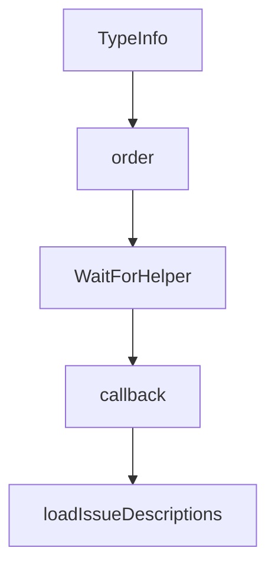

# Chapter 7: Development, Evaluation, and Contribution

Welcome to **Chapter 7: Development, Evaluation, and Contribution**. In this part of **Chrome DevTools MCP Tutorial: Browser Automation and Debugging for Coding Agents**, you will build an intuitive mental model first, then move into concrete implementation details and practical production tradeoffs.


This chapter maps contributor workflows for building, testing, and documenting changes.

## Learning Goals

- run local build and inspector workflows
- update generated docs when tools change
- align contributions with conventional commits
- test eval scenarios with pragmatic assertions

## Contributor Checklist

- install dependencies with supported Node version
- run build + inspector tests locally
- regenerate tool docs with `npm run docs` when needed
- follow CLA and contribution process requirements

## Source References

- [Chrome DevTools MCP Contributing Guide](https://github.com/ChromeDevTools/chrome-devtools-mcp/blob/main/CONTRIBUTING.md)
- [Tool Reference Generation Notes](https://github.com/ChromeDevTools/chrome-devtools-mcp/blob/main/CONTRIBUTING.md#updating-documentation)
- [Chrome DevTools MCP Repository](https://github.com/ChromeDevTools/chrome-devtools-mcp)

## Summary

You now have a clean contributor path for this MCP server ecosystem.

Next: [Chapter 8: Production Operations and Privacy Governance](08-production-operations-and-privacy-governance.md)

## Depth Expansion Playbook

## Source Code Walkthrough

### `scripts/generate-docs.ts`

The `TypeInfo` interface in [`scripts/generate-docs.ts`](https://github.com/ChromeDevTools/chrome-devtools-mcp/blob/HEAD/scripts/generate-docs.ts) handles a key part of this chapter's functionality:

```ts
}

interface TypeInfo {
  type: string;
  enum?: string[];
  items?: TypeInfo;
  description?: string;
  default?: unknown;
}

function escapeHtmlTags(text: string): string {
  return text
    .replace(/&(?![a-zA-Z]+;)/g, '&amp;')
    .replace(/<([a-zA-Z][^>]*)>/g, '&lt;$1&gt;');
}

function addCrossLinks(text: string, tools: ToolWithAnnotations[]): string {
  let result = text;

  // Create a set of all tool names for efficient lookup
  const toolNames = new Set(tools.map(tool => tool.name));

  // Sort tool names by length (descending) to match longer names first
  const sortedToolNames = Array.from(toolNames).sort(
    (a, b) => b.length - a.length,
  );

  for (const toolName of sortedToolNames) {
    // Create regex to match tool name (case insensitive, word boundaries)
    const regex = new RegExp(`\\b${toolName}\\b`, 'gi');

    result = result.replace(regex, match => {
```

This interface is important because it defines how Chrome DevTools MCP Tutorial: Browser Automation and Debugging for Coding Agents implements the patterns covered in this chapter.

### `scripts/generate-docs.ts`

The `order` interface in [`scripts/generate-docs.ts`](https://github.com/ChromeDevTools/chrome-devtools-mcp/blob/HEAD/scripts/generate-docs.ts) handles a key part of this chapter's functionality:

```ts
  });

  // Sort categories using the enum order
  const categoryOrder = Object.values(ToolCategory);
  const sortedCategories = Object.keys(categories).sort((a, b) => {
    const aIndex = categoryOrder.indexOf(a);
    const bIndex = categoryOrder.indexOf(b);
    // Put known categories first, unknown categories last
    if (aIndex === -1 && bIndex === -1) {
      return a.localeCompare(b);
    }
    if (aIndex === -1) {
      return 1;
    }
    if (bIndex === -1) {
      return -1;
    }
    return aIndex - bIndex;
  });
  return {toolsWithAnnotations, categories, sortedCategories};
}

async function generateToolDocumentation(): Promise<void> {
  try {
    console.log('Generating tool documentation from definitions...');

    {
      const {toolsWithAnnotations, categories, sortedCategories} =
        getToolsAndCategories(createTools({slim: false} as ParsedArguments));
      await generateReference(
        'Chrome DevTools MCP Tool Reference',
        OUTPUT_PATH,
```

This interface is important because it defines how Chrome DevTools MCP Tutorial: Browser Automation and Debugging for Coding Agents implements the patterns covered in this chapter.

### `src/WaitForHelper.ts`

The `WaitForHelper` class in [`src/WaitForHelper.ts`](https://github.com/ChromeDevTools/chrome-devtools-mcp/blob/HEAD/src/WaitForHelper.ts) handles a key part of this chapter's functionality:

```ts
import type {Page, Protocol, CdpPage} from './third_party/index.js';

export class WaitForHelper {
  #abortController = new AbortController();
  #page: CdpPage;
  #stableDomTimeout: number;
  #stableDomFor: number;
  #expectNavigationIn: number;
  #navigationTimeout: number;

  constructor(
    page: Page,
    cpuTimeoutMultiplier: number,
    networkTimeoutMultiplier: number,
  ) {
    this.#stableDomTimeout = 3000 * cpuTimeoutMultiplier;
    this.#stableDomFor = 100 * cpuTimeoutMultiplier;
    this.#expectNavigationIn = 100 * cpuTimeoutMultiplier;
    this.#navigationTimeout = 3000 * networkTimeoutMultiplier;
    this.#page = page as unknown as CdpPage;
  }

  /**
   * A wrapper that executes a action and waits for
   * a potential navigation, after which it waits
   * for the DOM to be stable before returning.
   */
  async waitForStableDom(): Promise<void> {
    const stableDomObserver = await this.#page.evaluateHandle(timeout => {
      let timeoutId: ReturnType<typeof setTimeout>;
      function callback() {
        clearTimeout(timeoutId);
```

This class is important because it defines how Chrome DevTools MCP Tutorial: Browser Automation and Debugging for Coding Agents implements the patterns covered in this chapter.

### `src/WaitForHelper.ts`

The `callback` function in [`src/WaitForHelper.ts`](https://github.com/ChromeDevTools/chrome-devtools-mcp/blob/HEAD/src/WaitForHelper.ts) handles a key part of this chapter's functionality:

```ts
    const stableDomObserver = await this.#page.evaluateHandle(timeout => {
      let timeoutId: ReturnType<typeof setTimeout>;
      function callback() {
        clearTimeout(timeoutId);
        timeoutId = setTimeout(() => {
          domObserver.resolver.resolve();
          domObserver.observer.disconnect();
        }, timeout);
      }
      const domObserver = {
        resolver: Promise.withResolvers<void>(),
        observer: new MutationObserver(callback),
      };
      // It's possible that the DOM is not gonna change so we
      // need to start the timeout initially.
      callback();

      domObserver.observer.observe(document.body, {
        childList: true,
        subtree: true,
        attributes: true,
      });

      return domObserver;
    }, this.#stableDomFor);

    this.#abortController.signal.addEventListener('abort', async () => {
      try {
        await stableDomObserver.evaluate(observer => {
          observer.observer.disconnect();
          observer.resolver.resolve();
        });
```

This function is important because it defines how Chrome DevTools MCP Tutorial: Browser Automation and Debugging for Coding Agents implements the patterns covered in this chapter.


## How These Components Connect


