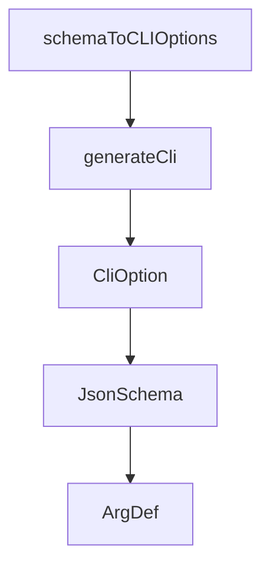

# Chapter 7: Development, Evaluation, and Contribution

Welcome to **Chapter 7: Development, Evaluation, and Contribution**. In this part of **Chrome DevTools MCP Tutorial: Browser Automation and Debugging for Coding Agents**, you will build an intuitive mental model first, then move into concrete implementation details and practical production tradeoffs.


This chapter maps contributor workflows for building, testing, and documenting changes.

## Learning Goals

- run local build and inspector workflows
- update generated docs when tools change
- align contributions with conventional commits
- test eval scenarios with pragmatic assertions

## Contributor Checklist

- install dependencies with supported Node version
- run build + inspector tests locally
- regenerate tool docs with `npm run docs` when needed
- follow CLA and contribution process requirements

## Source References

- [Chrome DevTools MCP Contributing Guide](https://github.com/ChromeDevTools/chrome-devtools-mcp/blob/main/CONTRIBUTING.md)
- [Tool Reference Generation Notes](https://github.com/ChromeDevTools/chrome-devtools-mcp/blob/main/CONTRIBUTING.md#updating-documentation)
- [Chrome DevTools MCP Repository](https://github.com/ChromeDevTools/chrome-devtools-mcp)

## Summary

You now have a clean contributor path for this MCP server ecosystem.

Next: [Chapter 8: Production Operations and Privacy Governance](08-production-operations-and-privacy-governance.md)

## Source Code Walkthrough

### `scripts/generate-cli.ts`

The `schemaToCLIOptions` function in [`scripts/generate-cli.ts`](https://github.com/ChromeDevTools/chrome-devtools-mcp/blob/HEAD/scripts/generate-cli.ts) handles a key part of this chapter's functionality:

```ts
}

function schemaToCLIOptions(schema: JsonSchema): CliOption[] {
  if (!schema || !schema.properties) {
    return [];
  }
  const required = schema.required || [];
  const properties = schema.properties;
  return Object.entries(properties).map(([name, prop]) => {
    const isRequired = required.includes(name);
    const description = prop.description || '';
    if (typeof prop.type !== 'string') {
      throw new Error(
        `Property ${name} has a complex type not supported by CLI.`,
      );
    }
    return {
      name,
      type: prop.type,
      description,
      required: isRequired,
      default: prop.default,
      enum: prop.enum,
    };
  });
}

async function generateCli() {
  const tools = await fetchTools();

  // Sort tools by name
  const sortedTools = tools
```

This function is important because it defines how Chrome DevTools MCP Tutorial: Browser Automation and Debugging for Coding Agents implements the patterns covered in this chapter.

### `scripts/generate-cli.ts`

The `generateCli` function in [`scripts/generate-cli.ts`](https://github.com/ChromeDevTools/chrome-devtools-mcp/blob/HEAD/scripts/generate-cli.ts) handles a key part of this chapter's functionality:

```ts
}

async function generateCli() {
  const tools = await fetchTools();

  // Sort tools by name
  const sortedTools = tools
    .sort((a, b) => a.name.localeCompare(b.name))
    .filter(tool => {
      // Skipping fill_form because it is not relevant in shell scripts
      // and CLI does not handle array/JSON args well.
      if (tool.name === 'fill_form') {
        return false;
      }
      // Skipping wait_for because CLI does not handle array/JSON args well
      // and shell scripts have many mechanisms for waiting.
      if (tool.name === 'wait_for') {
        return false;
      }
      return true;
    });

  const staticTools = createTools(parseArguments());
  const toolNameToCategory = new Map<string, string>();
  for (const tool of staticTools) {
    toolNameToCategory.set(
      tool.name,
      labels[tool.annotations.category as keyof typeof labels],
    );
  }

  const commands: Record<
```

This function is important because it defines how Chrome DevTools MCP Tutorial: Browser Automation and Debugging for Coding Agents implements the patterns covered in this chapter.

### `scripts/generate-cli.ts`

The `CliOption` interface in [`scripts/generate-cli.ts`](https://github.com/ChromeDevTools/chrome-devtools-mcp/blob/HEAD/scripts/generate-cli.ts) handles a key part of this chapter's functionality:

```ts
}

interface CliOption {
  name: string;
  type: string;
  description: string;
  required: boolean;
  default?: unknown;
  enum?: unknown[];
}

interface JsonSchema {
  type?: string | string[];
  description?: string;
  properties?: Record<string, JsonSchema>;
  required?: string[];
  default?: unknown;
  enum?: unknown[];
}

function schemaToCLIOptions(schema: JsonSchema): CliOption[] {
  if (!schema || !schema.properties) {
    return [];
  }
  const required = schema.required || [];
  const properties = schema.properties;
  return Object.entries(properties).map(([name, prop]) => {
    const isRequired = required.includes(name);
    const description = prop.description || '';
    if (typeof prop.type !== 'string') {
      throw new Error(
        `Property ${name} has a complex type not supported by CLI.`,
```

This interface is important because it defines how Chrome DevTools MCP Tutorial: Browser Automation and Debugging for Coding Agents implements the patterns covered in this chapter.

### `scripts/generate-cli.ts`

The `JsonSchema` interface in [`scripts/generate-cli.ts`](https://github.com/ChromeDevTools/chrome-devtools-mcp/blob/HEAD/scripts/generate-cli.ts) handles a key part of this chapter's functionality:

```ts
}

interface JsonSchema {
  type?: string | string[];
  description?: string;
  properties?: Record<string, JsonSchema>;
  required?: string[];
  default?: unknown;
  enum?: unknown[];
}

function schemaToCLIOptions(schema: JsonSchema): CliOption[] {
  if (!schema || !schema.properties) {
    return [];
  }
  const required = schema.required || [];
  const properties = schema.properties;
  return Object.entries(properties).map(([name, prop]) => {
    const isRequired = required.includes(name);
    const description = prop.description || '';
    if (typeof prop.type !== 'string') {
      throw new Error(
        `Property ${name} has a complex type not supported by CLI.`,
      );
    }
    return {
      name,
      type: prop.type,
      description,
      required: isRequired,
      default: prop.default,
      enum: prop.enum,
```

This interface is important because it defines how Chrome DevTools MCP Tutorial: Browser Automation and Debugging for Coding Agents implements the patterns covered in this chapter.


## How These Components Connect


