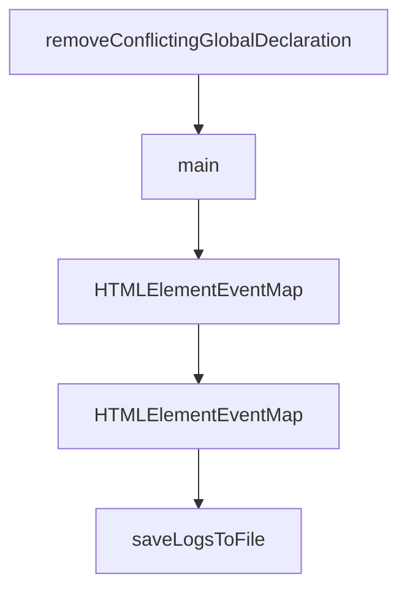

# Chapter 8: Production Operations and Privacy Governance

Welcome to **Chapter 8: Production Operations and Privacy Governance**. In this part of **Chrome DevTools MCP Tutorial: Browser Automation and Debugging for Coding Agents**, you will build an intuitive mental model first, then move into concrete implementation details and practical production tradeoffs.


This chapter covers operational governance for teams using browser-connected MCP tooling.

## Learning Goals

- manage telemetry and privacy settings deliberately
- define policy around sensitive browser data exposure
- enforce change controls for production MCP configs
- maintain observability and incident response readiness

## Governance Priorities

- document when to disable usage statistics
- avoid processing sensitive personal data in shared sessions
- restrict MCP usage scope to approved environments
- standardize logging and redaction practices

## Source References

- [Chrome DevTools MCP README: Usage Statistics](https://github.com/ChromeDevTools/chrome-devtools-mcp/blob/main/README.md#usage-statistics)
- [Chrome DevTools MCP README: Disclaimers](https://github.com/ChromeDevTools/chrome-devtools-mcp/blob/main/README.md#disclaimers)
- [Google Privacy Policy](https://policies.google.com/privacy)

## Summary

You now have a full Chrome DevTools MCP learning path from setup to governed production usage.

Next tutorial: [Codex CLI Tutorial](../codex-cli-tutorial/)

## Depth Expansion Playbook

## Source Code Walkthrough

### `scripts/prepare.ts`

The `removeConflictingGlobalDeclaration` function in [`scripts/prepare.ts`](https://github.com/ChromeDevTools/chrome-devtools-mcp/blob/HEAD/scripts/prepare.ts) handles a key part of this chapter's functionality:

```ts
 * the same property.
 */
function removeConflictingGlobalDeclaration(): void {
  const filePath = resolve(
    projectRoot,
    'node_modules/@paulirish/trace_engine/models/trace/ModelImpl.d.ts',
  );
  console.log(
    'Removing conflicting global declaration from @paulirish/trace_engine...',
  );
  const content = readFileSync(filePath, 'utf-8');
  // Remove the declare global block using regex
  // Matches: declare global { ... interface HTMLElementEventMap { ... } ... }
  const newContent = content.replace(
    /declare global\s*\{\s*interface HTMLElementEventMap\s*\{[^}]*\[ModelUpdateEvent\.eventName\]:\s*ModelUpdateEvent;\s*\}\s*\}/s,
    '',
  );
  writeFileSync(filePath, newContent, 'utf-8');
  console.log('Successfully removed conflicting global declaration.');
}

async function main() {
  console.log('Running prepare script to clean up chrome-devtools-frontend...');
  for (const file of filesToRemove) {
    const fullPath = resolve(projectRoot, file);
    console.log(`Removing: ${file}`);
    try {
      await rm(fullPath, {recursive: true, force: true});
    } catch (error) {
      console.error(`Failed to remove ${file}:`, error);
      process.exit(1);
    }
```

This function is important because it defines how Chrome DevTools MCP Tutorial: Browser Automation and Debugging for Coding Agents implements the patterns covered in this chapter.

### `scripts/prepare.ts`

The `main` function in [`scripts/prepare.ts`](https://github.com/ChromeDevTools/chrome-devtools-mcp/blob/HEAD/scripts/prepare.ts) handles a key part of this chapter's functionality:

```ts
}

async function main() {
  console.log('Running prepare script to clean up chrome-devtools-frontend...');
  for (const file of filesToRemove) {
    const fullPath = resolve(projectRoot, file);
    console.log(`Removing: ${file}`);
    try {
      await rm(fullPath, {recursive: true, force: true});
    } catch (error) {
      console.error(`Failed to remove ${file}:`, error);
      process.exit(1);
    }
  }
  console.log('Clean up of chrome-devtools-frontend complete.');

  removeConflictingGlobalDeclaration();
}

void main();

```

This function is important because it defines how Chrome DevTools MCP Tutorial: Browser Automation and Debugging for Coding Agents implements the patterns covered in this chapter.

### `scripts/prepare.ts`

The `HTMLElementEventMap` interface in [`scripts/prepare.ts`](https://github.com/ChromeDevTools/chrome-devtools-mcp/blob/HEAD/scripts/prepare.ts) handles a key part of this chapter's functionality:

```ts

/**
 * Removes the conflicting global HTMLElementEventMap declaration from
 * @paulirish/trace_engine/models/trace/ModelImpl.d.ts to avoid TS2717 error
 * when both chrome-devtools-frontend and @paulirish/trace_engine declare
 * the same property.
 */
function removeConflictingGlobalDeclaration(): void {
  const filePath = resolve(
    projectRoot,
    'node_modules/@paulirish/trace_engine/models/trace/ModelImpl.d.ts',
  );
  console.log(
    'Removing conflicting global declaration from @paulirish/trace_engine...',
  );
  const content = readFileSync(filePath, 'utf-8');
  // Remove the declare global block using regex
  // Matches: declare global { ... interface HTMLElementEventMap { ... } ... }
  const newContent = content.replace(
    /declare global\s*\{\s*interface HTMLElementEventMap\s*\{[^}]*\[ModelUpdateEvent\.eventName\]:\s*ModelUpdateEvent;\s*\}\s*\}/s,
    '',
  );
  writeFileSync(filePath, newContent, 'utf-8');
  console.log('Successfully removed conflicting global declaration.');
}

async function main() {
  console.log('Running prepare script to clean up chrome-devtools-frontend...');
  for (const file of filesToRemove) {
    const fullPath = resolve(projectRoot, file);
    console.log(`Removing: ${file}`);
    try {
```

This interface is important because it defines how Chrome DevTools MCP Tutorial: Browser Automation and Debugging for Coding Agents implements the patterns covered in this chapter.

### `scripts/prepare.ts`

The `HTMLElementEventMap` interface in [`scripts/prepare.ts`](https://github.com/ChromeDevTools/chrome-devtools-mcp/blob/HEAD/scripts/prepare.ts) handles a key part of this chapter's functionality:

```ts

/**
 * Removes the conflicting global HTMLElementEventMap declaration from
 * @paulirish/trace_engine/models/trace/ModelImpl.d.ts to avoid TS2717 error
 * when both chrome-devtools-frontend and @paulirish/trace_engine declare
 * the same property.
 */
function removeConflictingGlobalDeclaration(): void {
  const filePath = resolve(
    projectRoot,
    'node_modules/@paulirish/trace_engine/models/trace/ModelImpl.d.ts',
  );
  console.log(
    'Removing conflicting global declaration from @paulirish/trace_engine...',
  );
  const content = readFileSync(filePath, 'utf-8');
  // Remove the declare global block using regex
  // Matches: declare global { ... interface HTMLElementEventMap { ... } ... }
  const newContent = content.replace(
    /declare global\s*\{\s*interface HTMLElementEventMap\s*\{[^}]*\[ModelUpdateEvent\.eventName\]:\s*ModelUpdateEvent;\s*\}\s*\}/s,
    '',
  );
  writeFileSync(filePath, newContent, 'utf-8');
  console.log('Successfully removed conflicting global declaration.');
}

async function main() {
  console.log('Running prepare script to clean up chrome-devtools-frontend...');
  for (const file of filesToRemove) {
    const fullPath = resolve(projectRoot, file);
    console.log(`Removing: ${file}`);
    try {
```

This interface is important because it defines how Chrome DevTools MCP Tutorial: Browser Automation and Debugging for Coding Agents implements the patterns covered in this chapter.


## How These Components Connect


