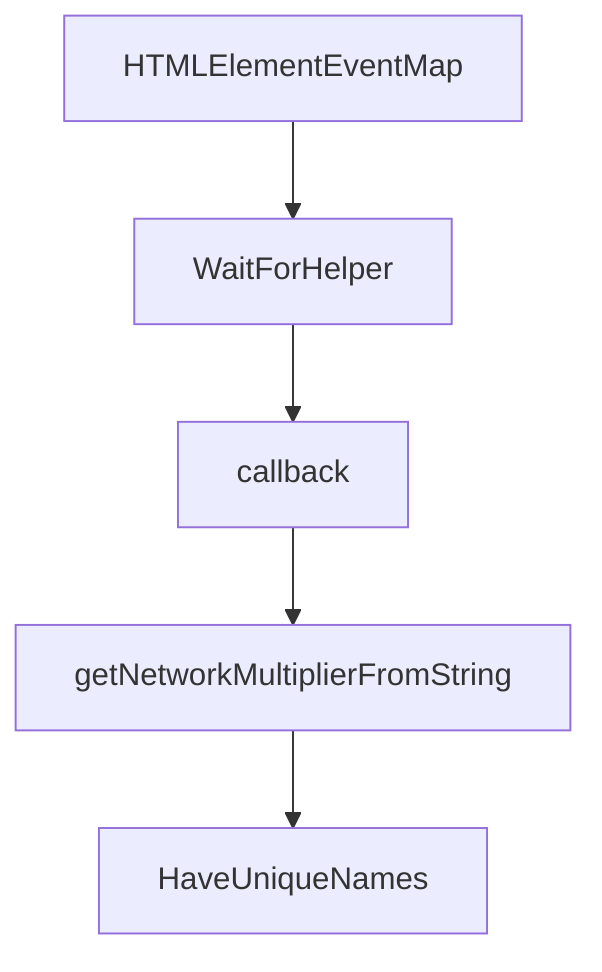

# Chapter 8: Production Operations and Privacy Governance

Welcome to **Chapter 8: Production Operations and Privacy Governance**. In this part of **Chrome DevTools MCP Tutorial: Browser Automation and Debugging for Coding Agents**, you will build an intuitive mental model first, then move into concrete implementation details and practical production tradeoffs.


This chapter covers operational governance for teams using browser-connected MCP tooling.

## Learning Goals

- manage telemetry and privacy settings deliberately
- define policy around sensitive browser data exposure
- enforce change controls for production MCP configs
- maintain observability and incident response readiness

## Governance Priorities

- document when to disable usage statistics
- avoid processing sensitive personal data in shared sessions
- restrict MCP usage scope to approved environments
- standardize logging and redaction practices

## Source References

- [Chrome DevTools MCP README: Usage Statistics](https://github.com/ChromeDevTools/chrome-devtools-mcp/blob/main/README.md#usage-statistics)
- [Chrome DevTools MCP README: Disclaimers](https://github.com/ChromeDevTools/chrome-devtools-mcp/blob/main/README.md#disclaimers)
- [Google Privacy Policy](https://policies.google.com/privacy)

## Summary

You now have a full Chrome DevTools MCP learning path from setup to governed production usage.

Next tutorial: [Codex CLI Tutorial](../codex-cli-tutorial/)

## Source Code Walkthrough

### `scripts/prepare.ts`

The `HTMLElementEventMap` interface in [`scripts/prepare.ts`](https://github.com/ChromeDevTools/chrome-devtools-mcp/blob/HEAD/scripts/prepare.ts) handles a key part of this chapter's functionality:

```ts

/**
 * Removes the conflicting global HTMLElementEventMap declaration from
 * @paulirish/trace_engine/models/trace/ModelImpl.d.ts to avoid TS2717 error
 * when both chrome-devtools-frontend and @paulirish/trace_engine declare
 * the same property.
 */
function removeConflictingGlobalDeclaration(): void {
  const filePath = resolve(
    projectRoot,
    'node_modules/@paulirish/trace_engine/models/trace/ModelImpl.d.ts',
  );
  console.log(
    'Removing conflicting global declaration from @paulirish/trace_engine...',
  );
  const content = readFileSync(filePath, 'utf-8');
  // Remove the declare global block using regex
  // Matches: declare global { ... interface HTMLElementEventMap { ... } ... }
  const newContent = content.replace(
    /declare global\s*\{\s*interface HTMLElementEventMap\s*\{[^}]*\[ModelUpdateEvent\.eventName\]:\s*ModelUpdateEvent;\s*\}\s*\}/s,
    '',
  );
  writeFileSync(filePath, newContent, 'utf-8');
  console.log('Successfully removed conflicting global declaration.');
}

async function main() {
  console.log('Running prepare script to clean up chrome-devtools-frontend...');
  for (const file of filesToRemove) {
    const fullPath = resolve(projectRoot, file);
    console.log(`Removing: ${file}`);
    try {
```

This interface is important because it defines how Chrome DevTools MCP Tutorial: Browser Automation and Debugging for Coding Agents implements the patterns covered in this chapter.

### `src/WaitForHelper.ts`

The `WaitForHelper` class in [`src/WaitForHelper.ts`](https://github.com/ChromeDevTools/chrome-devtools-mcp/blob/HEAD/src/WaitForHelper.ts) handles a key part of this chapter's functionality:

```ts
import type {PredefinedNetworkConditions} from './third_party/index.js';

export class WaitForHelper {
  #abortController = new AbortController();
  #page: CdpPage;
  #stableDomTimeout: number;
  #stableDomFor: number;
  #expectNavigationIn: number;
  #navigationTimeout: number;

  constructor(
    page: Page,
    cpuTimeoutMultiplier: number,
    networkTimeoutMultiplier: number,
  ) {
    this.#stableDomTimeout = 3000 * cpuTimeoutMultiplier;
    this.#stableDomFor = 100 * cpuTimeoutMultiplier;
    this.#expectNavigationIn = 100 * cpuTimeoutMultiplier;
    this.#navigationTimeout = 3000 * networkTimeoutMultiplier;
    this.#page = page as unknown as CdpPage;
  }

  /**
   * A wrapper that executes a action and waits for
   * a potential navigation, after which it waits
   * for the DOM to be stable before returning.
   */
  async waitForStableDom(): Promise<void> {
    const stableDomObserver = await this.#page.evaluateHandle(timeout => {
      let timeoutId: ReturnType<typeof setTimeout>;
      function callback() {
        clearTimeout(timeoutId);
```

This class is important because it defines how Chrome DevTools MCP Tutorial: Browser Automation and Debugging for Coding Agents implements the patterns covered in this chapter.

### `src/WaitForHelper.ts`

The `callback` function in [`src/WaitForHelper.ts`](https://github.com/ChromeDevTools/chrome-devtools-mcp/blob/HEAD/src/WaitForHelper.ts) handles a key part of this chapter's functionality:

```ts
    const stableDomObserver = await this.#page.evaluateHandle(timeout => {
      let timeoutId: ReturnType<typeof setTimeout>;
      function callback() {
        clearTimeout(timeoutId);
        timeoutId = setTimeout(() => {
          domObserver.resolver.resolve();
          domObserver.observer.disconnect();
        }, timeout);
      }
      const domObserver = {
        resolver: Promise.withResolvers<void>(),
        observer: new MutationObserver(callback),
      };
      // It's possible that the DOM is not gonna change so we
      // need to start the timeout initially.
      callback();

      domObserver.observer.observe(document.body, {
        childList: true,
        subtree: true,
        attributes: true,
      });

      return domObserver;
    }, this.#stableDomFor);

    this.#abortController.signal.addEventListener('abort', async () => {
      try {
        await stableDomObserver.evaluate(observer => {
          observer.observer.disconnect();
          observer.resolver.resolve();
        });
```

This function is important because it defines how Chrome DevTools MCP Tutorial: Browser Automation and Debugging for Coding Agents implements the patterns covered in this chapter.

### `src/WaitForHelper.ts`

The `getNetworkMultiplierFromString` function in [`src/WaitForHelper.ts`](https://github.com/ChromeDevTools/chrome-devtools-mcp/blob/HEAD/src/WaitForHelper.ts) handles a key part of this chapter's functionality:

```ts
}

export function getNetworkMultiplierFromString(
  condition: string | null,
): number {
  const puppeteerCondition =
    condition as keyof typeof PredefinedNetworkConditions;

  switch (puppeteerCondition) {
    case 'Fast 4G':
      return 1;
    case 'Slow 4G':
      return 2.5;
    case 'Fast 3G':
      return 5;
    case 'Slow 3G':
      return 10;
  }
  return 1;
}

```

This function is important because it defines how Chrome DevTools MCP Tutorial: Browser Automation and Debugging for Coding Agents implements the patterns covered in this chapter.


## How These Components Connect


