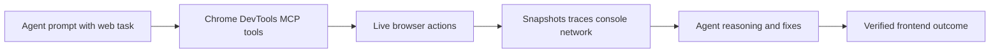

# Chrome DevTools MCP Tutorial: Browser Automation and Debugging for Coding Agents

> Learn how to use `ChromeDevTools/chrome-devtools-mcp` to give coding agents reliable browser control, performance tracing, and deep debugging capabilities.

## Why This Track Matters

Chrome DevTools MCP is one of the highest-impact MCP servers for coding workflows that touch frontend behavior, web performance, and browser automation.

This track focuses on:

- setting up Chrome DevTools MCP in major coding clients
- using tool categories effectively (input, navigation, performance, debugging)
- troubleshooting browser/session integration failures
- operating the server with privacy and governance awareness

## Current Snapshot (auto-updated)

- repository: [`ChromeDevTools/chrome-devtools-mcp`](https://github.com/ChromeDevTools/chrome-devtools-mcp)
- stars: about **24.1k**
- latest release: [`chrome-devtools-mcp-v0.17.0`](https://github.com/ChromeDevTools/chrome-devtools-mcp/releases/tag/chrome-devtools-mcp-v0.17.0)
- recent activity: updates on **February 11, 2026**
- project positioning: MCP server for browser automation, debugging, and performance analysis

## Mental Model

## Chapter Guide

| Chapter | Key Question | Outcome |
|:--------|:-------------|:--------|
| [01 - Getting Started](01-getting-started.md) | How do I install and connect Chrome DevTools MCP quickly? | Working baseline |
| [02 - Architecture and Design Principles](02-architecture-and-design-principles.md) | What principles shape tool behavior and outputs? | Strong mental model |
| [03 - Client Integrations and Setup Patterns](03-client-integrations-and-setup-patterns.md) | How do I configure this server across coding clients? | Stable integration setup |
| [04 - Automation Tooling: Input and Navigation](04-automation-tooling-input-and-navigation.md) | How do I automate page interactions reliably? | Better browser automation |
| [05 - Performance and Debugging Workflows](05-performance-and-debugging-workflows.md) | How do I diagnose frontend and performance issues? | Faster root-cause analysis |
| [06 - Troubleshooting and Reliability Hardening](06-troubleshooting-and-reliability-hardening.md) | How do I resolve common runtime failures? | Operator confidence |
| [07 - Development, Evaluation, and Contribution](07-development-evaluation-and-contribution.md) | How do contributors build/test/docs this project? | Contributor readiness |
| [08 - Production Operations and Privacy Governance](08-production-operations-and-privacy-governance.md) | How do teams operate this MCP server responsibly? | Governance runbook |

## What You Will Learn

- how to integrate Chrome DevTools MCP into coding-agent workflows
- how to combine automation and debugging tools effectively
- how to harden runtime reliability for browser-connected tasks
- how to manage privacy/telemetry concerns in production environments

## Source References

- [Chrome DevTools MCP Repository](https://github.com/ChromeDevTools/chrome-devtools-mcp)
- [Chrome DevTools MCP README](https://github.com/ChromeDevTools/chrome-devtools-mcp/blob/main/README.md)
- [Tool Reference](https://github.com/ChromeDevTools/chrome-devtools-mcp/blob/main/docs/tool-reference.md)
- [Troubleshooting Guide](https://github.com/ChromeDevTools/chrome-devtools-mcp/blob/main/docs/troubleshooting.md)
- [Design Principles](https://github.com/ChromeDevTools/chrome-devtools-mcp/blob/main/docs/design-principles.md)

## Related Tutorials

- [MCP Servers Tutorial](../mcp-servers-tutorial/)
- [Browser Use Tutorial](../browser-use-tutorial/)
- [OpenCode Tutorial](../opencode-tutorial/)
- [Context7 Tutorial](../context7-tutorial/)

---

Start with [Chapter 1: Getting Started](01-getting-started.md).

## Navigation & Backlinks

- [Start Here: Chapter 1: Getting Started](01-getting-started.md)
- [Back to Main Catalog](../../README.md#-tutorial-catalog)
- [Browse A-Z Tutorial Directory](../../discoverability/tutorial-directory.md)
- [Search by Intent](../../discoverability/query-hub.md)
- [Explore Category Hubs](../../README.md#category-hubs)

## Full Chapter Map

1. [Chapter 1: Getting Started](01-getting-started.md)
2. [Chapter 2: Architecture and Design Principles](02-architecture-and-design-principles.md)
3. [Chapter 3: Client Integrations and Setup Patterns](03-client-integrations-and-setup-patterns.md)
4. [Chapter 4: Automation Tooling: Input and Navigation](04-automation-tooling-input-and-navigation.md)
5. [Chapter 5: Performance and Debugging Workflows](05-performance-and-debugging-workflows.md)
6. [Chapter 6: Troubleshooting and Reliability Hardening](06-troubleshooting-and-reliability-hardening.md)
7. [Chapter 7: Development, Evaluation, and Contribution](07-development-evaluation-and-contribution.md)
8. [Chapter 8: Production Operations and Privacy Governance](08-production-operations-and-privacy-governance.md)

*Generated by [AI Codebase Knowledge Builder](https://github.com/The-Pocket/Tutorial-Codebase-Knowledge)*
