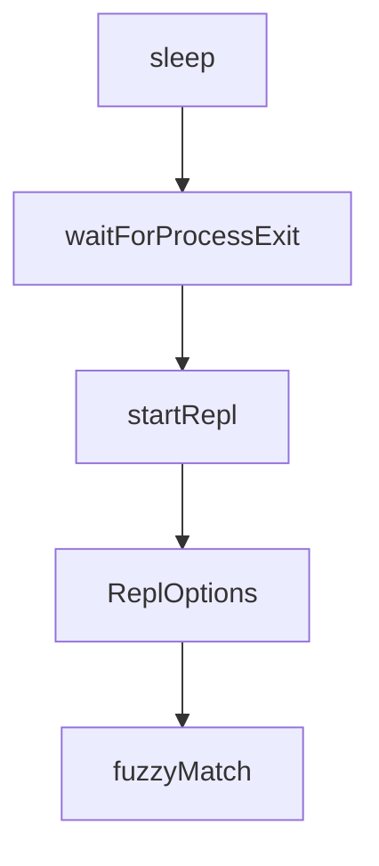

# Chapter 1: Getting Started

Welcome to **Chapter 1: Getting Started**. In this part of **Cipher Tutorial: Shared Memory Layer for Coding Agents**, you will build an intuitive mental model first, then move into concrete implementation details and practical production tradeoffs.


This chapter gets Cipher installed and running in local interactive mode.

## Quick Install

```bash
npm install -g @byterover/cipher
```

## Start Cipher

```bash
cipher
```

You can also run one-shot prompts:

```bash
cipher "Add this pattern to memory for future debugging"
```

## Source References

- [Cipher README quick start](https://github.com/campfirein/cipher/blob/main/README.md)

## Summary

You now have Cipher running with a baseline local session.

Next: [Chapter 2: Core Modes and Session Workflow](02-core-modes-and-session-workflow.md)

## Source Code Walkthrough

### `bin/kill-daemon.js`

The `sleep` function in [`bin/kill-daemon.js`](https://github.com/campfirein/cipher/blob/HEAD/bin/kill-daemon.js) handles a key part of this chapter's functionality:

```js
} from '@campfirein/brv-transport-client'

function sleep(ms) {
  return new Promise((resolve) => {
    setTimeout(resolve, ms)
  })
}

async function waitForProcessExit(pid, deadlineMs, pollMs) {
  const deadline = Date.now() + deadlineMs
  while (Date.now() < deadline) {
    if (!isProcessAlive(pid)) {
      return true
    }

    // eslint-disable-next-line no-await-in-loop
    await sleep(pollMs)
  }

  return false
}

const status = discoverDaemon()

// Extract PID from any discovery result that has one
const pid = status.running
  ? status.pid
  : 'pid' in status
    ? status.pid
    : undefined

if (pid === undefined || !isProcessAlive(pid)) {
```

This function is important because it defines how Cipher Tutorial: Shared Memory Layer for Coding Agents implements the patterns covered in this chapter.

### `bin/kill-daemon.js`

The `waitForProcessExit` function in [`bin/kill-daemon.js`](https://github.com/campfirein/cipher/blob/HEAD/bin/kill-daemon.js) handles a key part of this chapter's functionality:

```js
}

async function waitForProcessExit(pid, deadlineMs, pollMs) {
  const deadline = Date.now() + deadlineMs
  while (Date.now() < deadline) {
    if (!isProcessAlive(pid)) {
      return true
    }

    // eslint-disable-next-line no-await-in-loop
    await sleep(pollMs)
  }

  return false
}

const status = discoverDaemon()

// Extract PID from any discovery result that has one
const pid = status.running
  ? status.pid
  : 'pid' in status
    ? status.pid
    : undefined

if (pid === undefined || !isProcessAlive(pid)) {
  console.log('[kill-daemon] No running daemon found')
} else {
  console.log(`[kill-daemon] Stopping daemon (PID ${pid})...`)

  let stopped = false

```

This function is important because it defines how Cipher Tutorial: Shared Memory Layer for Coding Agents implements the patterns covered in this chapter.

### `src/tui/repl-startup.tsx`

The `startRepl` function in [`src/tui/repl-startup.tsx`](https://github.com/campfirein/cipher/blob/HEAD/src/tui/repl-startup.tsx) handles a key part of this chapter's functionality:

```tsx
 * Start the ByteRover REPL
 */
export async function startRepl(options: ReplOptions): Promise<void> {
  const {version} = options

  // Set version in store before rendering
  useTransportStore.getState().setVersion(version)

  const {waitUntilExit} = render(
    <AppProviders>
      <App />
    </AppProviders>,
  )

  await waitUntilExit()
}

```

This function is important because it defines how Cipher Tutorial: Shared Memory Layer for Coding Agents implements the patterns covered in this chapter.

### `src/tui/repl-startup.tsx`

The `ReplOptions` interface in [`src/tui/repl-startup.tsx`](https://github.com/campfirein/cipher/blob/HEAD/src/tui/repl-startup.tsx) handles a key part of this chapter's functionality:

```tsx
 * - TransportInitializer connects to daemon via connectToDaemon()
 */
export interface ReplOptions {
  version: string
}

/**
 * Start the ByteRover REPL
 */
export async function startRepl(options: ReplOptions): Promise<void> {
  const {version} = options

  // Set version in store before rendering
  useTransportStore.getState().setVersion(version)

  const {waitUntilExit} = render(
    <AppProviders>
      <App />
    </AppProviders>,
  )

  await waitUntilExit()
}

```

This interface is important because it defines how Cipher Tutorial: Shared Memory Layer for Coding Agents implements the patterns covered in this chapter.


## How These Components Connect


