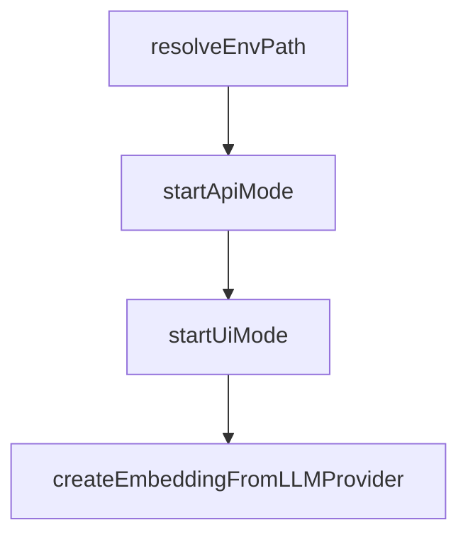

# Chapter 1: Getting Started

Welcome to **Chapter 1: Getting Started**. In this part of **Cipher Tutorial: Shared Memory Layer for Coding Agents**, you will build an intuitive mental model first, then move into concrete implementation details and practical production tradeoffs.


This chapter gets Cipher installed and running in local interactive mode.

## Quick Install

```bash
npm install -g @byterover/cipher
```

## Start Cipher

```bash
cipher
```

You can also run one-shot prompts:

```bash
cipher "Add this pattern to memory for future debugging"
```

## Source References

- [Cipher README quick start](https://github.com/campfirein/cipher/blob/main/README.md)

## Summary

You now have Cipher running with a baseline local session.

Next: [Chapter 2: Core Modes and Session Workflow](02-core-modes-and-session-workflow.md)

## Depth Expansion Playbook

## Source Code Walkthrough

### `src/app/index.ts`

The `resolveEnvPath` function in [`src/app/index.ts`](https://github.com/campfirein/cipher/blob/HEAD/src/app/index.ts) handles a key part of this chapter's functionality:

```ts

// Helper function to resolve .env file path
function resolveEnvPath(): string {
	// Try current working directory first
	if (existsSync('.env')) {
		return '.env';
	}

	// Try relative to project root (where package.json is located)
	const currentFileUrl = import.meta.url;
	const currentFilePath = fileURLToPath(currentFileUrl);
	const projectRoot = path.resolve(path.dirname(currentFilePath), '../..');
	const envPath = path.resolve(projectRoot, '.env');

	return envPath;
}

// ===== EARLY MCP MODE DETECTION AND LOG REDIRECTION =====
// Following Cipher's best practices to prevent stdio interference
// This must happen BEFORE any logging operations
const detectAndRedirectMcpLogs = () => {
	const args = process.argv;
	const isMcpMode = args.includes('--mode') && args[args.indexOf('--mode') + 1] === 'mcp';

	if (isMcpMode) {
		// Redirect logs immediately to prevent stdout contamination
		const logFile = process.env.CIPHER_MCP_LOG_FILE || path.join(os.tmpdir(), 'cipher-mcp.log');
		logger.redirectToFile(logFile);

		// Use stderr for critical startup messages only
		process.stderr.write(`[CIPHER-MCP] Log redirection activated: ${logFile}\n`);
	}
```

This function is important because it defines how Cipher Tutorial: Shared Memory Layer for Coding Agents implements the patterns covered in this chapter.

### `src/app/index.ts`

The `startApiMode` function in [`src/app/index.ts`](https://github.com/campfirein/cipher/blob/HEAD/src/app/index.ts) handles a key part of this chapter's functionality:

```ts
		 * Start the API server mode
		 */
		async function startApiMode(agent: MemAgent, options: any): Promise<void> {
			const port = parseInt(options.port) || 3001;
			const host = options.host || 'localhost';
			const mcpTransportType = options.mcpTransportType || undefined; // Pass through from CLI options
			const mcpPort = options.mcpPort ? parseInt(options.mcpPort, 10) : undefined; // Pass through from CLI options
			// Handle API prefix from environment variable or CLI option
			const apiPrefix =
				process.env.CIPHER_API_PREFIX !== undefined
					? process.env.CIPHER_API_PREFIX === '""'
						? ''
						: process.env.CIPHER_API_PREFIX
					: options.apiPrefix;

			logger.info(`Starting API server on ${host}:${port}`, null, 'green');

			const apiServer = new ApiServer(agent, {
				port,
				host,
				corsOrigins: ['http://localhost:3000', 'http://localhost:3001'], // Default CORS origins
				rateLimitWindowMs: 15 * 60 * 1000, // 15 minutes
				rateLimitMaxRequests: 100, // 100 requests per window
				// Enable WebSocket by default for API mode
				enableWebSocket: true,
				webSocketConfig: {
					path: '/ws',
					maxConnections: 1000,
					connectionTimeout: 300000, // 5 minutes
					heartbeatInterval: 30000, // 30 seconds
					enableCompression: true,
				},
```

This function is important because it defines how Cipher Tutorial: Shared Memory Layer for Coding Agents implements the patterns covered in this chapter.

### `src/app/index.ts`

The `startUiMode` function in [`src/app/index.ts`](https://github.com/campfirein/cipher/blob/HEAD/src/app/index.ts) handles a key part of this chapter's functionality:

```ts
		 * Start the UI mode with both API server and Web UI
		 */
		async function startUiMode(agent: MemAgent, options: any): Promise<void> {
			const apiPort = parseInt(options.port) || 3001;
			const uiPort = parseInt(options.uiPort) || 3000;
			const host = options.host || 'localhost';
			const mcpTransportType = options.mcpTransportType || undefined;
			const mcpPort = options.mcpPort ? parseInt(options.mcpPort, 10) : undefined;
			// Handle API prefix from environment variable or CLI option
			const apiPrefix =
				process.env.CIPHER_API_PREFIX !== undefined
					? process.env.CIPHER_API_PREFIX === '""'
						? ''
						: process.env.CIPHER_API_PREFIX
					: options.apiPrefix;

			logger.info(
				`Starting UI mode - API server on ${host}:${apiPort}, UI server on ${host}:${uiPort}`,
				null,
				'green'
			);

			// Start API server first
			const apiServer = new ApiServer(agent, {
				port: apiPort,
				host,
				corsOrigins: [`http://${host}:${uiPort}`, `http://localhost:${uiPort}`], // Allow UI to connect
				rateLimitWindowMs: 15 * 60 * 1000, // 15 minutes
				rateLimitMaxRequests: 100, // 100 requests per window
				// Enable WebSocket by default for UI mode
				enableWebSocket: true,
				webSocketConfig: {
```

This function is important because it defines how Cipher Tutorial: Shared Memory Layer for Coding Agents implements the patterns covered in this chapter.

### `src/core/utils/service-initializer.ts`

The `createEmbeddingFromLLMProvider` function in [`src/core/utils/service-initializer.ts`](https://github.com/campfirein/cipher/blob/HEAD/src/core/utils/service-initializer.ts) handles a key part of this chapter's functionality:

```ts
 * Create embedding configuration from LLM provider settings
 */
async function createEmbeddingFromLLMProvider(
	embeddingManager: EmbeddingManager,
	llmConfig: any
): Promise<{ embedder: any; info: any } | null> {
	const provider = llmConfig.provider?.toLowerCase();

	try {
		switch (provider) {
			case 'openai': {
				const apiKey = llmConfig.apiKey || process.env.OPENAI_API_KEY;
				if (!apiKey || apiKey.trim() === '') {
					logger.debug(
						'No OpenAI API key available for embedding fallback - switching to chat-only mode'
					);
					return null;
				}
				const embeddingConfig = {
					type: 'openai' as const,
					apiKey,
					model: 'text-embedding-3-small' as const,
					baseUrl: llmConfig.baseUrl,
					organization: llmConfig.organization,
					timeout: 30000,
					maxRetries: 3,
				};
				logger.debug('Using OpenAI embedding fallback: text-embedding-3-small');
				return await embeddingManager.createEmbedderFromConfig(embeddingConfig, 'default');
			}

			case 'ollama': {
```

This function is important because it defines how Cipher Tutorial: Shared Memory Layer for Coding Agents implements the patterns covered in this chapter.


## How These Components Connect


