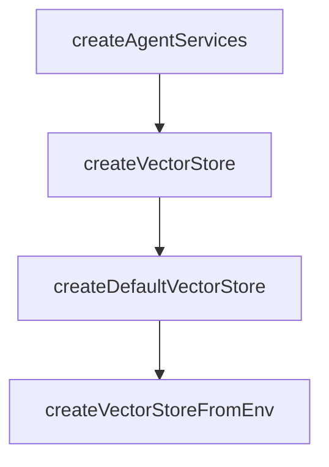

# Chapter 2: Core Modes and Session Workflow

Welcome to **Chapter 2: Core Modes and Session Workflow**. In this part of **Cipher Tutorial: Shared Memory Layer for Coding Agents**, you will build an intuitive mental model first, then move into concrete implementation details and practical production tradeoffs.


Cipher supports multiple run modes optimized for different integration points.

## Mode Overview

| Mode | Command | Typical Use |
|:-----|:--------|:------------|
| interactive CLI | `cipher` | manual memory-assisted workflows |
| API server | `cipher --mode api` | backend integration |
| MCP server | `cipher --mode mcp` | IDE/agent tool integration |
| Web UI | `cipher --mode ui` | browser-based operations |

## Source References

- [Cipher README CLI usage](https://github.com/campfirein/cipher/blob/main/README.md)

## Summary

You now understand which Cipher mode to run for each workflow type.

Next: [Chapter 3: Memory Architecture and Data Model](03-memory-architecture-and-data-model.md)

## Depth Expansion Playbook

## Source Code Walkthrough

### `src/core/utils/service-initializer.ts`

The `createAgentServices` function in [`src/core/utils/service-initializer.ts`](https://github.com/campfirein/cipher/blob/HEAD/src/core/utils/service-initializer.ts) handles a key part of this chapter's functionality:

```ts
};

export async function createAgentServices(
	agentConfig: AgentConfig,
	appMode?: 'cli' | 'mcp' | 'api'
): Promise<AgentServices> {
	let contextManager: ContextManager | undefined = undefined;
	// 1. Initialize agent config
	const config = agentConfig;

	// 1.1. Initialize event manager first (other services will use it)
	logger.debug('Initializing event manager...');

	// Use eventPersistence config if present, with environment variable overrides
	const eventPersistenceConfig = {
		...config.eventPersistence,
		// Support EVENT_PERSISTENCE_ENABLED env variable
		enabled:
			process.env.EVENT_PERSISTENCE_ENABLED === 'true' ||
			(config.eventPersistence?.enabled ?? false),
		// Support EVENT_PERSISTENCE_PATH env variable
		filePath: process.env.EVENT_PERSISTENCE_PATH || config.eventPersistence?.filePath,
	};

	// Support EVENT_FILTERING_ENABLED env variable
	const enableFiltering = process.env.EVENT_FILTERING_ENABLED === 'true';

	// Support EVENT_FILTERED_TYPES env variable (comma-separated)
	const filteredTypes = (process.env.EVENT_FILTERED_TYPES || '')
		.split(',')
		.map(s => s.trim())
		.filter(Boolean);
```

This function is important because it defines how Cipher Tutorial: Shared Memory Layer for Coding Agents implements the patterns covered in this chapter.

### `src/core/vector_storage/factory.ts`

The `createVectorStore` function in [`src/core/vector_storage/factory.ts`](https://github.com/campfirein/cipher/blob/HEAD/src/core/vector_storage/factory.ts) handles a key part of this chapter's functionality:

```ts
 * ```typescript
 * // Basic usage with Qdrant
 * const { manager, store } = await createVectorStore({
 *   type: 'qdrant',
 *   host: 'localhost',
 *   port: 6333,
 *   collectionName: 'documents',
 *   dimension: 1536
 * });
 *
 * // Use the vector store
 * await store.insert([vector], ['doc1'], [{ title: 'Document' }]);
 * const results = await store.search(queryVector, 5);
 *
 * // Cleanup when done
 * await manager.disconnect();
 * ```
 *
 * @example
 * ```typescript
 * // Development configuration with in-memory
 * const { manager, store } = await createVectorStore({
 *   type: 'in-memory',
 *   collectionName: 'test',
 *   dimension: 1536,
 *   maxVectors: 1000
 * });
 * ```
 */
export async function createVectorStore(config: VectorStoreConfig): Promise<VectorStoreFactory> {
	const logger = createLogger({ level: env.CIPHER_LOG_LEVEL });

```

This function is important because it defines how Cipher Tutorial: Shared Memory Layer for Coding Agents implements the patterns covered in this chapter.

### `src/core/vector_storage/factory.ts`

The `createDefaultVectorStore` function in [`src/core/vector_storage/factory.ts`](https://github.com/campfirein/cipher/blob/HEAD/src/core/vector_storage/factory.ts) handles a key part of this chapter's functionality:

```ts
 * @example
 * ```typescript
 * const { manager, store } = await createDefaultVectorStore();
 * // Uses in-memory backend with default settings
 *
 * const { manager, store } = await createDefaultVectorStore('my_collection', 768);
 * // Uses in-memory backend with custom collection and dimension
 * ```
 */
export async function createDefaultVectorStore(
	collectionName: string = 'knowledge_memory',
	dimension: number = 1536
): Promise<VectorStoreFactory> {
	return createVectorStore({
		type: 'in-memory',
		collectionName,
		dimension,
		maxVectors: 10000,
	});
}

/**
 * Creates vector storage from environment variables
 *
 * Reads vector storage configuration from environment variables and creates
 * the vector storage system. Falls back to in-memory if not configured.
 *
 * Environment variables:
 * - VECTOR_STORE_TYPE: Backend type (qdrant, in-memory)
 * - VECTOR_STORE_HOST: Qdrant host (if using Qdrant)
 * - VECTOR_STORE_PORT: Qdrant port (if using Qdrant)
 * - VECTOR_STORE_URL: Qdrant URL (if using Qdrant)
```

This function is important because it defines how Cipher Tutorial: Shared Memory Layer for Coding Agents implements the patterns covered in this chapter.

### `src/core/vector_storage/factory.ts`

The `createVectorStoreFromEnv` function in [`src/core/vector_storage/factory.ts`](https://github.com/campfirein/cipher/blob/HEAD/src/core/vector_storage/factory.ts) handles a key part of this chapter's functionality:

```ts
 * process.env.VECTOR_STORE_COLLECTION = 'documents';
 *
 * const { manager, store } = await createVectorStoreFromEnv();
 * ```
 */
export async function createVectorStoreFromEnv(agentConfig?: any): Promise<VectorStoreFactory> {
	const logger = createLogger({ level: env.CIPHER_LOG_LEVEL });

	// Get configuration from environment variables
	const config = getVectorStoreConfigFromEnv(agentConfig);
	// console.log('config', config);
	logger.info(`${LOG_PREFIXES.FACTORY} Creating vector storage from environment`, {
		type: config.type,
		collection: config.collectionName,
		dimension: config.dimension,
	});

	return createVectorStore(config);
}

/**
 * Creates dual collection vector storage from environment variables
 *
 * Creates a dual collection manager that handles both knowledge and reflection
 * memory collections. Reflection collection is only created if REFLECTION_VECTOR_STORE_COLLECTION
 * is set and the model supports reasoning.
 *
 * @param agentConfig - Optional agent configuration to override dimension from embedding config
 * @returns Promise resolving to dual collection manager and stores
 *
 * @example
 * ```typescript
```

This function is important because it defines how Cipher Tutorial: Shared Memory Layer for Coding Agents implements the patterns covered in this chapter.


## How These Components Connect


