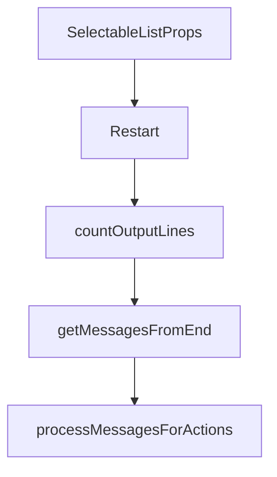

# Chapter 2: Core Modes and Session Workflow

Welcome to **Chapter 2: Core Modes and Session Workflow**. In this part of **Cipher Tutorial: Shared Memory Layer for Coding Agents**, you will build an intuitive mental model first, then move into concrete implementation details and practical production tradeoffs.


Cipher supports multiple run modes optimized for different integration points.

## Mode Overview

| Mode | Command | Typical Use |
|:-----|:--------|:------------|
| interactive CLI | `cipher` | manual memory-assisted workflows |
| API server | `cipher --mode api` | backend integration |
| MCP server | `cipher --mode mcp` | IDE/agent tool integration |
| Web UI | `cipher --mode ui` | browser-based operations |

## Source References

- [Cipher README CLI usage](https://github.com/campfirein/cipher/blob/main/README.md)

## Summary

You now understand which Cipher mode to run for each workflow type.

Next: [Chapter 3: Memory Architecture and Data Model](03-memory-architecture-and-data-model.md)

## Source Code Walkthrough

### `src/tui/components/selectable-list.tsx`

The `SelectableListProps` interface in [`src/tui/components/selectable-list.tsx`](https://github.com/campfirein/cipher/blob/HEAD/src/tui/components/selectable-list.tsx) handles a key part of this chapter's functionality:

```tsx
 * Props for SelectableList component.
 */
export interface SelectableListProps<T> {
  /** Available height in lines */
  availableHeight?: number
  /** Current/selected item (shows ● indicator) */
  currentItem?: T
  /** Keys to use for filtering (searched with fuzzy match) */
  filterKeys: (item: T) => string[]
  /** Function to get item key for comparison with currentItem */
  getCurrentKey?: (item: T) => string
  /** Optional grouping function */
  groupBy?: (item: T) => string
  /** Hide the Cancel keybind hint and disable Esc to cancel */
  hideCancelButton?: boolean
  /** Initial search value */
  initialSearch?: string
  /** Whether keyboard input is active */
  isActive?: boolean
  /** Array of items to display */
  items: T[]
  /** Custom keybinds */
  keybinds?: Array<{
    action: (item: T) => void
    key: string
    label: string
  }>
  /** Function to get unique key for each item */
  keyExtractor: (item: T) => string
  /** Callback when selection is cancelled (Esc) */
  onCancel?: () => void
  /** Callback when an item is selected */
```

This interface is important because it defines how Cipher Tutorial: Shared Memory Layer for Coding Agents implements the patterns covered in this chapter.

### `src/oclif/commands/restart.ts`

The `Restart` class in [`src/oclif/commands/restart.ts`](https://github.com/campfirein/cipher/blob/HEAD/src/oclif/commands/restart.ts) handles a key part of this chapter's functionality:

```ts
const SIGTERM_BUDGET_MS = 8000

export default class Restart extends Command {
  static description = `Restart ByteRover — stop everything and start fresh.

Run this when ByteRover is unresponsive, stuck, or after installing an update.
All open sessions and background processes are stopped.
The daemon will restart automatically on the next brv command.`
  static examples = ['<%= config.bin %> <%= command.id %>']
  /** Commands whose processes must not be killed (e.g. `brv update` calls `brv restart`). */
  private static readonly PROTECTED_COMMANDS = ['update']
  /** Server/agent patterns — cannot match CLI processes, no self-kill risk. */
  private static readonly SERVER_AGENT_PATTERNS = ['brv-server.js', 'agent-process.js']

  /**
   * Builds the list of CLI script patterns used to identify brv client processes.
   *
   * All patterns are absolute paths or specific filenames to avoid false-positive matches
   * against other oclif CLIs (which also use bin/run.js and bin/dev.js conventions).
   *
   * CLI script patterns (covers all installations):
   *   dev mode (bin/dev.js):       join(brvBinDir, 'dev.js') — absolute path, same installation only
   *   build/dev (bin/run.js):      join(brvBinDir, 'run.js')
   *   global install (npm / tgz):  byterover-cli/bin/run.js — package name in node_modules is fixed
   *   bundled binary (oclif pack): join('bin', 'brv') + argv1
   *   nvm / system global:         cmdline = node .../bin/brv  ← caught by 'bin/brv' substring
   *   curl install (/.brv-cli/):   join(brvBinDir, 'run') — entry point named 'run' without .js
   *
   * Set deduplicates when paths overlap (e.g. process.argv[1] is already run.js).
   */
  static buildCliPatterns(): string[] {
    const argv1 = resolve(process.argv[1])
```

This class is important because it defines how Cipher Tutorial: Shared Memory Layer for Coding Agents implements the patterns covered in this chapter.

### `src/tui/components/init.tsx`

The `countOutputLines` function in [`src/tui/components/init.tsx`](https://github.com/campfirein/cipher/blob/HEAD/src/tui/components/init.tsx) handles a key part of this chapter's functionality:

```tsx
 * @returns Total number of lines across all messages
 */
function countOutputLines(messages: StreamingMessage[]): number {
  let total = 0
  for (const msg of messages) {
    total += msg.content.split('\n').length
  }

  return total
}

/**
 * Get messages from the end that fit within maxLines, truncating from the beginning
 *
 * @param messages - Array of streaming messages
 * @param maxLines - Maximum number of lines to display
 * @returns Object containing display messages, skipped lines count, and total lines
 */
function getMessagesFromEnd(
  messages: StreamingMessage[],
  maxLines: number,
): {displayMessages: StreamingMessage[]; skippedLines: number; totalLines: number} {
  const totalLines = countOutputLines(messages)

  if (totalLines <= maxLines) {
    return {displayMessages: messages, skippedLines: 0, totalLines}
  }

  const displayMessages: StreamingMessage[] = []
  let lineCount = 0

  // Iterate from the end (newest messages first)
```

This function is important because it defines how Cipher Tutorial: Shared Memory Layer for Coding Agents implements the patterns covered in this chapter.

### `src/tui/components/init.tsx`

The `getMessagesFromEnd` function in [`src/tui/components/init.tsx`](https://github.com/campfirein/cipher/blob/HEAD/src/tui/components/init.tsx) handles a key part of this chapter's functionality:

```tsx
 * @returns Object containing display messages, skipped lines count, and total lines
 */
function getMessagesFromEnd(
  messages: StreamingMessage[],
  maxLines: number,
): {displayMessages: StreamingMessage[]; skippedLines: number; totalLines: number} {
  const totalLines = countOutputLines(messages)

  if (totalLines <= maxLines) {
    return {displayMessages: messages, skippedLines: 0, totalLines}
  }

  const displayMessages: StreamingMessage[] = []
  let lineCount = 0

  // Iterate from the end (newest messages first)
  for (let i = messages.length - 1; i >= 0; i--) {
    const msg = messages[i]
    const msgLineArray = msg.content.split('\n')
    const msgLineCount = msgLineArray.length

    if (lineCount + msgLineCount <= maxLines) {
      displayMessages.unshift(msg)
      lineCount += msgLineCount
    } else {
      const remainingSpace = maxLines - lineCount
      if (remainingSpace > 0) {
        const truncatedContent = msgLineArray.slice(-remainingSpace).join('\n')
        displayMessages.unshift({
          ...msg,
          content: truncatedContent,
        })
```

This function is important because it defines how Cipher Tutorial: Shared Memory Layer for Coding Agents implements the patterns covered in this chapter.


## How These Components Connect


