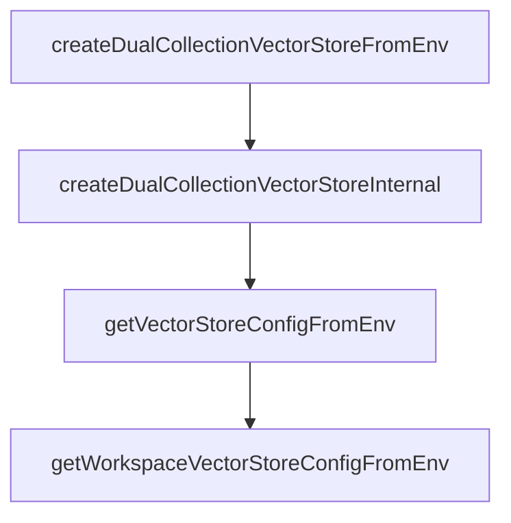

# Chapter 3: Memory Architecture and Data Model

Welcome to **Chapter 3: Memory Architecture and Data Model**. In this part of **Cipher Tutorial: Shared Memory Layer for Coding Agents**, you will build an intuitive mental model first, then move into concrete implementation details and practical production tradeoffs.


Cipher captures and retrieves coding memory across interactions, including knowledge and reasoning patterns.

## Memory Layers

| Layer | Purpose |
|:------|:--------|
| knowledge memory | reusable facts and implementation context |
| reasoning/reflection memory | higher-order reasoning traces and patterns |
| workspace memory | team/project-scoped shared context |

## Source References

- [Cipher README overview](https://github.com/campfirein/cipher/blob/main/README.md)
- [Built-in tools docs](https://github.com/campfirein/cipher/blob/main/docs/builtin-tools.md)

## Summary

You now understand the high-level memory model that powers Cipher across agent interactions.

Next: [Chapter 4: Configuration, Providers, and Embeddings](04-configuration-providers-and-embeddings.md)

## Depth Expansion Playbook

## Source Code Walkthrough

### `src/core/vector_storage/factory.ts`

The `createDualCollectionVectorStoreFromEnv` function in [`src/core/vector_storage/factory.ts`](https://github.com/campfirein/cipher/blob/HEAD/src/core/vector_storage/factory.ts) handles a key part of this chapter's functionality:

```ts
 * process.env.REFLECTION_VECTOR_STORE_COLLECTION = 'reflection_memory';
 *
 * const { manager, knowledgeStore, reflectionStore } = await createDualCollectionVectorStoreFromEnv();
 * ```
 */
export async function createDualCollectionVectorStoreFromEnv(
	agentConfig?: any
): Promise<DualCollectionVectorFactory> {
	const logger = createLogger({ level: env.CIPHER_LOG_LEVEL });

	// Get base configuration from environment variables
	const config = getVectorStoreConfigFromEnv(agentConfig);
	// console.log('createDualCollectionVectorStoreFromEnv config', config)
	// Use ServiceCache to prevent duplicate dual collection vector store creation
	const serviceCache = getServiceCache();
	const cacheKey = createServiceKey('dualCollectionVectorStore', {
		type: config.type,
		collection: config.collectionName,
		reflectionCollection: env.REFLECTION_VECTOR_STORE_COLLECTION || '',
		// Include dimension for proper cache key differentiation
		dimension: config.dimension,
	});

	return await serviceCache.getOrCreate(cacheKey, async () => {
		logger.debug('Creating new dual collection vector store instance');
		return await createDualCollectionVectorStoreInternal(config, logger);
	});
}

async function createDualCollectionVectorStoreInternal(
	config: VectorStoreConfig,
	logger: any
```

This function is important because it defines how Cipher Tutorial: Shared Memory Layer for Coding Agents implements the patterns covered in this chapter.

### `src/core/vector_storage/factory.ts`

The `createDualCollectionVectorStoreInternal` function in [`src/core/vector_storage/factory.ts`](https://github.com/campfirein/cipher/blob/HEAD/src/core/vector_storage/factory.ts) handles a key part of this chapter's functionality:

```ts
	return await serviceCache.getOrCreate(cacheKey, async () => {
		logger.debug('Creating new dual collection vector store instance');
		return await createDualCollectionVectorStoreInternal(config, logger);
	});
}

async function createDualCollectionVectorStoreInternal(
	config: VectorStoreConfig,
	logger: any
): Promise<DualCollectionVectorFactory> {
	// If reflection collection is not set or is empty/whitespace, treat as disabled
	const reflectionCollection = (env.REFLECTION_VECTOR_STORE_COLLECTION || '').trim();
	if (!reflectionCollection) {
		logger.info(
			`${LOG_PREFIXES.FACTORY} Reflection collection not set, creating single collection manager only`,
			{
				type: config.type,
				knowledgeCollection: config.collectionName,
			}
		);
		const manager = new DualCollectionVectorManager(config);

		try {
			await manager.connect();
			const knowledgeStore = manager.getStore('knowledge');
			if (!knowledgeStore) {
				throw new Error('Failed to get knowledge store from dual collection manager');
			}
			return {
				manager,
				knowledgeStore,
				reflectionStore: null,
```

This function is important because it defines how Cipher Tutorial: Shared Memory Layer for Coding Agents implements the patterns covered in this chapter.

### `src/core/vector_storage/factory.ts`

The `getVectorStoreConfigFromEnv` function in [`src/core/vector_storage/factory.ts`](https://github.com/campfirein/cipher/blob/HEAD/src/core/vector_storage/factory.ts) handles a key part of this chapter's functionality:

```ts

	// Get configuration from environment variables
	const config = getVectorStoreConfigFromEnv(agentConfig);
	// console.log('config', config);
	logger.info(`${LOG_PREFIXES.FACTORY} Creating vector storage from environment`, {
		type: config.type,
		collection: config.collectionName,
		dimension: config.dimension,
	});

	return createVectorStore(config);
}

/**
 * Creates dual collection vector storage from environment variables
 *
 * Creates a dual collection manager that handles both knowledge and reflection
 * memory collections. Reflection collection is only created if REFLECTION_VECTOR_STORE_COLLECTION
 * is set and the model supports reasoning.
 *
 * @param agentConfig - Optional agent configuration to override dimension from embedding config
 * @returns Promise resolving to dual collection manager and stores
 *
 * @example
 * ```typescript
 * // Set environment variables for reasoning model with dual collections
 * process.env.VECTOR_STORE_TYPE = 'in-memory';
 * process.env.VECTOR_STORE_COLLECTION = 'knowledge';
 * process.env.REFLECTION_VECTOR_STORE_COLLECTION = 'reflection_memory';
 *
 * const { manager, knowledgeStore, reflectionStore } = await createDualCollectionVectorStoreFromEnv();
 * ```
```

This function is important because it defines how Cipher Tutorial: Shared Memory Layer for Coding Agents implements the patterns covered in this chapter.

### `src/core/vector_storage/factory.ts`

The `getWorkspaceVectorStoreConfigFromEnv` function in [`src/core/vector_storage/factory.ts`](https://github.com/campfirein/cipher/blob/HEAD/src/core/vector_storage/factory.ts) handles a key part of this chapter's functionality:

```ts
 * @example
 * ```typescript
 * const config = getWorkspaceVectorStoreConfigFromEnv();
 * console.log('Workspace vector store configuration:', config);
 *
 * // Then use the config to create workspace store
 * const { manager, store } = await createVectorStore(config);
 * ```
 */
export function getWorkspaceVectorStoreConfigFromEnv(agentConfig?: any): VectorStoreConfig {
	const logger = createLogger({ level: env.CIPHER_LOG_LEVEL });

	// Get workspace-specific configuration with fallbacks to default vector store config
	const storeType = env.WORKSPACE_VECTOR_STORE_TYPE || env.VECTOR_STORE_TYPE;
	const collectionName = env.WORKSPACE_VECTOR_STORE_COLLECTION || 'workspace_memory';
	let dimension =
		env.WORKSPACE_VECTOR_STORE_DIMENSION !== undefined &&
		!Number.isNaN(env.WORKSPACE_VECTOR_STORE_DIMENSION)
			? env.WORKSPACE_VECTOR_STORE_DIMENSION
			: env.VECTOR_STORE_DIMENSION !== undefined && !Number.isNaN(env.VECTOR_STORE_DIMENSION)
				? env.VECTOR_STORE_DIMENSION
				: 1536;
	const maxVectors =
		env.WORKSPACE_VECTOR_STORE_MAX_VECTORS !== undefined &&
		!Number.isNaN(env.WORKSPACE_VECTOR_STORE_MAX_VECTORS)
			? env.WORKSPACE_VECTOR_STORE_MAX_VECTORS
			: env.VECTOR_STORE_MAX_VECTORS !== undefined && !Number.isNaN(env.VECTOR_STORE_MAX_VECTORS)
				? env.VECTOR_STORE_MAX_VECTORS
				: 10000;

	// Override dimension from agent config if embedding configuration is present
	if (
```

This function is important because it defines how Cipher Tutorial: Shared Memory Layer for Coding Agents implements the patterns covered in this chapter.


## How These Components Connect


