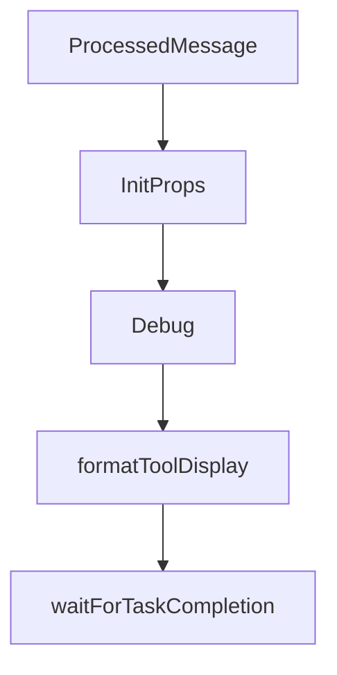

# Chapter 3: Memory Architecture and Data Model

Welcome to **Chapter 3: Memory Architecture and Data Model**. In this part of **Cipher Tutorial: Shared Memory Layer for Coding Agents**, you will build an intuitive mental model first, then move into concrete implementation details and practical production tradeoffs.


Cipher captures and retrieves coding memory across interactions, including knowledge and reasoning patterns.

## Memory Layers

| Layer | Purpose |
|:------|:--------|
| knowledge memory | reusable facts and implementation context |
| reasoning/reflection memory | higher-order reasoning traces and patterns |
| workspace memory | team/project-scoped shared context |

## Source References

- [Cipher README overview](https://github.com/campfirein/cipher/blob/main/README.md)
- [Built-in tools docs](https://github.com/campfirein/cipher/blob/main/docs/builtin-tools.md)

## Summary

You now understand the high-level memory model that powers Cipher across agent interactions.

Next: [Chapter 4: Configuration, Providers, and Embeddings](04-configuration-providers-and-embeddings.md)

## Source Code Walkthrough

### `src/tui/components/init.tsx`

The `ProcessedMessage` interface in [`src/tui/components/init.tsx`](https://github.com/campfirein/cipher/blob/HEAD/src/tui/components/init.tsx) handles a key part of this chapter's functionality:

```tsx
 * Includes action state for spinner display
 */
export interface ProcessedMessage extends StreamingMessage {
  /** For action_start: whether the action is still running (no matching action_stop) */
  isActionRunning?: boolean
  /** For action_start: the completion message from action_stop */
  stopMessage?: string
}

/**
 * Count the total number of lines in streaming messages (simple newline count)
 *
 * @param messages - Array of streaming messages
 * @returns Total number of lines across all messages
 */
function countOutputLines(messages: StreamingMessage[]): number {
  let total = 0
  for (const msg of messages) {
    total += msg.content.split('\n').length
  }

  return total
}

/**
 * Get messages from the end that fit within maxLines, truncating from the beginning
 *
 * @param messages - Array of streaming messages
 * @param maxLines - Maximum number of lines to display
 * @returns Object containing display messages, skipped lines count, and total lines
 */
function getMessagesFromEnd(
```

This interface is important because it defines how Cipher Tutorial: Shared Memory Layer for Coding Agents implements the patterns covered in this chapter.

### `src/tui/components/init.tsx`

The `InitProps` interface in [`src/tui/components/init.tsx`](https://github.com/campfirein/cipher/blob/HEAD/src/tui/components/init.tsx) handles a key part of this chapter's functionality:

```tsx
const INLINE_SEARCH_OVERHEAD = 3

export interface InitProps {
  /** Whether the component should be interactive (for EnterPrompt activation) */
  active?: boolean

  /** Auto-start init without waiting for Enter key in idle state */
  autoStart?: boolean

  /** Custom idle state message (optional) */
  idleMessage?: string

  /** Maximum lines available for streaming output */
  maxOutputLines: number

  /** Optional callback when init completes successfully */
  onInitComplete?: () => void

  /** Show idle state message? (default: true for InitView, false for OnboardingFlow) */
  showIdleMessage?: boolean
}

export const Init: React.FC<InitProps> = ({
  active = true,
  autoStart = false,
  idleMessage = 'Your project needs initializing.',
  maxOutputLines,
  onInitComplete,
  showIdleMessage = true,
}) => {
  const {
    theme: {colors},
```

This interface is important because it defines how Cipher Tutorial: Shared Memory Layer for Coding Agents implements the patterns covered in this chapter.

### `src/oclif/commands/debug.ts`

The `Debug` class in [`src/oclif/commands/debug.ts`](https://github.com/campfirein/cipher/blob/HEAD/src/oclif/commands/debug.ts) handles a key part of this chapter's functionality:

```ts
}

export default class Debug extends Command {
  public static description = 'Live monitor for daemon internal state (development only)'
  public static examples = [
    '<%= config.bin %> <%= command.id %>',
    '<%= config.bin %> <%= command.id %> --format json',
    '<%= config.bin %> <%= command.id %> --once',
  ]
  public static flags = {
    force: Flags.boolean({
      default: false,
      description: 'Kill existing daemon and start fresh',
    }),
    format: Flags.string({
      char: 'f',
      default: 'tree',
      description: 'Output format',
      options: ['tree', 'json'],
    }),
    once: Flags.boolean({
      default: false,
      description: 'Print once and exit (no live monitoring)',
    }),
  }
  public static hidden = !isDevelopment()

  protected clearScreen(): void {
    if (process.stdout.isTTY) {
      process.stdout.write('\u001B[2J\u001B[H')
    }
  }
```

This class is important because it defines how Cipher Tutorial: Shared Memory Layer for Coding Agents implements the patterns covered in this chapter.

### `src/oclif/lib/task-client.ts`

The `formatToolDisplay` function in [`src/oclif/lib/task-client.ts`](https://github.com/campfirein/cipher/blob/HEAD/src/oclif/lib/task-client.ts) handles a key part of this chapter's functionality:

```ts

/**
 * Format tool call for CLI display (simplified version of TUI formatToolDisplay).
 */
export function formatToolDisplay(toolName: string, args: Record<string, unknown>): string {
  switch (toolName.toLowerCase()) {
    case 'bash': {
      const cmd = args.command ? String(args.command) : ''
      return `Bash ${cmd.length > 60 ? `$ ${cmd.slice(0, 57)}...` : `$ ${cmd}`}`
    }

    case 'code_exec': {
      return 'CodeExec'
    }

    case 'edit': {
      const filePath = args.file_path ?? args.filePath
      return filePath ? `Edit ${filePath}` : 'Edit'
    }

    case 'glob': {
      const {path, pattern} = args
      return pattern ? `Glob "${pattern}"${path ? ` in ${path}` : ''}` : 'Glob'
    }

    case 'grep': {
      const {path, pattern} = args
      return pattern ? `Grep "${pattern}"${path ? ` in ${path}` : ''}` : 'Grep'
    }

    case 'read': {
      const filePath = args.file_path ?? args.filePath
```

This function is important because it defines how Cipher Tutorial: Shared Memory Layer for Coding Agents implements the patterns covered in this chapter.


## How These Components Connect


