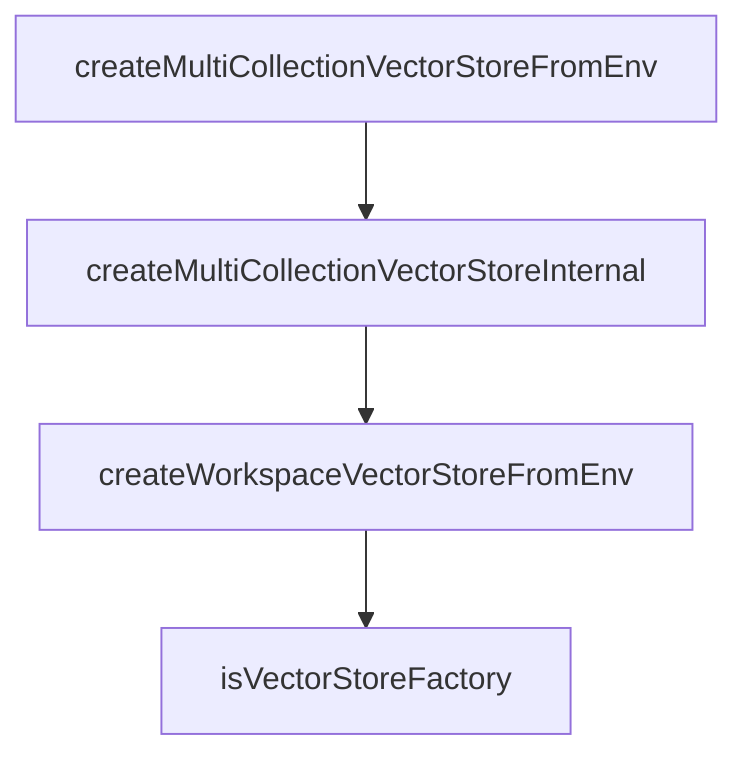

# Chapter 4: Configuration, Providers, and Embeddings

Welcome to **Chapter 4: Configuration, Providers, and Embeddings**. In this part of **Cipher Tutorial: Shared Memory Layer for Coding Agents**, you will build an intuitive mental model first, then move into concrete implementation details and practical production tradeoffs.


Cipher configuration starts in `memAgent/cipher.yml` and environment variables for secrets/runtime options.

## Config Focus Areas

- LLM provider and model selection
- embedding provider/model and dimensions
- optional MCP server definitions
- environment-level secret and deployment toggles

## Source References

- [Configuration guide](https://github.com/campfirein/cipher/blob/main/docs/configuration.md)
- [LLM provider docs](https://github.com/campfirein/cipher/blob/main/docs/llm-providers.md)
- [Embedding configuration docs](https://github.com/campfirein/cipher/blob/main/docs/embedding-configuration.md)

## Summary

You now have a configuration strategy for deterministic Cipher behavior across environments.

Next: [Chapter 5: Vector Stores and Workspace Memory](05-vector-stores-and-workspace-memory.md)

## Depth Expansion Playbook

## Source Code Walkthrough

### `src/core/vector_storage/factory.ts`

The `createMultiCollectionVectorStoreFromEnv` function in [`src/core/vector_storage/factory.ts`](https://github.com/campfirein/cipher/blob/HEAD/src/core/vector_storage/factory.ts) handles a key part of this chapter's functionality:

```ts
 * @returns Promise resolving to multi collection manager and stores
 */
export async function createMultiCollectionVectorStoreFromEnv(
	agentConfig?: any
): Promise<MultiCollectionVectorFactory> {
	const logger = createLogger({ level: env.CIPHER_LOG_LEVEL });

	// Import MultiCollectionVectorManager dynamically to avoid circular dependencies
	// const { MultiCollectionVectorManager } = await import('./multi-collection-manager.js'); // Not used in this scope

	// Get base configuration from environment
	const config = getVectorStoreConfigFromEnv(agentConfig);

	// Use ServiceCache to prevent duplicate multi collection vector store creation
	const serviceCache = getServiceCache();
	const cacheKey = createServiceKey('multiCollectionVectorStore', {
		type: config.type,
		collection: config.collectionName,
		reflectionCollection: env.REFLECTION_VECTOR_STORE_COLLECTION || '',
		workspaceCollection: env.WORKSPACE_VECTOR_STORE_COLLECTION || 'workspace_memory',
		workspaceEnabled: !!env.USE_WORKSPACE_MEMORY,
		// Include dimension for proper cache key differentiation
		dimension: config.dimension,
	});

	return await serviceCache.getOrCreate(cacheKey, async () => {
		logger.debug('Creating new multi collection vector store instance');
		return await createMultiCollectionVectorStoreInternal(config, logger);
	});
}

async function createMultiCollectionVectorStoreInternal(
```

This function is important because it defines how Cipher Tutorial: Shared Memory Layer for Coding Agents implements the patterns covered in this chapter.

### `src/core/vector_storage/factory.ts`

The `createMultiCollectionVectorStoreInternal` function in [`src/core/vector_storage/factory.ts`](https://github.com/campfirein/cipher/blob/HEAD/src/core/vector_storage/factory.ts) handles a key part of this chapter's functionality:

```ts
	return await serviceCache.getOrCreate(cacheKey, async () => {
		logger.debug('Creating new multi collection vector store instance');
		return await createMultiCollectionVectorStoreInternal(config, logger);
	});
}

async function createMultiCollectionVectorStoreInternal(
	config: VectorStoreConfig,
	logger: any
): Promise<MultiCollectionVectorFactory> {
	// Import MultiCollectionVectorManager dynamically
	const { MultiCollectionVectorManager } = await import('./multi-collection-manager.js');

	logger.info(`${LOG_PREFIXES.FACTORY} Creating multi collection vector storage from environment`, {
		type: config.type,
		knowledgeCollection: config.collectionName,
		reflectionCollection: env.REFLECTION_VECTOR_STORE_COLLECTION || 'disabled',
		workspaceCollection: env.USE_WORKSPACE_MEMORY
			? env.WORKSPACE_VECTOR_STORE_COLLECTION || 'workspace_memory'
			: 'disabled',
		workspaceEnabled: !!env.USE_WORKSPACE_MEMORY,
	});

	// Create multi collection manager
	const manager = new MultiCollectionVectorManager(config);

	try {
		const connected = await manager.connect();

		if (!connected) {
			throw new Error('Failed to connect multi collection vector manager');
		}
```

This function is important because it defines how Cipher Tutorial: Shared Memory Layer for Coding Agents implements the patterns covered in this chapter.

### `src/core/vector_storage/factory.ts`

The `createWorkspaceVectorStoreFromEnv` function in [`src/core/vector_storage/factory.ts`](https://github.com/campfirein/cipher/blob/HEAD/src/core/vector_storage/factory.ts) handles a key part of this chapter's functionality:

```ts
 * process.env.WORKSPACE_VECTOR_STORE_COLLECTION = 'team_workspace';
 *
 * const { manager, store } = await createWorkspaceVectorStoreFromEnv();
 * ```
 */
export async function createWorkspaceVectorStoreFromEnv(
	agentConfig?: any
): Promise<VectorStoreFactory> {
	const logger = createLogger({ level: env.CIPHER_LOG_LEVEL });

	// Get workspace-specific configuration from environment variables
	const config = getWorkspaceVectorStoreConfigFromEnv(agentConfig);

	logger.info(`${LOG_PREFIXES.FACTORY} Creating workspace memory vector storage from environment`, {
		type: config.type,
		collection: config.collectionName,
		dimension: config.dimension,
		workspaceSpecific: config.collectionName !== env.VECTOR_STORE_COLLECTION,
	});

	return createVectorStore(config);
}

/**
 * Type guard to check if an object is a VectorStoreFactory
 *
 * @param obj - Object to check
 * @returns true if the object has manager and store properties
 */
export function isVectorStoreFactory(obj: unknown): obj is VectorStoreFactory {
	return (
		typeof obj === 'object' &&
```

This function is important because it defines how Cipher Tutorial: Shared Memory Layer for Coding Agents implements the patterns covered in this chapter.

### `src/core/vector_storage/factory.ts`

The `isVectorStoreFactory` function in [`src/core/vector_storage/factory.ts`](https://github.com/campfirein/cipher/blob/HEAD/src/core/vector_storage/factory.ts) handles a key part of this chapter's functionality:

```ts
 * @returns true if the object has manager and store properties
 */
export function isVectorStoreFactory(obj: unknown): obj is VectorStoreFactory {
	return (
		typeof obj === 'object' &&
		obj !== null &&
		'manager' in obj &&
		'store' in obj &&
		obj.manager instanceof VectorStoreManager
	);
}

/**
 * Check if Qdrant configuration is available in environment
 */
export function isQdrantConfigAvailable(): boolean {
	return !!(
		process.env.VECTOR_STORE_URL ||
		process.env.VECTOR_STORE_HOST ||
		process.env.VECTOR_STORE_PORT
	);
}

```

This function is important because it defines how Cipher Tutorial: Shared Memory Layer for Coding Agents implements the patterns covered in this chapter.


## How These Components Connect


