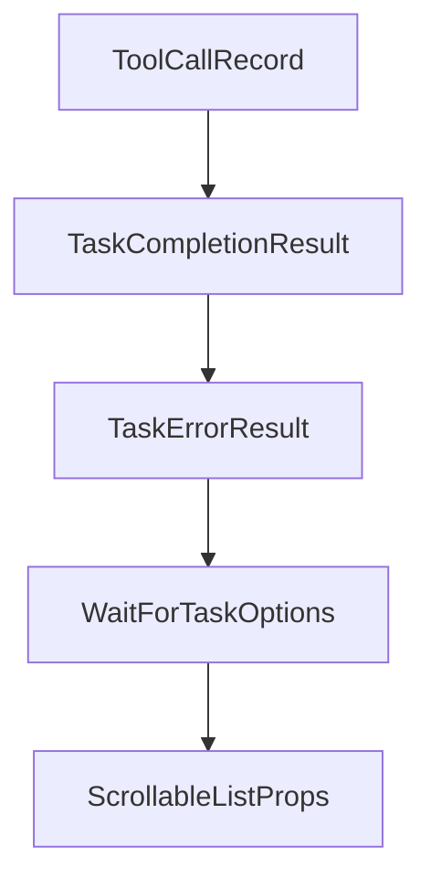

# Chapter 4: Configuration, Providers, and Embeddings

Welcome to **Chapter 4: Configuration, Providers, and Embeddings**. In this part of **Cipher Tutorial: Shared Memory Layer for Coding Agents**, you will build an intuitive mental model first, then move into concrete implementation details and practical production tradeoffs.


Cipher configuration starts in `memAgent/cipher.yml` and environment variables for secrets/runtime options.

## Config Focus Areas

- LLM provider and model selection
- embedding provider/model and dimensions
- optional MCP server definitions
- environment-level secret and deployment toggles

## Source References

- [Configuration guide](https://github.com/campfirein/cipher/blob/main/docs/configuration.md)
- [LLM provider docs](https://github.com/campfirein/cipher/blob/main/docs/llm-providers.md)
- [Embedding configuration docs](https://github.com/campfirein/cipher/blob/main/docs/embedding-configuration.md)

## Summary

You now have a configuration strategy for deterministic Cipher behavior across environments.

Next: [Chapter 5: Vector Stores and Workspace Memory](05-vector-stores-and-workspace-memory.md)

## Source Code Walkthrough

### `src/oclif/lib/task-client.ts`

The `ToolCallRecord` interface in [`src/oclif/lib/task-client.ts`](https://github.com/campfirein/cipher/blob/HEAD/src/oclif/lib/task-client.ts) handles a key part of this chapter's functionality:

```ts

/** Collected tool call with result (mirrors TUI ToolCallEvent) */
export interface ToolCallRecord {
  args: Record<string, unknown>
  callId?: string
  error?: string
  result?: unknown
  status: 'completed' | 'error' | 'running'
  success?: boolean
  toolName: string
}

/** Completion result passed to onCompleted callback */
export interface TaskCompletionResult {
  logId?: string
  result?: string
  taskId: string
  toolCalls: ToolCallRecord[]
}

/** Error result passed to onError callback */
export interface TaskErrorResult {
  error: {code?: string; message: string}
  logId?: string
  taskId: string
  toolCalls: ToolCallRecord[]
}

/** Options for waitForTaskCompletion */
export interface WaitForTaskOptions {
  /** Client to subscribe events on */
  client: ITransportClient
```

This interface is important because it defines how Cipher Tutorial: Shared Memory Layer for Coding Agents implements the patterns covered in this chapter.

### `src/oclif/lib/task-client.ts`

The `TaskCompletionResult` interface in [`src/oclif/lib/task-client.ts`](https://github.com/campfirein/cipher/blob/HEAD/src/oclif/lib/task-client.ts) handles a key part of this chapter's functionality:

```ts

/** Completion result passed to onCompleted callback */
export interface TaskCompletionResult {
  logId?: string
  result?: string
  taskId: string
  toolCalls: ToolCallRecord[]
}

/** Error result passed to onError callback */
export interface TaskErrorResult {
  error: {code?: string; message: string}
  logId?: string
  taskId: string
  toolCalls: ToolCallRecord[]
}

/** Options for waitForTaskCompletion */
export interface WaitForTaskOptions {
  /** Client to subscribe events on */
  client: ITransportClient
  /** Command name for JSON output */
  command: string
  /** Output format */
  format: 'json' | 'text'
  /** Called on task:completed */
  onCompleted: (result: TaskCompletionResult) => void
  /** Called on task:error */
  onError: (result: TaskErrorResult) => void
  /** Called on llmservice:response (optional, used by query to display final answer) */
  onResponse?: (content: string, taskId: string) => void
  /** Task ID to wait for */
```

This interface is important because it defines how Cipher Tutorial: Shared Memory Layer for Coding Agents implements the patterns covered in this chapter.

### `src/oclif/lib/task-client.ts`

The `TaskErrorResult` interface in [`src/oclif/lib/task-client.ts`](https://github.com/campfirein/cipher/blob/HEAD/src/oclif/lib/task-client.ts) handles a key part of this chapter's functionality:

```ts

/** Error result passed to onError callback */
export interface TaskErrorResult {
  error: {code?: string; message: string}
  logId?: string
  taskId: string
  toolCalls: ToolCallRecord[]
}

/** Options for waitForTaskCompletion */
export interface WaitForTaskOptions {
  /** Client to subscribe events on */
  client: ITransportClient
  /** Command name for JSON output */
  command: string
  /** Output format */
  format: 'json' | 'text'
  /** Called on task:completed */
  onCompleted: (result: TaskCompletionResult) => void
  /** Called on task:error */
  onError: (result: TaskErrorResult) => void
  /** Called on llmservice:response (optional, used by query to display final answer) */
  onResponse?: (content: string, taskId: string) => void
  /** Task ID to wait for */
  taskId: string
  /** Timeout in ms (default: 5 minutes) */
  timeoutMs?: number
}

/** Grace period before treating 'reconnecting' as daemon death (ms) */
const DISCONNECT_GRACE_MS = 10_000
/** Default timeout for task completion (ms) */
```

This interface is important because it defines how Cipher Tutorial: Shared Memory Layer for Coding Agents implements the patterns covered in this chapter.

### `src/oclif/lib/task-client.ts`

The `WaitForTaskOptions` interface in [`src/oclif/lib/task-client.ts`](https://github.com/campfirein/cipher/blob/HEAD/src/oclif/lib/task-client.ts) handles a key part of this chapter's functionality:

```ts

/** Options for waitForTaskCompletion */
export interface WaitForTaskOptions {
  /** Client to subscribe events on */
  client: ITransportClient
  /** Command name for JSON output */
  command: string
  /** Output format */
  format: 'json' | 'text'
  /** Called on task:completed */
  onCompleted: (result: TaskCompletionResult) => void
  /** Called on task:error */
  onError: (result: TaskErrorResult) => void
  /** Called on llmservice:response (optional, used by query to display final answer) */
  onResponse?: (content: string, taskId: string) => void
  /** Task ID to wait for */
  taskId: string
  /** Timeout in ms (default: 5 minutes) */
  timeoutMs?: number
}

/** Grace period before treating 'reconnecting' as daemon death (ms) */
const DISCONNECT_GRACE_MS = 10_000
/** Default timeout for task completion (ms) */
const DEFAULT_TIMEOUT_MS = 5 * 60 * 1000

/**
 * Format tool call for CLI display (simplified version of TUI formatToolDisplay).
 */
export function formatToolDisplay(toolName: string, args: Record<string, unknown>): string {
  switch (toolName.toLowerCase()) {
    case 'bash': {
```

This interface is important because it defines how Cipher Tutorial: Shared Memory Layer for Coding Agents implements the patterns covered in this chapter.


## How These Components Connect


