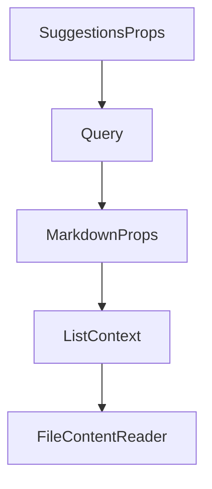

# Chapter 5: Vector Stores and Workspace Memory

Welcome to **Chapter 5: Vector Stores and Workspace Memory**. In this part of **Cipher Tutorial: Shared Memory Layer for Coding Agents**, you will build an intuitive mental model first, then move into concrete implementation details and practical production tradeoffs.


Cipher supports multiple vector backends and optional workspace-scoped memory for team collaboration.

## Storage Strategy

| Component | Common Options |
|:----------|:---------------|
| vector store | Qdrant, Milvus, in-memory |
| chat/session history | SQLite or PostgreSQL paths |
| workspace memory | enabled via dedicated config/env settings |

## Source References

- [Vector stores docs](https://github.com/campfirein/cipher/blob/main/docs/vector-stores.md)
- [Workspace memory docs](https://github.com/campfirein/cipher/blob/main/docs/workspace-memory.md)
- [Chat history docs](https://github.com/campfirein/cipher/blob/main/docs/chat-history.md)

## Summary

You now know how to choose and operate Cipher storage backends for single-user and team scenarios.

Next: [Chapter 6: MCP Integration Patterns](06-mcp-integration-patterns.md)

## Source Code Walkthrough

### `src/tui/components/suggestions.tsx`

The `SuggestionsProps` interface in [`src/tui/components/suggestions.tsx`](https://github.com/campfirein/cipher/blob/HEAD/src/tui/components/suggestions.tsx) handles a key part of this chapter's functionality:

```tsx
const MAX_VISIBLE_ITEMS = 7

interface SuggestionsProps {
  input: string
  onInsert?: (value: string) => void
  onSelect?: (value: string) => void
}

export const Suggestions: React.FC<SuggestionsProps> = ({input, onInsert, onSelect}) => {
  const {
    theme: {colors},
  } = useTheme()
  const {mode, setMode} = useMode()
  const {
    activeIndex,
    clearSuggestions,
    hasMatchedCommand,
    isCommandAttempt,
    nextSuggestion,
    prevSuggestion,
    selectSuggestion,
    suggestions,
  } = useSlashCompletion(input)

  // Track if user dismissed suggestions with Escape
  const isDismissedRef = useRef(false)
  const prevInputRef = useRef(input)

  // Reset dismissed state when input changes
  useEffect(() => {
    if (input !== prevInputRef.current) {
      isDismissedRef.current = false
```

This interface is important because it defines how Cipher Tutorial: Shared Memory Layer for Coding Agents implements the patterns covered in this chapter.

### `src/oclif/commands/query.ts`

The `Query` class in [`src/oclif/commands/query.ts`](https://github.com/campfirein/cipher/blob/HEAD/src/oclif/commands/query.ts) handles a key part of this chapter's functionality:

```ts

/** Parsed flags type */
type QueryFlags = {
  format?: 'json' | 'text'
}

export default class Query extends Command {
  public static args = {
    query: Args.string({
      description: 'Natural language question about your codebase or project knowledge',
      required: true,
    }),
  }
  public static description = `Query and retrieve information from the context tree

Good:
- "How is user authentication implemented?"
- "What are the API rate limits and where are they enforced?"
Bad:
- "auth" or "authentication" (too vague, not a question)
- "show me code" (not specific about what information is needed)`
  public static examples = [
    '# Ask questions about patterns, decisions, or implementation details',
    '<%= config.bin %> <%= command.id %> What are the coding standards?',
    '<%= config.bin %> <%= command.id %> How is authentication implemented?',
    '',
    '# JSON output (for automation)',
    '<%= config.bin %> <%= command.id %> "How does auth work?" --format json',
  ]
  public static flags = {
    format: Flags.string({
      default: 'text',
```

This class is important because it defines how Cipher Tutorial: Shared Memory Layer for Coding Agents implements the patterns covered in this chapter.

### `src/tui/components/markdown.tsx`

The `MarkdownProps` interface in [`src/tui/components/markdown.tsx`](https://github.com/campfirein/cipher/blob/HEAD/src/tui/components/markdown.tsx) handles a key part of this chapter's functionality:

```tsx
import {useTheme} from '../hooks/index.js'

interface MarkdownProps {
  children: string
}

interface ListContext {
  index: number
  ordered: boolean
}

const renderPhrasingContent = (nodes: PhrasingContent[], theme: Theme): React.ReactNode => nodes.map((node, index) => {
  switch (node.type) {
    case 'break': {
      return <Text key={index}>{'\n'}</Text>
    }

    case 'emphasis': {
      return (
        <Text italic key={index}>
          {renderPhrasingContent((node as Emphasis).children, theme)}
        </Text>
      )
    }

    case 'inlineCode': {
      return (
        <Text backgroundColor={theme.colors.bg2} key={index}>
          {(node as InlineCode).value}
        </Text>
      )
    }
```

This interface is important because it defines how Cipher Tutorial: Shared Memory Layer for Coding Agents implements the patterns covered in this chapter.

### `src/tui/components/markdown.tsx`

The `ListContext` interface in [`src/tui/components/markdown.tsx`](https://github.com/campfirein/cipher/blob/HEAD/src/tui/components/markdown.tsx) handles a key part of this chapter's functionality:

```tsx
}

interface ListContext {
  index: number
  ordered: boolean
}

const renderPhrasingContent = (nodes: PhrasingContent[], theme: Theme): React.ReactNode => nodes.map((node, index) => {
  switch (node.type) {
    case 'break': {
      return <Text key={index}>{'\n'}</Text>
    }

    case 'emphasis': {
      return (
        <Text italic key={index}>
          {renderPhrasingContent((node as Emphasis).children, theme)}
        </Text>
      )
    }

    case 'inlineCode': {
      return (
        <Text backgroundColor={theme.colors.bg2} key={index}>
          {(node as InlineCode).value}
        </Text>
      )
    }

    case 'link': {
      return (
        <Text color={theme.colors.info} key={index} underline>
```

This interface is important because it defines how Cipher Tutorial: Shared Memory Layer for Coding Agents implements the patterns covered in this chapter.


## How These Components Connect


