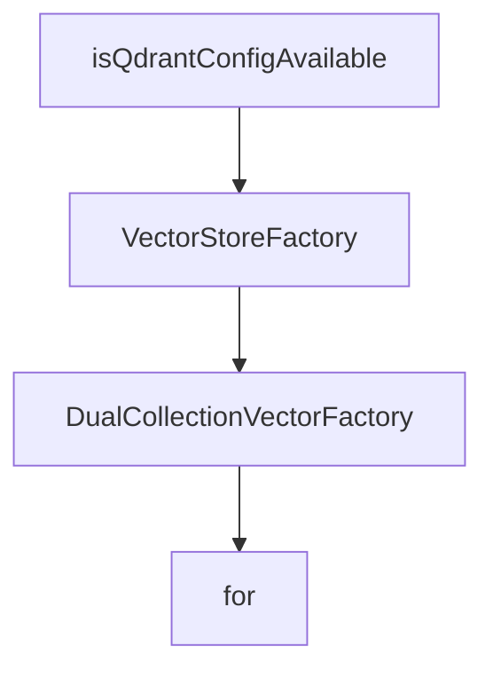

# Chapter 5: Vector Stores and Workspace Memory

Welcome to **Chapter 5: Vector Stores and Workspace Memory**. In this part of **Cipher Tutorial: Shared Memory Layer for Coding Agents**, you will build an intuitive mental model first, then move into concrete implementation details and practical production tradeoffs.


Cipher supports multiple vector backends and optional workspace-scoped memory for team collaboration.

## Storage Strategy

| Component | Common Options |
|:----------|:---------------|
| vector store | Qdrant, Milvus, in-memory |
| chat/session history | SQLite or PostgreSQL paths |
| workspace memory | enabled via dedicated config/env settings |

## Source References

- [Vector stores docs](https://github.com/campfirein/cipher/blob/main/docs/vector-stores.md)
- [Workspace memory docs](https://github.com/campfirein/cipher/blob/main/docs/workspace-memory.md)
- [Chat history docs](https://github.com/campfirein/cipher/blob/main/docs/chat-history.md)

## Summary

You now know how to choose and operate Cipher storage backends for single-user and team scenarios.

Next: [Chapter 6: MCP Integration Patterns](06-mcp-integration-patterns.md)

## Depth Expansion Playbook

## Source Code Walkthrough

### `src/core/vector_storage/factory.ts`

The `isQdrantConfigAvailable` function in [`src/core/vector_storage/factory.ts`](https://github.com/campfirein/cipher/blob/HEAD/src/core/vector_storage/factory.ts) handles a key part of this chapter's functionality:

```ts
 * Check if Qdrant configuration is available in environment
 */
export function isQdrantConfigAvailable(): boolean {
	return !!(
		process.env.VECTOR_STORE_URL ||
		process.env.VECTOR_STORE_HOST ||
		process.env.VECTOR_STORE_PORT
	);
}

```

This function is important because it defines how Cipher Tutorial: Shared Memory Layer for Coding Agents implements the patterns covered in this chapter.

### `src/core/vector_storage/factory.ts`

The `VectorStoreFactory` interface in [`src/core/vector_storage/factory.ts`](https://github.com/campfirein/cipher/blob/HEAD/src/core/vector_storage/factory.ts) handles a key part of this chapter's functionality:

```ts
 * Factory result containing both the manager and vector store
 */
export interface VectorStoreFactory {
	/** The vector store manager instance for lifecycle control */
	manager: VectorStoreManager;
	/** The connected vector store ready for use */
	store: VectorStore;
}

/**
 * Dual collection factory result containing dual manager and stores
 */
export interface DualCollectionVectorFactory {
	/** The dual collection manager instance for lifecycle control */
	manager: DualCollectionVectorManager;
	/** The knowledge vector store ready for use */
	knowledgeStore: VectorStore;
	/** The reflection vector store ready for use (null if disabled) */
	reflectionStore: VectorStore | null;
}

/**
 * Creates and connects vector storage backend
 *
 * This is the primary factory function for initializing the vector storage system.
 * It creates a VectorStoreManager, connects to the configured backend, and
 * returns both the manager and the connected vector store.
 *
 * @param config - Vector storage configuration
 * @returns Promise resolving to manager and connected vector store
 * @throws {VectorStoreConnectionError} If connection fails and no fallback is available
 *
```

This interface is important because it defines how Cipher Tutorial: Shared Memory Layer for Coding Agents implements the patterns covered in this chapter.

### `src/core/vector_storage/factory.ts`

The `DualCollectionVectorFactory` interface in [`src/core/vector_storage/factory.ts`](https://github.com/campfirein/cipher/blob/HEAD/src/core/vector_storage/factory.ts) handles a key part of this chapter's functionality:

```ts
 * Dual collection factory result containing dual manager and stores
 */
export interface DualCollectionVectorFactory {
	/** The dual collection manager instance for lifecycle control */
	manager: DualCollectionVectorManager;
	/** The knowledge vector store ready for use */
	knowledgeStore: VectorStore;
	/** The reflection vector store ready for use (null if disabled) */
	reflectionStore: VectorStore | null;
}

/**
 * Creates and connects vector storage backend
 *
 * This is the primary factory function for initializing the vector storage system.
 * It creates a VectorStoreManager, connects to the configured backend, and
 * returns both the manager and the connected vector store.
 *
 * @param config - Vector storage configuration
 * @returns Promise resolving to manager and connected vector store
 * @throws {VectorStoreConnectionError} If connection fails and no fallback is available
 *
 * @example
 * ```typescript
 * // Basic usage with Qdrant
 * const { manager, store } = await createVectorStore({
 *   type: 'qdrant',
 *   host: 'localhost',
 *   port: 6333,
 *   collectionName: 'documents',
 *   dimension: 1536
 * });
```

This interface is important because it defines how Cipher Tutorial: Shared Memory Layer for Coding Agents implements the patterns covered in this chapter.

### `src/core/vector_storage/factory.ts`

The `for` interface in [`src/core/vector_storage/factory.ts`](https://github.com/campfirein/cipher/blob/HEAD/src/core/vector_storage/factory.ts) handles a key part of this chapter's functionality:

```ts
 * Vector Storage Factory
 *
 * Factory functions for creating and initializing the vector storage system.
 * Provides a simplified API for common vector storage setup patterns.
 *
 * @module vector_storage/factory
 */

import { VectorStoreManager } from './manager.js';
import { DualCollectionVectorManager } from './dual-collection-manager.js';
import type { VectorStoreConfig } from './types.js';
import { VectorStore } from './backend/vector-store.js';
import { createLogger } from '../logger/index.js';
import { LOG_PREFIXES } from './constants.js';
import { env } from '../env.js';
import { getServiceCache, createServiceKey } from '../brain/memory/service-cache.js';

/**
 * Factory result containing both the manager and vector store
 */
export interface VectorStoreFactory {
	/** The vector store manager instance for lifecycle control */
	manager: VectorStoreManager;
	/** The connected vector store ready for use */
	store: VectorStore;
}

/**
 * Dual collection factory result containing dual manager and stores
 */
export interface DualCollectionVectorFactory {
	/** The dual collection manager instance for lifecycle control */
```

This interface is important because it defines how Cipher Tutorial: Shared Memory Layer for Coding Agents implements the patterns covered in this chapter.


## How These Components Connect


