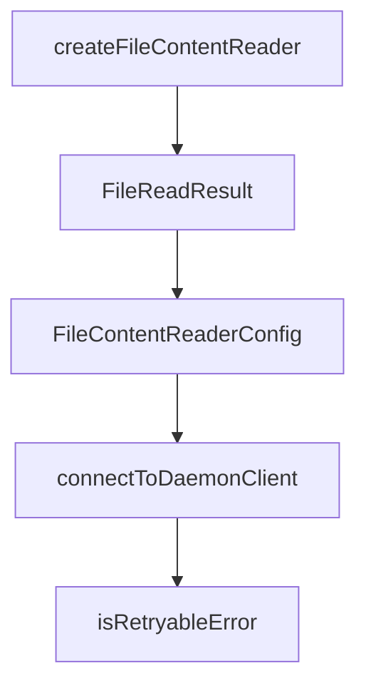

# Chapter 6: MCP Integration Patterns

Welcome to **Chapter 6: MCP Integration Patterns**. In this part of **Cipher Tutorial: Shared Memory Layer for Coding Agents**, you will build an intuitive mental model first, then move into concrete implementation details and practical production tradeoffs.


Cipher can run as an MCP server and expose tools to clients like Claude Desktop, Cursor, Windsurf, and others.

## Integration Dimensions

- transport type: stdio, SSE, streamable-HTTP
- server mode: default vs aggregator
- environment export requirements in MCP mode

## Source References

- [MCP integration docs](https://github.com/campfirein/cipher/blob/main/docs/mcp-integration.md)
- [Examples docs](https://github.com/campfirein/cipher/blob/main/docs/examples.md)

## Summary

You now have a practical map for integrating Cipher with MCP clients under different transport and mode constraints.

Next: [Chapter 7: Deployment and Operations Modes](07-deployment-and-operations-modes.md)

## Source Code Walkthrough

### `src/server/utils/file-content-reader.ts`

The `createFileContentReader` function in [`src/server/utils/file-content-reader.ts`](https://github.com/campfirein/cipher/blob/HEAD/src/server/utils/file-content-reader.ts) handles a key part of this chapter's functionality:

```ts
 * Factory function to create a FileContentReader instance.
 */
export function createFileContentReader(documentParser?: IDocumentParserService): FileContentReader {
  return new FileContentReader(documentParser)
}

```

This function is important because it defines how Cipher Tutorial: Shared Memory Layer for Coding Agents implements the patterns covered in this chapter.

### `src/server/utils/file-content-reader.ts`

The `FileReadResult` interface in [`src/server/utils/file-content-reader.ts`](https://github.com/campfirein/cipher/blob/HEAD/src/server/utils/file-content-reader.ts) handles a key part of this chapter's functionality:

```ts
 * Result of reading a file's content.
 */
export interface FileReadResult {
  /** Extracted content from the file */
  content: string

  /** Error message if reading failed */
  error?: string

  /** Original file path */
  filePath: string

  /** Detected file type */
  fileType: 'binary' | 'image' | 'office' | 'pdf' | 'text'

  /** Additional metadata about the file */
  metadata?: {
    /** Number of lines (for text files) */
    lineCount?: number

    /** Number of pages (for PDFs) */
    pageCount?: number

    /** Whether content was truncated */
    truncated?: boolean
  }

  /** Whether the read was successful */
  success: boolean
}

/**
```

This interface is important because it defines how Cipher Tutorial: Shared Memory Layer for Coding Agents implements the patterns covered in this chapter.

### `src/server/utils/file-content-reader.ts`

The `FileContentReaderConfig` interface in [`src/server/utils/file-content-reader.ts`](https://github.com/campfirein/cipher/blob/HEAD/src/server/utils/file-content-reader.ts) handles a key part of this chapter's functionality:

```ts
 * Configuration options for file reading.
 */
interface FileContentReaderConfig {
  /** Maximum content length per file in characters (default: 40000) */
  maxContentLength?: number

  /** Maximum lines to read for text files (default: 2000) */
  maxLinesPerFile?: number

  /** Maximum pages to extract for PDFs (default: 50) */
  maxPdfPages?: number
}

const DEFAULT_MAX_CONTENT_LENGTH = 40_000
const DEFAULT_MAX_LINES_PER_FILE = 2000
const DEFAULT_MAX_PDF_PAGES = 50
const SAMPLE_BUFFER_SIZE = 4096

/**
 * Service for reading file contents with support for various file types.
 *
 * Supports:
 * - Text/code files: Read directly with truncation
 * - Office documents (.docx, .pptx, .xlsx, etc.): Parse using DocumentParserService
 * - PDFs: Extract text using PdfExtractor
 * - Images/Binaries: Skip with appropriate error message
 */
export class FileContentReader {
  private readonly documentParser: IDocumentParserService

  constructor(documentParser?: IDocumentParserService) {
    this.documentParser = documentParser ?? createDocumentParserService()
```

This interface is important because it defines how Cipher Tutorial: Shared Memory Layer for Coding Agents implements the patterns covered in this chapter.

### `src/oclif/lib/daemon-client.ts`

The `connectToDaemonClient` function in [`src/oclif/lib/daemon-client.ts`](https://github.com/campfirein/cipher/blob/HEAD/src/oclif/lib/daemon-client.ts) handles a key part of this chapter's functionality:

```ts
 * Connects to the daemon, auto-starting it if needed.
 */
export async function connectToDaemonClient(
  options?: Pick<DaemonClientOptions, 'transportConnector'>,
): Promise<ConnectionResult> {
  const connector = options?.transportConnector ?? createDaemonAwareConnector()
  return connector()
}

/**
 * Executes an operation against the daemon with retry logic.
 *
 * Retries on infrastructure failures (daemon spawn timeout, connection dropped,
 * agent disconnected). Does NOT retry on business errors (auth, validation, etc.).
 */
export async function withDaemonRetry<T>(
  fn: (client: ITransportClient, projectRoot?: string) => Promise<T>,
  options?: DaemonClientOptions & {
    /** Called before each retry with attempt number (1-indexed) */
    onRetry?: (attempt: number, maxRetries: number) => void
  },
): Promise<T> {
  const maxRetries = options?.maxRetries ?? MAX_RETRIES
  const retryDelayMs = options?.retryDelayMs ?? DEFAULT_RETRY_DELAY_MS
  const connector = options?.transportConnector ?? createDaemonAwareConnector()

  let lastError: unknown

  /* eslint-disable no-await-in-loop -- intentional sequential retry loop */
  for (let attempt = 1; attempt <= maxRetries; attempt++) {
    let client: ITransportClient | undefined

```

This function is important because it defines how Cipher Tutorial: Shared Memory Layer for Coding Agents implements the patterns covered in this chapter.


## How These Components Connect


