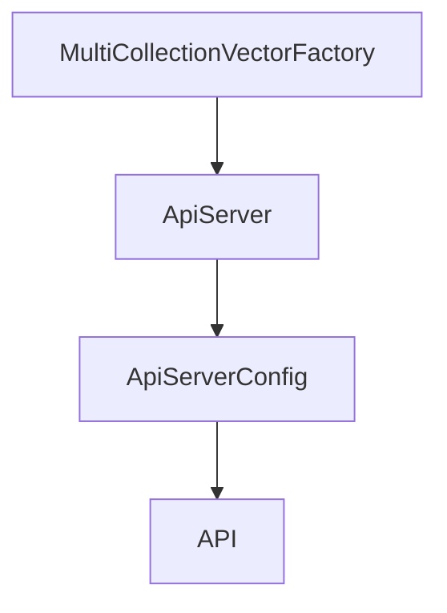

# Chapter 6: MCP Integration Patterns

Welcome to **Chapter 6: MCP Integration Patterns**. In this part of **Cipher Tutorial: Shared Memory Layer for Coding Agents**, you will build an intuitive mental model first, then move into concrete implementation details and practical production tradeoffs.


Cipher can run as an MCP server and expose tools to clients like Claude Desktop, Cursor, Windsurf, and others.

## Integration Dimensions

- transport type: stdio, SSE, streamable-HTTP
- server mode: default vs aggregator
- environment export requirements in MCP mode

## Source References

- [MCP integration docs](https://github.com/campfirein/cipher/blob/main/docs/mcp-integration.md)
- [Examples docs](https://github.com/campfirein/cipher/blob/main/docs/examples.md)

## Summary

You now have a practical map for integrating Cipher with MCP clients under different transport and mode constraints.

Next: [Chapter 7: Deployment and Operations Modes](07-deployment-and-operations-modes.md)

## Depth Expansion Playbook

## Source Code Walkthrough

### `src/core/vector_storage/factory.ts`

The `MultiCollectionVectorFactory` interface in [`src/core/vector_storage/factory.ts`](https://github.com/campfirein/cipher/blob/HEAD/src/core/vector_storage/factory.ts) handles a key part of this chapter's functionality:

```ts
 * Multi Collection Vector Factory interface for workspace memory support
 */
export interface MultiCollectionVectorFactory {
	/** The multi collection manager instance */
	manager: any; // MultiCollectionVectorManager
	/** The knowledge vector store ready for use */
	knowledgeStore: VectorStore;
	/** The reflection vector store ready for use (null if disabled) */
	reflectionStore: VectorStore | null;
	/** The workspace vector store ready for use (null if disabled) */
	workspaceStore: VectorStore | null;
}

/**
 * Creates multi-collection vector storage from environment variables
 *
 * Creates a multi-collection manager that handles knowledge, reflection, and workspace
 * memory collections. This replaces DualCollectionVectorManager when workspace memory is enabled.
 *
 * @param agentConfig - Optional agent configuration to override dimension from embedding config
 * @returns Promise resolving to multi collection manager and stores
 */
export async function createMultiCollectionVectorStoreFromEnv(
	agentConfig?: any
): Promise<MultiCollectionVectorFactory> {
	const logger = createLogger({ level: env.CIPHER_LOG_LEVEL });

	// Import MultiCollectionVectorManager dynamically to avoid circular dependencies
	// const { MultiCollectionVectorManager } = await import('./multi-collection-manager.js'); // Not used in this scope

	// Get base configuration from environment
	const config = getVectorStoreConfigFromEnv(agentConfig);
```

This interface is important because it defines how Cipher Tutorial: Shared Memory Layer for Coding Agents implements the patterns covered in this chapter.

### `src/app/api/server.ts`

The `ApiServer` class in [`src/app/api/server.ts`](https://github.com/campfirein/cipher/blob/HEAD/src/app/api/server.ts) handles a key part of this chapter's functionality:

```ts
import { createWebhookRoutes } from './routes/webhook.js';

export interface ApiServerConfig {
	port: number;
	host?: string;
	corsOrigins?: string[];
	rateLimitWindowMs?: number;
	rateLimitMaxRequests?: number;
	mcpTransportType?: 'stdio' | 'sse' | 'http';
	mcpPort?: number;
	// WebSocket configuration
	enableWebSocket?: boolean;
	webSocketConfig?: WebSocketConfig;
	// API prefix configuration
	apiPrefix?: string;
}

export class ApiServer {
	private app: Application;
	private agent: MemAgent;
	private config: ApiServerConfig;
	private apiPrefix: string;
	private mcpServer?: McpServer;
	private activeMcpSseTransports: Map<string, SSEServerTransport> = new Map();

	// WebSocket components
	private httpServer?: http.Server;
	private wss?: WebSocketServer;
	private wsConnectionManager?: WebSocketConnectionManager;
	private wsMessageRouter?: WebSocketMessageRouter;
	private wsEventSubscriber?: WebSocketEventSubscriber;
	private heartbeatInterval?: NodeJS.Timeout;
```

This class is important because it defines how Cipher Tutorial: Shared Memory Layer for Coding Agents implements the patterns covered in this chapter.

### `src/app/api/server.ts`

The `ApiServerConfig` interface in [`src/app/api/server.ts`](https://github.com/campfirein/cipher/blob/HEAD/src/app/api/server.ts) handles a key part of this chapter's functionality:

```ts
import { createWebhookRoutes } from './routes/webhook.js';

export interface ApiServerConfig {
	port: number;
	host?: string;
	corsOrigins?: string[];
	rateLimitWindowMs?: number;
	rateLimitMaxRequests?: number;
	mcpTransportType?: 'stdio' | 'sse' | 'http';
	mcpPort?: number;
	// WebSocket configuration
	enableWebSocket?: boolean;
	webSocketConfig?: WebSocketConfig;
	// API prefix configuration
	apiPrefix?: string;
}

export class ApiServer {
	private app: Application;
	private agent: MemAgent;
	private config: ApiServerConfig;
	private apiPrefix: string;
	private mcpServer?: McpServer;
	private activeMcpSseTransports: Map<string, SSEServerTransport> = new Map();

	// WebSocket components
	private httpServer?: http.Server;
	private wss?: WebSocketServer;
	private wsConnectionManager?: WebSocketConnectionManager;
	private wsMessageRouter?: WebSocketMessageRouter;
	private wsEventSubscriber?: WebSocketEventSubscriber;
	private heartbeatInterval?: NodeJS.Timeout;
```

This interface is important because it defines how Cipher Tutorial: Shared Memory Layer for Coding Agents implements the patterns covered in this chapter.

### `src/app/api/server.ts`

The `API` interface in [`src/app/api/server.ts`](https://github.com/campfirein/cipher/blob/HEAD/src/app/api/server.ts) handles a key part of this chapter's functionality:

```ts
	enableWebSocket?: boolean;
	webSocketConfig?: WebSocketConfig;
	// API prefix configuration
	apiPrefix?: string;
}

export class ApiServer {
	private app: Application;
	private agent: MemAgent;
	private config: ApiServerConfig;
	private apiPrefix: string;
	private mcpServer?: McpServer;
	private activeMcpSseTransports: Map<string, SSEServerTransport> = new Map();

	// WebSocket components
	private httpServer?: http.Server;
	private wss?: WebSocketServer;
	private wsConnectionManager?: WebSocketConnectionManager;
	private wsMessageRouter?: WebSocketMessageRouter;
	private wsEventSubscriber?: WebSocketEventSubscriber;
	private heartbeatInterval?: NodeJS.Timeout;

	constructor(agent: MemAgent, config: ApiServerConfig) {
		this.agent = agent;
		this.config = config;

		// Validate and set API prefix
		this.apiPrefix = this.validateAndNormalizeApiPrefix(config.apiPrefix);

		this.app = express();
		this.setupMiddleware();
		this.setupRoutes();
```

This interface is important because it defines how Cipher Tutorial: Shared Memory Layer for Coding Agents implements the patterns covered in this chapter.


## How These Components Connect


