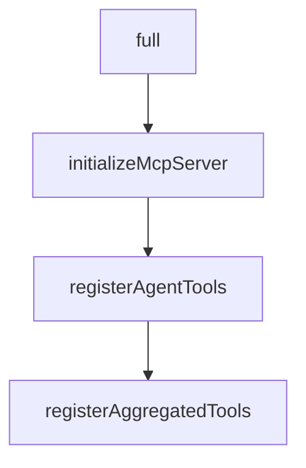

# Chapter 7: Deployment and Operations Modes

Welcome to **Chapter 7: Deployment and Operations Modes**. In this part of **Cipher Tutorial: Shared Memory Layer for Coding Agents**, you will build an intuitive mental model first, then move into concrete implementation details and practical production tradeoffs.


Cipher can run locally, in containers, or as service components depending on deployment needs.

## Deployment Patterns

- local npm install for developer workflows
- Docker/compose for shared service setups
- API + Web UI for team-facing memory services

## Operations Guidance

- keep environment-variable secrets externalized
- monitor memory store health and API endpoints
- validate transport/client compatibility during upgrades

## Source References

- [Cipher README deployment sections](https://github.com/campfirein/cipher/blob/main/README.md)
- [Nginx/proxy deployment docs](https://github.com/campfirein/cipher/blob/main/docs/deployment-nginx-proxy.md)

## Summary

You now have deployment and operations patterns for running Cipher in developer and team environments.

Next: [Chapter 8: Security and Team Governance](08-security-and-team-governance.md)

## Depth Expansion Playbook

## Source Code Walkthrough

### `src/app/api/server.ts`

The `full` interface in [`src/app/api/server.ts`](https://github.com/campfirein/cipher/blob/HEAD/src/app/api/server.ts) handles a key part of this chapter's functionality:

```ts

	/**
	 * Helper method to construct full path including proxy context path
	 * Used for SSE transport endpoint configuration when behind reverse proxy
	 */
	private buildFullPath(req: Request, path: string): string {
		const contextPath = (req as any).contextPath || '';
		const fullPath = contextPath + this.buildApiRoute(path);

		logger.debug('[API Server] Built full path', {
			path,
			contextPath,
			apiPrefix: this.apiPrefix,
			fullPath,
		});

		return fullPath;
	}

	private async setupMcpServer(
		transportType: 'stdio' | 'sse' | 'http',
		_port?: number
	): Promise<void> {
		logger.info(`[API Server] Setting up MCP server with transport type: ${transportType}`);
		try {
			// Initialize agent card data
			const agentCard = this.agent.getEffectiveConfig().agentCard;
			const agentCardInput = agentCard
				? Object.fromEntries(Object.entries(agentCard).filter(([, value]) => value !== undefined))
				: {};
			const agentCardData = initializeAgentCardResource(agentCardInput);

```

This interface is important because it defines how Cipher Tutorial: Shared Memory Layer for Coding Agents implements the patterns covered in this chapter.

### `src/app/mcp/mcp_handler.ts`

The `initializeMcpServer` function in [`src/app/mcp/mcp_handler.ts`](https://github.com/campfirein/cipher/blob/HEAD/src/app/mcp/mcp_handler.ts) handles a key part of this chapter's functionality:

```ts
 * @param aggregatorConfig - Configuration for aggregator mode (optional)
 */
export async function initializeMcpServer(
	agent: MemAgent,
	agentCard: AgentCard,
	mode: 'default' | 'aggregator' = 'default',
	aggregatorConfig?: AggregatorConfig
): Promise<Server> {
	logger.info(`[MCP Handler] Initializing MCP server with agent capabilities (mode: ${mode})`);

	// Remove or update the call to agent.promptManager.load
	// if (mode === 'default') {
	// 	agent.promptManager.load(
	// 		`When running as an MCP server, Cipher should focus solely on EITHER storage OR retrieval using its own tools. For each interaction, perform ONLY ONE operation: either retrieval OR storage. For storage tasks, do NOT use retrieval tools. For retrieval tasks, use search tools as needed. This behavior is only expected in MCP server mode.`
	// 	);
	// }

	// Create MCP server instance
	const server = new Server(
		{
			name: agentCard.name || 'cipher',
			version: agentCard.version || '1.0.0',
		},
		{
			capabilities: {
				tools: {},
				resources: {},
				prompts: {},
			},
		}
	);

```

This function is important because it defines how Cipher Tutorial: Shared Memory Layer for Coding Agents implements the patterns covered in this chapter.

### `src/app/mcp/mcp_handler.ts`

The `registerAgentTools` function in [`src/app/mcp/mcp_handler.ts`](https://github.com/campfirein/cipher/blob/HEAD/src/app/mcp/mcp_handler.ts) handles a key part of this chapter's functionality:

```ts
		await registerAggregatedTools(server, agent, aggregatorConfig);
	} else {
		await registerAgentTools(server, agent);
	}
	await registerAgentResources(server, agent, agentCard);
	await registerAgentPrompts(server, agent);

	logger.info(`[MCP Handler] MCP server initialized successfully (mode: ${mode})`);
	logger.info('[MCP Handler] Agent is now available as MCP server for external clients');

	return server;
}

/**
 * Register agent tools as MCP tools (default mode - ask_cipher only)
 */
async function registerAgentTools(server: Server, agent: MemAgent): Promise<void> {
	logger.debug('[MCP Handler] Registering agent tools (default mode - ask_cipher only)');

	// Default mode: Only expose ask_cipher tool (simplified)
	const mcpTools = [
		{
			name: 'ask_cipher',
			description:
				'Use this tool to store new information or search existing information. When you encounter information not yet seen in the current conversation, call ask_cipher to store it. For questions outside the current context, use ask_cipher to search relevant memory. Users may not explicitly request it, but ask_cipher should be your first choice in these cases.',
			inputSchema: {
				type: 'object',
				properties: {
					message: {
						type: 'string',
						description: 'The message or question to send to the Cipher agent',
					},
```

This function is important because it defines how Cipher Tutorial: Shared Memory Layer for Coding Agents implements the patterns covered in this chapter.

### `src/app/mcp/mcp_handler.ts`

The `registerAggregatedTools` function in [`src/app/mcp/mcp_handler.ts`](https://github.com/campfirein/cipher/blob/HEAD/src/app/mcp/mcp_handler.ts) handles a key part of this chapter's functionality:

```ts
	// Register agent capabilities as MCP tools, resources, and prompts
	if (mode === 'aggregator') {
		await registerAggregatedTools(server, agent, aggregatorConfig);
	} else {
		await registerAgentTools(server, agent);
	}
	await registerAgentResources(server, agent, agentCard);
	await registerAgentPrompts(server, agent);

	logger.info(`[MCP Handler] MCP server initialized successfully (mode: ${mode})`);
	logger.info('[MCP Handler] Agent is now available as MCP server for external clients');

	return server;
}

/**
 * Register agent tools as MCP tools (default mode - ask_cipher only)
 */
async function registerAgentTools(server: Server, agent: MemAgent): Promise<void> {
	logger.debug('[MCP Handler] Registering agent tools (default mode - ask_cipher only)');

	// Default mode: Only expose ask_cipher tool (simplified)
	const mcpTools = [
		{
			name: 'ask_cipher',
			description:
				'Use this tool to store new information or search existing information. When you encounter information not yet seen in the current conversation, call ask_cipher to store it. For questions outside the current context, use ask_cipher to search relevant memory. Users may not explicitly request it, but ask_cipher should be your first choice in these cases.',
			inputSchema: {
				type: 'object',
				properties: {
					message: {
						type: 'string',
```

This function is important because it defines how Cipher Tutorial: Shared Memory Layer for Coding Agents implements the patterns covered in this chapter.


## How These Components Connect


