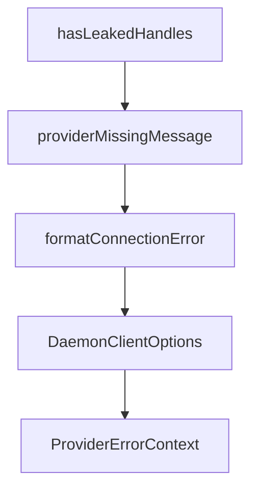

# Chapter 7: Deployment and Operations Modes

Welcome to **Chapter 7: Deployment and Operations Modes**. In this part of **Cipher Tutorial: Shared Memory Layer for Coding Agents**, you will build an intuitive mental model first, then move into concrete implementation details and practical production tradeoffs.


Cipher can run locally, in containers, or as service components depending on deployment needs.

## Deployment Patterns

- local npm install for developer workflows
- Docker/compose for shared service setups
- API + Web UI for team-facing memory services

## Operations Guidance

- keep environment-variable secrets externalized
- monitor memory store health and API endpoints
- validate transport/client compatibility during upgrades

## Source References

- [Cipher README deployment sections](https://github.com/campfirein/cipher/blob/main/README.md)
- [Nginx/proxy deployment docs](https://github.com/campfirein/cipher/blob/main/docs/deployment-nginx-proxy.md)

## Summary

You now have deployment and operations patterns for running Cipher in developer and team environments.

Next: [Chapter 8: Security and Team Governance](08-security-and-team-governance.md)

## Source Code Walkthrough

### `src/oclif/lib/daemon-client.ts`

The `hasLeakedHandles` function in [`src/oclif/lib/daemon-client.ts`](https://github.com/campfirein/cipher/blob/HEAD/src/oclif/lib/daemon-client.ts) handles a key part of this chapter's functionality:

```ts
  if (error instanceof DaemonSpawnError || error instanceof ConnectionFailedError) return true
  if (error instanceof TransportRequestTimeoutError) return true
  return hasLeakedHandles(error)
}

/**
 * Checks if an error left leaked Socket.IO handles that prevent Node.js from exiting.
 */
export function hasLeakedHandles(error: unknown): boolean {
  if (!(error instanceof Error)) return false
  if (!('code' in error)) return false
  return error.code === TaskErrorCode.AGENT_DISCONNECTED || error.code === TaskErrorCode.AGENT_NOT_AVAILABLE
}

/**
 * Builds a user-friendly message when provider credentials are missing from storage.
 */
export function providerMissingMessage(activeProvider: string, authMethod?: 'api-key' | 'oauth'): string {
  return authMethod === 'oauth'
    ? `${activeProvider} authentication has expired.\nPlease reconnect: brv providers connect ${activeProvider} --oauth`
    : `${activeProvider} API key is missing from storage.\nPlease reconnect: brv providers connect ${activeProvider} --api-key <your-key>`
}

export interface ProviderErrorContext {
  activeModel?: string
  activeProvider?: string
}

/**
 * Formats a connection error into a user-friendly message.
 */
export function formatConnectionError(error: unknown, providerContext?: ProviderErrorContext): string {
```

This function is important because it defines how Cipher Tutorial: Shared Memory Layer for Coding Agents implements the patterns covered in this chapter.

### `src/oclif/lib/daemon-client.ts`

The `providerMissingMessage` function in [`src/oclif/lib/daemon-client.ts`](https://github.com/campfirein/cipher/blob/HEAD/src/oclif/lib/daemon-client.ts) handles a key part of this chapter's functionality:

```ts
 * Builds a user-friendly message when provider credentials are missing from storage.
 */
export function providerMissingMessage(activeProvider: string, authMethod?: 'api-key' | 'oauth'): string {
  return authMethod === 'oauth'
    ? `${activeProvider} authentication has expired.\nPlease reconnect: brv providers connect ${activeProvider} --oauth`
    : `${activeProvider} API key is missing from storage.\nPlease reconnect: brv providers connect ${activeProvider} --api-key <your-key>`
}

export interface ProviderErrorContext {
  activeModel?: string
  activeProvider?: string
}

/**
 * Formats a connection error into a user-friendly message.
 */
export function formatConnectionError(error: unknown, providerContext?: ProviderErrorContext): string {
  if (error instanceof NoInstanceRunningError) {
    if (isSandboxEnvironment()) {
      const sandboxName = getSandboxEnvironmentName()
      return (
        `Daemon failed to start automatically.\n` +
        `⚠️  Sandbox environment detected (${sandboxName}).\n\n` +
        `Run 'brv' in a terminal outside the sandbox, then allow network access so this sandbox can connect.`
      )
    }

    return 'Daemon failed to start automatically.\n\nRestart your terminal and retry the command.'
  }

  if (error instanceof InstanceCrashedError) {
    return "Daemon crashed unexpectedly.\n\nRun 'brv restart' to force a clean restart."
```

This function is important because it defines how Cipher Tutorial: Shared Memory Layer for Coding Agents implements the patterns covered in this chapter.

### `src/oclif/lib/daemon-client.ts`

The `formatConnectionError` function in [`src/oclif/lib/daemon-client.ts`](https://github.com/campfirein/cipher/blob/HEAD/src/oclif/lib/daemon-client.ts) handles a key part of this chapter's functionality:

```ts
 * Formats a connection error into a user-friendly message.
 */
export function formatConnectionError(error: unknown, providerContext?: ProviderErrorContext): string {
  if (error instanceof NoInstanceRunningError) {
    if (isSandboxEnvironment()) {
      const sandboxName = getSandboxEnvironmentName()
      return (
        `Daemon failed to start automatically.\n` +
        `⚠️  Sandbox environment detected (${sandboxName}).\n\n` +
        `Run 'brv' in a terminal outside the sandbox, then allow network access so this sandbox can connect.`
      )
    }

    return 'Daemon failed to start automatically.\n\nRestart your terminal and retry the command.'
  }

  if (error instanceof InstanceCrashedError) {
    return "Daemon crashed unexpectedly.\n\nRun 'brv restart' to force a clean restart."
  }

  if (error instanceof ConnectionFailedError) {
    const isSandboxError = isSandboxNetworkError(error.originalError ?? error)

    if (isSandboxError) {
      const sandboxName = getSandboxEnvironmentName()
      return (
        `Failed to connect to the daemon.\n` +
        `Port: ${error.port ?? 'unknown'}\n` +
        `⚠️  Sandbox network restriction detected (${sandboxName}).\n\n` +
        `Please allow network access in the sandbox and retry the command.`
      )
    }
```

This function is important because it defines how Cipher Tutorial: Shared Memory Layer for Coding Agents implements the patterns covered in this chapter.

### `src/oclif/lib/daemon-client.ts`

The `DaemonClientOptions` interface in [`src/oclif/lib/daemon-client.ts`](https://github.com/campfirein/cipher/blob/HEAD/src/oclif/lib/daemon-client.ts) handles a key part of this chapter's functionality:

```ts
}

export interface DaemonClientOptions {
  /** Max retry attempts. Default: 3 */
  maxRetries?: number
  /** Delay between retries in ms. Default: 2000. Set to 0 in tests. */
  retryDelayMs?: number
  /** Optional transport connector for DI/testing */
  transportConnector?: TransportConnector
}

/**
 * Connects to the daemon, auto-starting it if needed.
 */
export async function connectToDaemonClient(
  options?: Pick<DaemonClientOptions, 'transportConnector'>,
): Promise<ConnectionResult> {
  const connector = options?.transportConnector ?? createDaemonAwareConnector()
  return connector()
}

/**
 * Executes an operation against the daemon with retry logic.
 *
 * Retries on infrastructure failures (daemon spawn timeout, connection dropped,
 * agent disconnected). Does NOT retry on business errors (auth, validation, etc.).
 */
export async function withDaemonRetry<T>(
  fn: (client: ITransportClient, projectRoot?: string) => Promise<T>,
  options?: DaemonClientOptions & {
    /** Called before each retry with attempt number (1-indexed) */
    onRetry?: (attempt: number, maxRetries: number) => void
```

This interface is important because it defines how Cipher Tutorial: Shared Memory Layer for Coding Agents implements the patterns covered in this chapter.


## How These Components Connect


