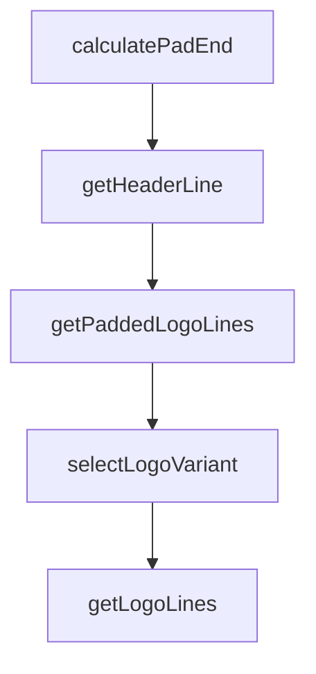

# Chapter 8: Security and Team Governance

Welcome to **Chapter 8: Security and Team Governance**. In this part of **Cipher Tutorial: Shared Memory Layer for Coding Agents**, you will build an intuitive mental model first, then move into concrete implementation details and practical production tradeoffs.


Team usage of Cipher requires explicit controls over secrets, memory write behavior, and MCP tool exposure.

## Governance Checklist

1. keep API keys and vector-store secrets in secure env management
2. define policy for memory extraction/update permissions
3. review MCP server/tool additions before enabling in shared environments
4. partition workspace memory scope by team or project boundaries
5. audit logs and memory retention behavior regularly

## Source References

- [Cipher configuration docs](https://github.com/campfirein/cipher/blob/main/docs/configuration.md)
- [Cipher MCP integration docs](https://github.com/campfirein/cipher/blob/main/docs/mcp-integration.md)

## Summary

You now have a governance baseline for production Cipher deployments across teams and tools.

## Source Code Walkthrough

### `src/tui/components/logo.tsx`

The `calculatePadEnd` function in [`src/tui/components/logo.tsx`](https://github.com/campfirein/cipher/blob/HEAD/src/tui/components/logo.tsx) handles a key part of this chapter's functionality:

```tsx
 * Calculate padding end string to fill remaining width
 */
function calculatePadEnd(contentLength: number, terminalWidth: number): string {
  const availableWidth = terminalWidth
  const padEndLength = availableWidth - PAD_START.length - contentLength - 1
  return padEndLength > 0 ? ' ' + '/'.repeat(padEndLength) : ''
}

/**
 * Get header line with BRV and version
 */
function getHeaderLine(logoLine: string, version: string, terminalWidth: number): HeaderLine {
  const logoLength = [...logoLine].length
  const brv = ''
  const versionText = version ? `v${version}` : ''

  // Spaces between BRV and version to match logo width
  const spacesLength = logoLength - brv.length - versionText.length
  const spaces = spacesLength > 0 ? ' '.repeat(spacesLength) : ' '

  const contentLength = brv.length + spaces.length + versionText.length
  const padEnd = calculatePadEnd(contentLength, terminalWidth)

  return {brv, padEnd, padStart: PAD_START, spaces, version: versionText}
}

/**
 * Get padded logo lines with '/' - 5 at start, fill rest to terminal width
 */
function getPaddedLogoLines(lines: string[], terminalWidth: number): PaddedLine[] {
  return lines.map((line) => {
    const lineLength = [...line].length // Handle unicode characters
```

This function is important because it defines how Cipher Tutorial: Shared Memory Layer for Coding Agents implements the patterns covered in this chapter.

### `src/tui/components/logo.tsx`

The `getHeaderLine` function in [`src/tui/components/logo.tsx`](https://github.com/campfirein/cipher/blob/HEAD/src/tui/components/logo.tsx) handles a key part of this chapter's functionality:

```tsx
 * Get header line with BRV and version
 */
function getHeaderLine(logoLine: string, version: string, terminalWidth: number): HeaderLine {
  const logoLength = [...logoLine].length
  const brv = ''
  const versionText = version ? `v${version}` : ''

  // Spaces between BRV and version to match logo width
  const spacesLength = logoLength - brv.length - versionText.length
  const spaces = spacesLength > 0 ? ' '.repeat(spacesLength) : ' '

  const contentLength = brv.length + spaces.length + versionText.length
  const padEnd = calculatePadEnd(contentLength, terminalWidth)

  return {brv, padEnd, padStart: PAD_START, spaces, version: versionText}
}

/**
 * Get padded logo lines with '/' - 5 at start, fill rest to terminal width
 */
function getPaddedLogoLines(lines: string[], terminalWidth: number): PaddedLine[] {
  return lines.map((line) => {
    const lineLength = [...line].length // Handle unicode characters
    const padEnd = calculatePadEnd(lineLength, terminalWidth)

    return {content: line, padEnd, padStart: PAD_START}
  })
}

type LogoVariant = 'full' | 'text'

/**
```

This function is important because it defines how Cipher Tutorial: Shared Memory Layer for Coding Agents implements the patterns covered in this chapter.

### `src/tui/components/logo.tsx`

The `getPaddedLogoLines` function in [`src/tui/components/logo.tsx`](https://github.com/campfirein/cipher/blob/HEAD/src/tui/components/logo.tsx) handles a key part of this chapter's functionality:

```tsx
 * Get padded logo lines with '/' - 5 at start, fill rest to terminal width
 */
function getPaddedLogoLines(lines: string[], terminalWidth: number): PaddedLine[] {
  return lines.map((line) => {
    const lineLength = [...line].length // Handle unicode characters
    const padEnd = calculatePadEnd(lineLength, terminalWidth)

    return {content: line, padEnd, padStart: PAD_START}
  })
}

type LogoVariant = 'full' | 'text'

/**
 * Select the best logo variant based on terminal size
 */
function selectLogoVariant(width: number, height: number): LogoVariant {
  // Full logo needs >= 60 width, >= 20 height
  if (width >= 60 && height >= 20) {
    return 'full'
  }

  // Fall back to text-only
  return 'text'
}

/**
 * Get logo lines for variant
 */
function getLogoLines(variant: LogoVariant, terminalWidth: number): PaddedLine[] {
  switch (variant) {
    case 'full': {
```

This function is important because it defines how Cipher Tutorial: Shared Memory Layer for Coding Agents implements the patterns covered in this chapter.

### `src/tui/components/logo.tsx`

The `selectLogoVariant` function in [`src/tui/components/logo.tsx`](https://github.com/campfirein/cipher/blob/HEAD/src/tui/components/logo.tsx) handles a key part of this chapter's functionality:

```tsx
 * Select the best logo variant based on terminal size
 */
function selectLogoVariant(width: number, height: number): LogoVariant {
  // Full logo needs >= 60 width, >= 20 height
  if (width >= 60 && height >= 20) {
    return 'full'
  }

  // Fall back to text-only
  return 'text'
}

/**
 * Get logo lines for variant
 */
function getLogoLines(variant: LogoVariant, terminalWidth: number): PaddedLine[] {
  switch (variant) {
    case 'full': {
      return getPaddedLogoLines(LOGO_FULL, terminalWidth)
    }

    default: {
      return []
    }
  }
}

interface LogoProps {
  /**
   * Compact mode, only show text logo
   */
  compact?: boolean
```

This function is important because it defines how Cipher Tutorial: Shared Memory Layer for Coding Agents implements the patterns covered in this chapter.


## How These Components Connect


