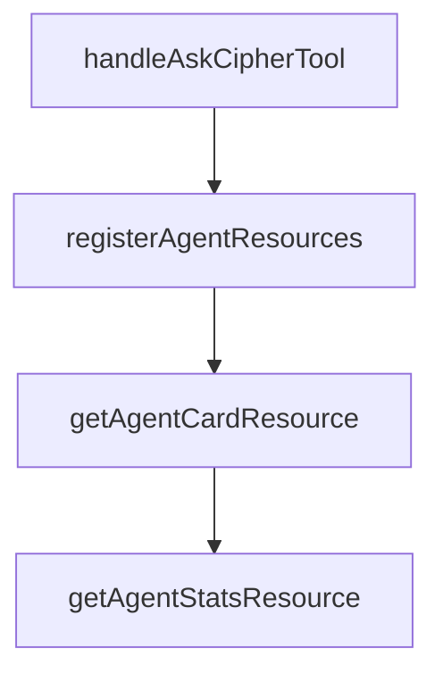

# Chapter 8: Security and Team Governance

Welcome to **Chapter 8: Security and Team Governance**. In this part of **Cipher Tutorial: Shared Memory Layer for Coding Agents**, you will build an intuitive mental model first, then move into concrete implementation details and practical production tradeoffs.


Team usage of Cipher requires explicit controls over secrets, memory write behavior, and MCP tool exposure.

## Governance Checklist

1. keep API keys and vector-store secrets in secure env management
2. define policy for memory extraction/update permissions
3. review MCP server/tool additions before enabling in shared environments
4. partition workspace memory scope by team or project boundaries
5. audit logs and memory retention behavior regularly

## Source References

- [Cipher configuration docs](https://github.com/campfirein/cipher/blob/main/docs/configuration.md)
- [Cipher MCP integration docs](https://github.com/campfirein/cipher/blob/main/docs/mcp-integration.md)

## Summary

You now have a governance baseline for production Cipher deployments across teams and tools.

## Depth Expansion Playbook

## Source Code Walkthrough

### `src/app/mcp/mcp_handler.ts`

The `handleAskCipherTool` function in [`src/app/mcp/mcp_handler.ts`](https://github.com/campfirein/cipher/blob/HEAD/src/app/mcp/mcp_handler.ts) handles a key part of this chapter's functionality:

```ts

		if (name === 'ask_cipher') {
			return await handleAskCipherTool(agent, args);
		}

		// Default mode only supports ask_cipher
		throw new Error(
			`Tool '${name}' not available in default mode. Use aggregator mode for access to all tools.`
		);
	});
}

/**
 * Register aggregated tools as MCP tools (aggregator mode - all tools)
 */
async function registerAggregatedTools(
	server: Server,
	agent: MemAgent,
	config?: AggregatorConfig
): Promise<void> {
	logger.debug('[MCP Handler] Registering all tools (aggregator mode - built-in + MCP servers)');

	// Get all agent-accessible tools from unifiedToolManager
	const unifiedToolManager = agent.unifiedToolManager;
	const combinedTools = await unifiedToolManager.getAllTools();

	// Apply conflict resolution if needed
	const resolvedTools = new Map<string, any>();
	const conflictResolution = config?.conflictResolution || 'prefix';

	Object.entries(combinedTools).forEach(([toolName, tool]) => {
		let resolvedName = toolName;
```

This function is important because it defines how Cipher Tutorial: Shared Memory Layer for Coding Agents implements the patterns covered in this chapter.

### `src/app/mcp/mcp_handler.ts`

The `registerAgentResources` function in [`src/app/mcp/mcp_handler.ts`](https://github.com/campfirein/cipher/blob/HEAD/src/app/mcp/mcp_handler.ts) handles a key part of this chapter's functionality:

```ts
		await registerAgentTools(server, agent);
	}
	await registerAgentResources(server, agent, agentCard);
	await registerAgentPrompts(server, agent);

	logger.info(`[MCP Handler] MCP server initialized successfully (mode: ${mode})`);
	logger.info('[MCP Handler] Agent is now available as MCP server for external clients');

	return server;
}

/**
 * Register agent tools as MCP tools (default mode - ask_cipher only)
 */
async function registerAgentTools(server: Server, agent: MemAgent): Promise<void> {
	logger.debug('[MCP Handler] Registering agent tools (default mode - ask_cipher only)');

	// Default mode: Only expose ask_cipher tool (simplified)
	const mcpTools = [
		{
			name: 'ask_cipher',
			description:
				'Use this tool to store new information or search existing information. When you encounter information not yet seen in the current conversation, call ask_cipher to store it. For questions outside the current context, use ask_cipher to search relevant memory. Users may not explicitly request it, but ask_cipher should be your first choice in these cases.',
			inputSchema: {
				type: 'object',
				properties: {
					message: {
						type: 'string',
						description: 'The message or question to send to the Cipher agent',
					},
					stream: {
						type: 'boolean',
```

This function is important because it defines how Cipher Tutorial: Shared Memory Layer for Coding Agents implements the patterns covered in this chapter.

### `src/app/mcp/mcp_handler.ts`

The `getAgentCardResource` function in [`src/app/mcp/mcp_handler.ts`](https://github.com/campfirein/cipher/blob/HEAD/src/app/mcp/mcp_handler.ts) handles a key part of this chapter's functionality:

```ts
		switch (uri) {
			case 'cipher://agent/card':
				return await getAgentCardResource(agentCard);
			case 'cipher://agent/stats':
				return await getAgentStatsResource(agent);
			default:
				throw new Error(`Unknown resource: ${uri}`);
		}
	});
}

/**
 * Get agent card resource
 */
async function getAgentCardResource(agentCard: AgentCard): Promise<any> {
	return {
		contents: [
			{
				uri: 'cipher://agent/card',
				mimeType: 'application/json',
				text: JSON.stringify(redactSensitiveData(agentCard), null, 2),
			},
		],
	};
}

/**
 * Get agent statistics resource
 */
async function getAgentStatsResource(agent: MemAgent): Promise<any> {
	try {
		const sessionCount = await agent.sessionManager.getSessionCount();
```

This function is important because it defines how Cipher Tutorial: Shared Memory Layer for Coding Agents implements the patterns covered in this chapter.

### `src/app/mcp/mcp_handler.ts`

The `getAgentStatsResource` function in [`src/app/mcp/mcp_handler.ts`](https://github.com/campfirein/cipher/blob/HEAD/src/app/mcp/mcp_handler.ts) handles a key part of this chapter's functionality:

```ts
				return await getAgentCardResource(agentCard);
			case 'cipher://agent/stats':
				return await getAgentStatsResource(agent);
			default:
				throw new Error(`Unknown resource: ${uri}`);
		}
	});
}

/**
 * Get agent card resource
 */
async function getAgentCardResource(agentCard: AgentCard): Promise<any> {
	return {
		contents: [
			{
				uri: 'cipher://agent/card',
				mimeType: 'application/json',
				text: JSON.stringify(redactSensitiveData(agentCard), null, 2),
			},
		],
	};
}

/**
 * Get agent statistics resource
 */
async function getAgentStatsResource(agent: MemAgent): Promise<any> {
	try {
		const sessionCount = await agent.sessionManager.getSessionCount();
		const activeSessionIds = await agent.sessionManager.getActiveSessionIds();
		const mcpClients = agent.getMcpClients();
```

This function is important because it defines how Cipher Tutorial: Shared Memory Layer for Coding Agents implements the patterns covered in this chapter.


## How These Components Connect


