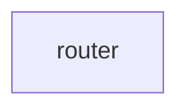

# Chapter 1: Getting Started

Welcome to **Chapter 1: Getting Started**. In this part of **Claude Code Router Tutorial: Multi-Provider Routing and Control Plane for Claude Code**, you will build an intuitive mental model first, then move into concrete implementation details and practical production tradeoffs.


This chapter gets Claude Code Router installed with a minimal working configuration.

## Learning Goals

- install CLI and verify command availability
- initialize a valid `config.json` baseline
- route first Claude Code session through CCR
- verify service restart behavior after config changes

## Baseline Commands

```bash
npm install -g @musistudio/claude-code-router
ccr start
ccr code
```

## First Validation Checklist

- `ccr` commands available
- `~/.claude-code-router/config.json` exists and parses
- routing path works for at least one provider/model
- logs are being written in expected locations

## Source References

- [README: Getting Started](https://github.com/musistudio/claude-code-router/blob/main/README.md#getting-started)
- [CLI Intro](https://github.com/musistudio/claude-code-router/blob/main/docs/docs/cli/intro.md)

## Summary

You now have a working CCR baseline for deeper routing configuration.

Next: [Chapter 2: Architecture and Package Topology](02-architecture-and-package-topology.md)

## Source Code Walkthrough

### `custom-router.example.js`

The `router` function in [`custom-router.example.js`](https://github.com/musistudio/claude-code-router/blob/HEAD/custom-router.example.js) handles a key part of this chapter's functionality:

```js
module.exports = async function router(req, config) {
  return "deepseek,deepseek-chat";
};

```

This function is important because it defines how Claude Code Router Tutorial: Multi-Provider Routing and Control Plane for Claude Code implements the patterns covered in this chapter.


## How These Components Connect


