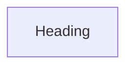

# Chapter 2: Architecture and Package Topology

Welcome to **Chapter 2: Architecture and Package Topology**. In this part of **Claude Code Router Tutorial: Multi-Provider Routing and Control Plane for Claude Code**, you will build an intuitive mental model first, then move into concrete implementation details and practical production tradeoffs.


This chapter maps CCR's monorepo structure and runtime boundaries.

## Learning Goals

- understand responsibilities of CLI, server, and shared packages
- trace request flow across router and transformer layers
- identify extension points for custom routing/transformers
- reduce confusion when debugging multi-layer behavior

## Core Package Roles

| Package | Responsibility |
|:--------|:---------------|
| CLI | command orchestration, model/preset/status workflows |
| Server | request routing, API handling, stream processing |
| Shared | common config, constants, preset utilities |
| external `@musistudio/llms` | provider transformation framework |

## Source References

- [CLAUDE.md Architecture Notes](https://github.com/musistudio/claude-code-router/blob/main/CLAUDE.md)
- [Server Intro](https://github.com/musistudio/claude-code-router/blob/main/docs/docs/server/intro.md)

## Summary

You now have a clear component model for reasoning about CCR behavior.

Next: [Chapter 3: Provider Configuration and Transformer Strategy](03-provider-configuration-and-transformer-strategy.md)

## Depth Expansion Playbook

## Source Code Walkthrough

### `docs/src/docusaurus.d.ts`

The `Heading` function in [`docs/src/docusaurus.d.ts`](https://github.com/musistudio/claude-code-router/blob/HEAD/docs/src/docusaurus.d.ts) handles a key part of this chapter's functionality:

```ts

// Additional theme component type declarations
declare module '@theme/Heading' {
  import type {ReactNode, CSSProperties} from 'react';

  export type Props = {
    readonly as?: 'h1' | 'h2' | 'h3' | 'h4' | 'h5' | 'h6';
    readonly className?: string;
    readonly style?: CSSProperties;
    readonly children?: ReactNode;
  };

  export default function Heading(props: Props): ReactNode;
}

```

This function is important because it defines how Claude Code Router Tutorial: Multi-Provider Routing and Control Plane for Claude Code implements the patterns covered in this chapter.


## How These Components Connect


