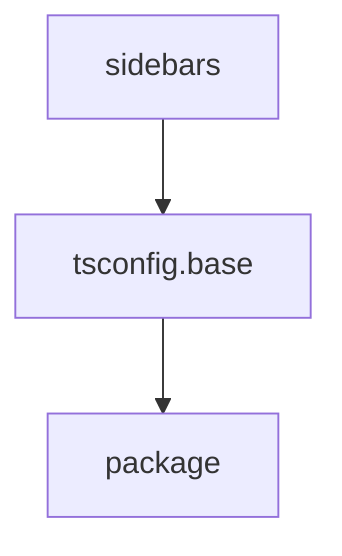

# Chapter 3: Provider Configuration and Transformer Strategy

Welcome to **Chapter 3: Provider Configuration and Transformer Strategy**. In this part of **Claude Code Router Tutorial: Multi-Provider Routing and Control Plane for Claude Code**, you will build an intuitive mental model first, then move into concrete implementation details and practical production tradeoffs.


This chapter focuses on building reliable provider definitions and transformation pipelines.

## Learning Goals

- configure providers with environment-variable-safe secrets
- select transformers by provider API compatibility needs
- understand global vs model-scoped transformer application
- avoid brittle provider configs that fail under load

## Provider Configuration Essentials

| Field | Why It Matters |
|:------|:---------------|
| `name` | routing and model reference key |
| `api_base_url` | provider endpoint compatibility |
| `api_key` | secure auth, ideally via env interpolation |
| `models` | allowed model surface for routing |
| `transformer` | request/response compatibility adjustments |

## Source References

- [README: Configuration](https://github.com/musistudio/claude-code-router/blob/main/README.md#2-configuration)
- [README: Transformers](https://github.com/musistudio/claude-code-router/blob/main/README.md#transformers)
- [Server Config: Providers](https://github.com/musistudio/claude-code-router/blob/main/docs/docs/server/config/providers.md)

## Summary

You now have a stable foundation for provider onboarding and transformer management.

Next: [Chapter 4: Routing Rules, Fallbacks, and Custom Router Logic](04-routing-rules-fallbacks-and-custom-router-logic.md)

## Source Code Walkthrough

### `docs/sidebars.ts`

The `sidebars` module in [`docs/sidebars.ts`](https://github.com/musistudio/claude-code-router/blob/HEAD/docs/sidebars.ts) handles a key part of this chapter's functionality:

```ts
import type { SidebarsConfig } from '@docusaurus/plugin-content-docs';

const sidebars: SidebarsConfig = {
  tutorialSidebar: [
    {
      type: 'category',
      label: 'CLI',
      link: {
        type: 'generated-index',
        title: 'Claude Code Router CLI',
        description: 'Command-line tool usage guide',
        slug: 'category/cli',
      },
      items: [
        'cli/intro',
        'cli/installation',
        'cli/quick-start',
        {
          type: 'category',
          label: 'Commands',
          link: {
            type: 'generated-index',
            title: 'CLI Commands',
            description: 'Complete command reference',
            slug: 'category/cli-commands',
          },
          items: [
            'cli/commands/start',
            'cli/commands/model',
            'cli/commands/status',
            'cli/commands/statusline',
            'cli/commands/preset',
            'cli/commands/other',
          ],
        },
```

This module is important because it defines how Claude Code Router Tutorial: Multi-Provider Routing and Control Plane for Claude Code implements the patterns covered in this chapter.

### `tsconfig.base.json`

The `tsconfig.base` module in [`tsconfig.base.json`](https://github.com/musistudio/claude-code-router/blob/HEAD/tsconfig.base.json) handles a key part of this chapter's functionality:

```json
{
  "compilerOptions": {
    "target": "ES2022",
    "module": "CommonJS",
    "strict": true,
    "esModuleInterop": true,
    "skipLibCheck": true,
    "forceConsistentCasingInFileNames": true,
    "resolveJsonModule": true,
    "moduleResolution": "node",
    "noImplicitAny": true,
    "allowSyntheticDefaultImports": true,
    "sourceMap": true,
    "declaration": true,
    "typeRoots": ["./node_modules/@types", "./packages/*/node_modules/@types"]
  }
}

```

This module is important because it defines how Claude Code Router Tutorial: Multi-Provider Routing and Control Plane for Claude Code implements the patterns covered in this chapter.

### `package.json`

The `package` module in [`package.json`](https://github.com/musistudio/claude-code-router/blob/HEAD/package.json) handles a key part of this chapter's functionality:

```json
{
  "name": "@musistudio/claude-code-router",
  "version": "2.0.0",
  "description": "Use Claude Code without an Anthropics account and route it to another LLM provider",
  "scripts": {
    "build": "pnpm build:shared && pnpm build:core && pnpm build:server && pnpm build:cli && pnpm build:ui",
    "build:core": "pnpm --filter @musistudio/llms build",
    "build:shared": "pnpm --filter @CCR/shared build",
    "build:cli": "pnpm --filter @CCR/cli build",
    "build:server": "pnpm --filter @CCR/server build",
    "build:ui": "pnpm --filter @CCR/ui build",
    "build:docs": "pnpm --filter claude-code-router-docs build",
    "release": "pnpm build && bash scripts/release.sh all",
    "release:npm": "bash scripts/release.sh npm",
    "release:docker": "bash scripts/release.sh docker",
    "dev:cli": "pnpm --filter @CCR/cli dev",
    "dev:server": "pnpm --filter @CCR/server dev",
    "dev:ui": "pnpm --filter @CCR/ui dev",
    "dev:core": "pnpm --filter @musistudio/llms dev",
    "dev:docs": "pnpm --filter claude-code-router-docs start",
    "serve:docs": "pnpm --filter claude-code-router-docs serve"
  },
  "bin": {
    "ccr": "dist/cli.js"
  },
  "keywords": [
    "claude",
    "code",
    "router",
    "llm",
    "anthropic"
  ],
  "author": "musistudio",
  "license": "MIT",
  "devDependencies": {
```

This module is important because it defines how Claude Code Router Tutorial: Multi-Provider Routing and Control Plane for Claude Code implements the patterns covered in this chapter.


## How These Components Connect


