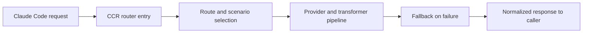

# Claude Code Router Tutorial: Multi-Provider Routing Control for Claude Code

> Learn how to use `musistudio/claude-code-router` to route Claude Code requests across multiple model providers with configurable routing rules, transformer pipelines, fallback logic, and operational controls.

## Why This Track Matters

`claude-code-router` is a major routing control-plane project that lets teams decouple workflow policy from a single model endpoint.

This track focuses on:

- configuring providers and transformations safely
- building resilient routing and fallback policies
- using CLI/preset/statusline workflows effectively
- deploying CCR for local, CI, and shared team operations

## Current Snapshot (Verified February 12, 2026)

- repository: [`musistudio/claude-code-router`](https://github.com/musistudio/claude-code-router)
- stars: about **27.7k**
- latest release: no tagged GitHub release published yet
- recent activity: updates on **January 10, 2026**
- project positioning: multi-provider routing layer for Claude Code with CLI + server architecture

## Mental Model

## Chapter Guide

| Chapter | Key Question | Outcome |
|:--------|:-------------|:--------|
| [01 - Getting Started](01-getting-started.md) | How do I install and verify CCR quickly? | Working baseline |
| [02 - Architecture and Package Topology](02-architecture-and-package-topology.md) | How do CLI, server, and shared layers fit together? | Strong system map |
| [03 - Provider Configuration and Transformer Strategy](03-provider-configuration-and-transformer-strategy.md) | How should provider and transformer config be structured? | Safer provider integration |
| [04 - Routing Rules, Fallbacks, and Custom Router Logic](04-routing-rules-fallbacks-and-custom-router-logic.md) | How do I route by scenario and recover from failures? | More reliable routing behavior |
| [05 - CLI Operations: Model, Preset, and Statusline Workflows](05-cli-operations-model-preset-and-statusline-workflows.md) | Which CLI workflows matter most day-to-day? | Faster operator throughput |
| [06 - Server Deployment and API Integration](06-server-deployment-and-api-integration.md) | How do I run CCR beyond a local session? | Production baseline |
| [07 - CI and Non-Interactive Team Workflows](07-ci-and-non-interactive-team-workflows.md) | How do I run CCR reliably in automation? | Better CI readiness |
| [08 - Troubleshooting, Security, and Maintenance](08-troubleshooting-security-and-maintenance.md) | How do I keep routing stable over time? | Reliability playbook |

## What You Will Learn

- how to route Claude Code workloads across heterogeneous provider fleets
- how to configure transformations and fallbacks defensively
- how to manage routing config with less manual JSON toil
- how to deploy and operate CCR safely in team and CI contexts

## Source References

- [Claude Code Router Repository](https://github.com/musistudio/claude-code-router)
- [README](https://github.com/musistudio/claude-code-router/blob/main/README.md)
- [CLI Intro](https://github.com/musistudio/claude-code-router/blob/main/docs/docs/cli/intro.md)
- [Server Intro](https://github.com/musistudio/claude-code-router/blob/main/docs/docs/server/intro.md)
- [Routing Config Docs](https://github.com/musistudio/claude-code-router/blob/main/docs/docs/server/config/routing.md)

## Related Tutorials

- [Claude Code Tutorial](../claude-code-tutorial/)
- [Cline Tutorial](../cline-tutorial/)
- [Codex Analysis Platform](../codex-analysis-platform/)
- [Anthropic Code Tutorial](../anthropic-code-tutorial/)

---

Start with [Chapter 1: Getting Started](01-getting-started.md).
