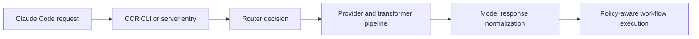

# Claude Code Router Tutorial: Multi-Provider Routing and Control Plane for Claude Code

> Learn how to use `musistudio/claude-code-router` to route Claude Code workloads across multiple model providers with configurable routing rules, transformers, presets, and operational controls.

## Why This Track Matters

`claude-code-router` is one of the largest routing control-plane projects for Claude Code and helps teams decouple workflow policy from any single model endpoint.

This track focuses on:

- setting up provider and router config safely
- understanding routing, fallback, and transformer pipelines
- using CLI, presets, and statusline for day-to-day operations
- deploying and securing the server for team usage

## Current Snapshot (auto-updated)

- repository: [`musistudio/claude-code-router`](https://github.com/musistudio/claude-code-router)
- stars: about **27.7k**
- latest release: no tagged GitHub release published yet
- recent activity: updates on **January 10, 2026**
- project positioning: multi-provider Claude Code routing layer with CLI + server architecture

## Mental Model

## Chapter Guide

| Chapter | Key Question | Outcome |
|:--------|:-------------|:--------|
| [01 - Getting Started](01-getting-started.md) | How do I install and run CCR quickly? | Working baseline |
| [02 - Architecture and Package Topology](02-architecture-and-package-topology.md) | How are CLI, server, and shared layers organized? | Better system understanding |
| [03 - Provider Configuration and Transformer Strategy](03-provider-configuration-and-transformer-strategy.md) | How should providers and transformers be configured? | Safer, cleaner provider integration |
| [04 - Routing Rules, Fallbacks, and Custom Router Logic](04-routing-rules-fallbacks-and-custom-router-logic.md) | How do I route by task profile and failure mode? | More reliable routing behavior |
| [05 - CLI Operations: Model, Preset, and Statusline Workflows](05-cli-operations-model-preset-and-statusline-workflows.md) | Which CLI workflows matter most in daily use? | Faster operator throughput |
| [06 - Server Deployment and API Integration](06-server-deployment-and-api-integration.md) | How do I deploy CCR beyond local machine usage? | Production-ready deployment baseline |
| [07 - GitHub Actions, Non-Interactive Mode, and Team Ops](07-github-actions-non-interactive-mode-and-team-ops.md) | How do I run CCR in CI and team environments? | Better automation readiness |
| [08 - Troubleshooting, Security, and Contribution Workflow](08-troubleshooting-security-and-contribution-workflow.md) | How do I maintain CCR safely as it evolves? | Long-term reliability playbook |

## What You Will Learn

- how to route Claude Code requests across heterogeneous model providers
- how to design resilient fallback and transformer behavior
- how to use presets and CLI tooling to simplify configuration management
- how to deploy, secure, and maintain CCR in team and CI contexts

## Source References

- [Claude Code Router Repository](https://github.com/musistudio/claude-code-router)
- [README](https://github.com/musistudio/claude-code-router/blob/main/README.md)
- [CLI Docs Intro](https://github.com/musistudio/claude-code-router/blob/main/docs/docs/cli/intro.md)
- [Server Docs Intro](https://github.com/musistudio/claude-code-router/blob/main/docs/docs/server/intro.md)
- [Routing Config Docs](https://github.com/musistudio/claude-code-router/blob/main/docs/docs/server/config/routing.md)

## Related Tutorials

- [Claude Code Tutorial](../claude-code-tutorial/)
- [OpenCode Tutorial](../opencode-tutorial/)
- [Codex CLI Tutorial](../codex-cli-tutorial/)
- [Anthropic Skills Tutorial](../anthropic-skills-tutorial/)

---

Start with [Chapter 1: Getting Started](01-getting-started.md).

## Navigation & Backlinks

- [Start Here: Chapter 1: Getting Started](01-getting-started.md)
- [Back to Main Catalog](../../README.md#-tutorial-catalog)
- [Browse A-Z Tutorial Directory](../../discoverability/tutorial-directory.md)
- [Search by Intent](../../discoverability/query-hub.md)
- [Explore Category Hubs](../../README.md#category-hubs)

## Full Chapter Map

1. [Chapter 1: Getting Started](01-getting-started.md)
2. [Chapter 2: Architecture and Package Topology](02-architecture-and-package-topology.md)
3. [Chapter 3: Provider Configuration and Transformer Strategy](03-provider-configuration-and-transformer-strategy.md)
4. [Chapter 4: Routing Rules, Fallbacks, and Custom Router Logic](04-routing-rules-fallbacks-and-custom-router-logic.md)
5. [Chapter 5: CLI Operations: Model, Preset, and Statusline Workflows](05-cli-operations-model-preset-and-statusline-workflows.md)
6. [Chapter 6: Server Deployment and API Integration](06-server-deployment-and-api-integration.md)
7. [Chapter 7: GitHub Actions, Non-Interactive Mode, and Team Ops](07-github-actions-non-interactive-mode-and-team-ops.md)
8. [Chapter 8: Troubleshooting, Security, and Contribution Workflow](08-troubleshooting-security-and-contribution-workflow.md)

*Generated by [AI Codebase Knowledge Builder](https://github.com/The-Pocket/Tutorial-Codebase-Knowledge)*
