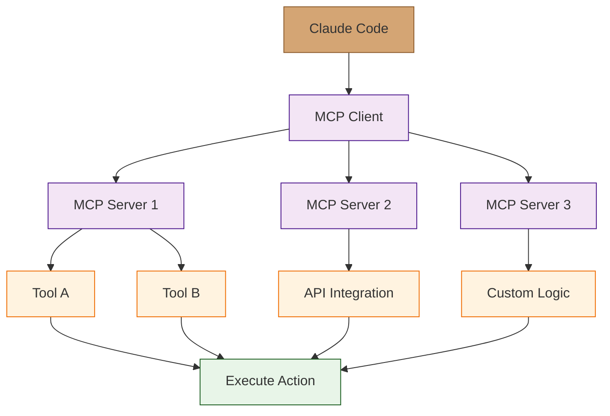

# Chapter 7: MCP Integration - Extending Claude Code with Custom Tools

> Master the Model Context Protocol to create custom tools, integrations, and extend Claude Code's capabilities.

## Overview

The Model Context Protocol (MCP) allows you to extend Claude Code with custom tools and integrations. This chapter covers creating MCP servers, building custom tools, and integrating external services with Claude Code.

## MCP Fundamentals

### What is MCP?

```yaml
# Model Context Protocol (MCP) is a standard for:
- Tool integration with AI assistants
- Secure communication between tools and models
- Extensible architecture for custom capabilities
- Standardized interface for tool development

# MCP enables:
- Custom tool development
- External API integrations
- Specialized functionality
- Secure tool execution
- Context-aware tool responses
```

### MCP Architecture



### MCP Communication Flow

```python
# MCP message flow:
# 1. Claude Code sends tool request
# 2. MCP client forwards to appropriate server
# 3. MCP server executes tool
# 4. Server returns structured response
# 5. Client formats response for Claude
# 6. Claude uses tool output in reasoning

# Example flow for a database query tool:
# User: "Show me users registered this month"
# Claude: [plans to use database tool]
# MCP Client: [forwards to database server]
# Database Server: [executes SQL query]
# Database Server: [returns user data]
# MCP Client: [formats data for Claude]
# Claude: [summarizes user registration trends]
```

## Creating MCP Servers

### Basic MCP Server Structure

```python
# basic_mcp_server.py
import asyncio
from mcp import Tool, ToolCall
from mcp.server import Server
from typing import Sequence
import json

class BasicMCPServer(Server):
    """Basic MCP server with custom tools"""

    def __init__(self):
        super().__init__("basic-tools")
        self.register_tools()

    def register_tools(self):
        """Register available tools"""

        # Calculator tool
        self.register_tool(Tool(
            name="calculator",
            description="Perform mathematical calculations",
            inputSchema={
                "type": "object",
                "properties": {
                    "expression": {
                        "type": "string",
                        "description": "Mathematical expression to evaluate"
                    }
                },
                "required": ["expression"]
            }
        ))

        # Text analyzer tool
        self.register_tool(Tool(
            name="analyze_text",
            description="Analyze text for various metrics",
            inputSchema={
                "type": "object",
                "properties": {
                    "text": {
                        "type": "string",
                        "description": "Text to analyze"
                    },
                    "analysis_type": {
                        "type": "string",
                        "enum": ["sentiment", "complexity", "summary"],
                        "description": "Type of analysis to perform"
                    }
                },
                "required": ["text", "analysis_type"]
            }
        ))

    async def handle_tool_call(self, tool_call: ToolCall) -> str:
        """Handle tool execution"""

        if tool_call.name == "calculator":
            return await self.handle_calculator(tool_call.arguments)

        elif tool_call.name == "analyze_text":
            return await self.handle_text_analysis(tool_call.arguments)

        else:
            raise ValueError(f"Unknown tool: {tool_call.name}")

    async def handle_calculator(self, args: dict) -> str:
        """Handle calculator tool"""
        expression = args.get("expression", "")

        try:
            # Safe evaluation (in production, use proper expression parser)
            result = eval(expression, {"__builtins__": {}})
            return json.dumps({
                "expression": expression,
                "result": result,
                "success": True
            })
        except Exception as e:
            return json.dumps({
                "expression": expression,
                "error": str(e),
                "success": False
            })

    async def handle_text_analysis(self, args: dict) -> str:
        """Handle text analysis tool"""
        text = args.get("text", "")
        analysis_type = args.get("analysis_type", "summary")

        if analysis_type == "sentiment":
            # Simple sentiment analysis
            positive_words = ["good", "great", "excellent", "amazing"]
            negative_words = ["bad", "terrible", "awful", "poor"]

            text_lower = text.lower()
            positive_count = sum(1 for word in positive_words if word in text_lower)
            negative_count = sum(1 for word in negative_words if word in text_lower)

            if positive_count > negative_count:
                sentiment = "positive"
            elif negative_count > positive_count:
                sentiment = "negative"
            else:
                sentiment = "neutral"

            return json.dumps({
                "text_length": len(text),
                "sentiment": sentiment,
                "positive_indicators": positive_count,
                "negative_indicators": negative_count
            })

        elif analysis_type == "complexity":
            # Simple complexity analysis
            sentences = len(text.split('.'))
            words = len(text.split())
            avg_words_per_sentence = words / sentences if sentences > 0 else 0

            return json.dumps({
                "sentences": sentences,
                "words": words,
                "avg_words_per_sentence": avg_words_per_sentence,
                "complexity_score": "high" if avg_words_per_sentence > 20 else "medium" if avg_words_per_sentence > 10 else "low"
            })

        elif analysis_type == "summary":
            # Simple extractive summary
            sentences = text.split('.')
            # Return first and last sentences as summary
            summary = '. '.join([sentences[0], sentences[-1]]).strip()

            return json.dumps({
                "original_length": len(text),
                "summary": summary,
                "compression_ratio": len(summary) / len(text) if len(text) > 0 else 0
            })

# Server startup
if __name__ == "__main__":
    server = BasicMCPServer()
    server.run()
```

### MCP Server Configuration

```yaml
# mcp-config.yaml
mcpServers:
  - name: "basic-tools"
    command: "python"
    args: ["basic_mcp_server.py"]
    env:
      PYTHONPATH: "/app"

  - name: "database-tools"
    command: "node"
    args: ["database-mcp-server.js"]
    env:
      DATABASE_URL: "${DATABASE_URL}"

  - name: "api-tools"
    command: "go"
    args: ["run", "api-mcp-server.go"]
    env:
      API_KEY: "${API_KEY}"

# Claude Code configuration
claude:
  mcp:
    enabled: true
    configFile: "./mcp-config.yaml"
    timeout: 30
    maxConcurrentTools: 5
```

### Advanced MCP Server Features

```python
# advanced_mcp_server.py
import asyncio
from mcp import Tool, ToolCall, Resource
from mcp.server import Server
from typing import Sequence, Optional
import aiohttp
import json
from datetime import datetime

class AdvancedMCPServer(Server):
    """Advanced MCP server with resources and complex tools"""

    def __init__(self):
        super().__init__("advanced-tools")
        self.http_session = None
        self.register_tools()
        self.register_resources()

    async def initialize(self):
        """Initialize server resources"""
        self.http_session = aiohttp.ClientSession()

    async def cleanup(self):
        """Clean up server resources"""
        if self.http_session:
            await self.http_session.close()

    def register_tools(self):
        """Register advanced tools"""

        # Web scraper tool
        self.register_tool(Tool(
            name="web_scraper",
            description="Scrape content from web pages with intelligent parsing",
            inputSchema={
                "type": "object",
                "properties": {
                    "url": {"type": "string", "description": "URL to scrape"},
                    "selectors": {
                        "type": "object",
                        "description": "CSS selectors for content extraction",
                        "properties": {
                            "title": {"type": "string"},
                            "content": {"type": "string"},
                            "metadata": {"type": "string"}
                        }
                    },
                    "follow_links": {"type": "boolean", "description": "Follow internal links"}
                },
                "required": ["url"]
            }
        ))

        # API client tool
        self.register_tool(Tool(
            name="api_client",
            description="Make HTTP API calls with proper error handling",
            inputSchema={
                "type": "object",
                "properties": {
                    "method": {"type": "string", "enum": ["GET", "POST", "PUT", "DELETE"]},
                    "url": {"type": "string"},
                    "headers": {"type": "object"},
                    "body": {"type": "string"},
                    "timeout": {"type": "number"}
                },
                "required": ["method", "url"]
            }
        ))

        # Database query tool
        self.register_tool(Tool(
            name="database_query",
            description="Execute safe database queries with result formatting",
            inputSchema={
                "type": "object",
                "properties": {
                    "query": {"type": "string", "description": "SQL query to execute"},
                    "database": {"type": "string", "description": "Database connection string"},
                    "max_rows": {"type": "number", "description": "Maximum rows to return"}
                },
                "required": ["query"]
            }
        ))

    def register_resources(self):
        """Register MCP resources"""

        # Configuration resource
        self.register_resource(Resource(
            uri="config://server/settings",
            name="Server Configuration",
            description="Current server configuration and settings",
            mimeType="application/json"
        ))

        # Metrics resource
        self.register_resource(Resource(
            uri="metrics://server/stats",
            name="Server Metrics",
            description="Real-time server performance metrics",
            mimeType="application/json"
        ))

        # Log resource
        self.register_resource(Resource(
            uri="logs://server/recent",
            name="Recent Server Logs",
            description="Recent server activity logs",
            mimeType="text/plain"
        ))

    async def handle_tool_call(self, tool_call: ToolCall) -> str:
        """Handle tool execution"""

        if tool_call.name == "web_scraper":
            return await self.handle_web_scraper(tool_call.arguments)

        elif tool_call.name == "api_client":
            return await self.handle_api_client(tool_call.arguments)

        elif tool_call.name == "database_query":
            return await self.handle_database_query(tool_call.arguments)

        else:
            raise ValueError(f"Unknown tool: {tool_call.name}")

    async def handle_resource_read(self, uri: str) -> str:
        """Handle resource reading"""

        if uri == "config://server/settings":
            return json.dumps(self.get_server_config())

        elif uri == "metrics://server/stats":
            return json.dumps(self.get_server_metrics())

        elif uri == "logs://server/recent":
            return self.get_recent_logs()

        else:
            raise ValueError(f"Unknown resource: {uri}")

    async def handle_web_scraper(self, args: dict) -> str:
        """Handle web scraping tool"""
        url = args.get("url")
        selectors = args.get("selectors", {})
        follow_links = args.get("follow_links", False)

        try:
            async with self.http_session.get(url) as response:
                html = await response.text()

            # Parse HTML and extract content
            # (In production, use beautifulsoup4 or similar)
            extracted_data = {
                "url": url,
                "status_code": response.status,
                "title": self.extract_title(html),
                "content": self.extract_content(html, selectors),
                "links": self.extract_links(html) if follow_links else []
            }

            return json.dumps(extracted_data)

        except Exception as e:
            return json.dumps({
                "error": str(e),
                "url": url
            })

    async def handle_api_client(self, args: dict) -> str:
        """Handle API client tool"""
        method = args.get("method", "GET")
        url = args.get("url")
        headers = args.get("headers", {})
        body = args.get("body")
        timeout = args.get("timeout", 30)

        try:
            request_kwargs = {
                "method": method,
                "url": url,
                "headers": headers,
                "timeout": aiohttp.ClientTimeout(total=timeout)
            }

            if body and method in ["POST", "PUT", "PATCH"]:
                request_kwargs["data"] = body

            async with self.http_session.request(**request_kwargs) as response:
                response_data = await response.text()

                # Try to parse JSON
                try:
                    json_data = json.loads(response_data)
                    return json.dumps({
                        "status_code": response.status,
                        "headers": dict(response.headers),
                        "json": json_data
                    })
                except json.JSONDecodeError:
                    return json.dumps({
                        "status_code": response.status,
                        "headers": dict(response.headers),
                        "text": response_data[:1000]  # Limit text length
                    })

        except Exception as e:
            return json.dumps({
                "error": str(e),
                "method": method,
                "url": url
            })

    async def handle_database_query(self, args: dict) -> str:
        """Handle database query tool"""
        query = args.get("query")
        database_url = args.get("database")
        max_rows = args.get("max_rows", 100)

        # Security: Only allow SELECT queries
        if not query.strip().upper().startswith("SELECT"):
            return json.dumps({
                "error": "Only SELECT queries are allowed",
                "query": query
            })

        try:
            # Database connection and query execution
            # (Implementation depends on database type)
            results = await self.execute_safe_query(query, database_url, max_rows)

            return json.dumps({
                "query": query,
                "row_count": len(results),
                "columns": list(results[0].keys()) if results else [],
                "rows": results
            })

        except Exception as e:
            return json.dumps({
                "error": str(e),
                "query": query
            })

    # Helper methods
    def extract_title(self, html: str) -> str:
        """Extract page title (simplified)"""
        # In production, use proper HTML parsing
        return "Page Title"

    def extract_content(self, html: str, selectors: dict) -> dict:
        """Extract content using selectors (simplified)"""
        # In production, use CSS selector libraries
        return {"main_content": "Extracted content"}

    def extract_links(self, html: str) -> list:
        """Extract links from HTML (simplified)"""
        # In production, use HTML parsing libraries
        return ["link1", "link2"]

    async def execute_safe_query(self, query: str, db_url: str, max_rows: int) -> list:
        """Execute database query safely (simplified)"""
        # In production, use proper database libraries with connection pooling
        return [{"id": 1, "name": "Sample Data"}]

    def get_server_config(self) -> dict:
        """Get server configuration"""
        return {
            "version": "1.0.0",
            "max_tools": 10,
            "timeout": 30,
            "debug_mode": False
        }

    def get_server_metrics(self) -> dict:
        """Get server metrics"""
        return {
            "uptime_seconds": 3600,
            "total_requests": 150,
            "active_connections": 5,
            "memory_usage_mb": 256
        }

    def get_recent_logs(self) -> str:
        """Get recent server logs"""
        return "2024-01-01 10:00:00 INFO Server started\n2024-01-01 10:05:00 INFO Tool executed successfully"

# Server lifecycle
async def main():
    server = AdvancedMCPServer()
    await server.initialize()

    try:
        await server.run()
    finally:
        await server.cleanup()

if __name__ == "__main__":
    asyncio.run(main())
```

## MCP Tool Development Best Practices

### Tool Design Principles

```python
# effective_tool_design.py
from typing import Dict, Any, Optional
import pydantic
from enum import Enum

class ToolCategory(Enum):
    DATA_RETRIEVAL = "data_retrieval"
    DATA_PROCESSING = "data_processing"
    EXTERNAL_INTEGRATION = "external_integration"
    UTILITY = "utility"

class ToolMetadata:
    """Metadata for tool registration"""
    def __init__(self,
                 name: str,
                 description: str,
                 category: ToolCategory,
                 version: str = "1.0.0",
                 author: str = "",
                 tags: list = None):
        self.name = name
        self.description = description
        self.category = category
        self.version = version
        self.author = author
        self.tags = tags or []

class BaseTool:
    """Base class for MCP tools with common functionality"""

    def __init__(self, metadata: ToolMetadata):
        self.metadata = metadata
        self.call_count = 0
        self.error_count = 0
        self.last_used = None

    def get_schema(self) -> Dict[str, Any]:
        """Get JSON schema for tool input"""
        raise NotImplementedError

    async def execute(self, **kwargs) -> Dict[str, Any]:
        """Execute the tool"""
        self.call_count += 1
        self.last_used = datetime.now()

        try:
            result = await self._execute_impl(**kwargs)
            return {
                "success": True,
                "result": result,
                "execution_time": time.time() - time.time(),  # Would track actual time
                "tool_version": self.metadata.version
            }
        except Exception as e:
            self.error_count += 1
            return {
                "success": False,
                "error": str(e),
                "error_type": type(e).__name__,
                "tool_version": self.metadata.version
            }

    async def _execute_impl(self, **kwargs) -> Any:
        """Actual tool implementation"""
        raise NotImplementedError

    def get_stats(self) -> Dict[str, Any]:
        """Get tool usage statistics"""
        return {
            "calls": self.call_count,
            "errors": self.error_count,
            "success_rate": (self.call_count - self.error_count) / self.call_count if self.call_count > 0 else 0,
            "last_used": self.last_used.isoformat() if self.last_used else None
        }

# Example implementation
class WeatherAPITool(BaseTool):
    """Tool for weather API integration"""

    def __init__(self):
        metadata = ToolMetadata(
            name="weather_api",
            description="Get current weather and forecasts",
            category=ToolCategory.EXTERNAL_INTEGRATION,
            version="2.1.0",
            author="Weather Corp",
            tags=["weather", "api", "forecast"]
        )
        super().__init__(metadata)

    def get_schema(self) -> Dict[str, Any]:
        return {
            "type": "object",
            "properties": {
                "location": {
                    "type": "string",
                    "description": "City name or coordinates (lat,lng)"
                },
                "units": {
                    "type": "string",
                    "enum": ["metric", "imperial"],
                    "default": "metric",
                    "description": "Temperature units"
                },
                "include_forecast": {
                    "type": "boolean",
                    "default": False,
                    "description": "Include 5-day forecast"
                }
            },
            "required": ["location"]
        }

    async def _execute_impl(self, location: str, units: str = "metric", include_forecast: bool = False) -> Dict[str, Any]:
        """Get weather data from API"""
        # API call implementation
        # This would make actual API calls to weather service

        # Mock response for example
        return {
            "location": location,
            "current": {
                "temperature": 22.5,
                "humidity": 65,
                "condition": "Partly cloudy",
                "wind_speed": 12.5
            },
            "forecast": [
                {"date": "2024-01-02", "temp": 24.0, "condition": "Sunny"},
                {"date": "2024-01-03", "temp": 21.0, "condition": "Rainy"}
            ] if include_forecast else None,
            "units": units
        }

# Tool registry
class ToolRegistry:
    """Registry for managing MCP tools"""

    def __init__(self):
        self.tools: Dict[str, BaseTool] = {}

    def register(self, tool: BaseTool):
        """Register a tool"""
        self.tools[tool.metadata.name] = tool

    def get_tool(self, name: str) -> Optional[BaseTool]:
        """Get tool by name"""
        return self.tools.get(name)

    def list_tools(self, category: Optional[ToolCategory] = None) -> list:
        """List registered tools"""
        tools = list(self.tools.values())
        if category:
            tools = [t for t in tools if t.metadata.category == category]
        return tools

    def get_stats(self) -> Dict[str, Any]:
        """Get registry statistics"""
        total_tools = len(self.tools)
        tools_by_category = {}
        for tool in self.tools.values():
            cat = tool.metadata.category.value
            tools_by_category[cat] = tools_by_category.get(cat, 0) + 1

        return {
            "total_tools": total_tools,
            "tools_by_category": tools_by_category,
            "most_used_tool": max(self.tools.values(), key=lambda t: t.call_count).metadata.name if self.tools else None
        }

# Global registry
tool_registry = ToolRegistry()

# Register example tool
weather_tool = WeatherAPITool()
tool_registry.register(weather_tool)
```

### Error Handling and Resilience

```python
# resilient_tools.py
import asyncio
import backoff
from typing import Callable, Any, Optional
import logging

logger = logging.getLogger(__name__)

class ResilientTool:
    """Tool with built-in resilience features"""

    def __init__(self, max_retries: int = 3, backoff_factor: float = 2.0, timeout: float = 30.0):
        self.max_retries = max_retries
        self.backoff_factor = backoff_factor
        self.timeout = timeout

    @backoff.on_exception(
        backoff.expo,
        (ConnectionError, TimeoutError, aiohttp.ClientError),
        max_tries=3,
        factor=2.0
    )
    async def execute_with_retry(self, func: Callable, *args, **kwargs) -> Any:
        """Execute function with exponential backoff retry"""
        return await asyncio.wait_for(func(*args, **kwargs), timeout=self.timeout)

    async def execute_with_fallback(self,
                                   primary_func: Callable,
                                   fallback_func: Callable,
                                   *args, **kwargs) -> Any:
        """Execute with fallback mechanism"""
        try:
            return await self.execute_with_retry(primary_func, *args, **kwargs)
        except Exception as e:
            logger.warning(f"Primary execution failed: {e}, trying fallback")
            try:
                return await self.execute_with_retry(fallback_func, *args, **kwargs)
            except Exception as fallback_error:
                logger.error(f"Fallback also failed: {fallback_error}")
                raise fallback_error

    async def execute_with_circuit_breaker(self,
                                          func: Callable,
                                          circuit_key: str,
                                          failure_threshold: int = 5,
                                          *args, **kwargs) -> Any:
        """Execute with circuit breaker pattern"""
        # Circuit breaker implementation would go here
        # For now, just execute normally
        return await self.execute_with_retry(func, *args, **kwargs)

class CircuitBreaker:
    """Simple circuit breaker implementation"""

    def __init__(self, failure_threshold: int = 5, recovery_timeout: int = 60):
        self.failure_threshold = failure_threshold
        self.recovery_timeout = recovery_timeout
        self.failure_count = 0
        self.last_failure_time = 0
        self.state = "closed"  # closed, open, half-open

    async def call(self, func: Callable, *args, **kwargs) -> Any:
        current_time = time.time()

        if self.state == "open":
            if current_time - self.last_failure_time > self.recovery_timeout:
                self.state = "half-open"
            else:
                raise Exception("Circuit breaker is OPEN")

        try:
            result = await func(*args, **kwargs)
            if self.state == "half-open":
                self.state = "closed"
                self.failure_count = 0
            return result
        except Exception as e:
            self.failure_count += 1
            self.last_failure_time = current_time

            if self.failure_count >= self.failure_threshold:
                self.state = "open"

            raise e

# Enhanced tool with resilience
class ResilientAPITool(ResilientTool):
    """API tool with comprehensive error handling"""

    def __init__(self, api_key: str, base_url: str):
        super().__init__()
        self.api_key = api_key
        self.base_url = base_url
        self.circuit_breaker = CircuitBreaker()

    async def make_api_call(self, endpoint: str, method: str = "GET", data: Optional[dict] = None) -> dict:
        """Make API call with full resilience"""

        async def _api_call():
            url = f"{self.base_url}/{endpoint}"
            headers = {"Authorization": f"Bearer {self.api_key}"}

            async with aiohttp.ClientSession() as session:
                async with session.request(method, url, headers=headers, json=data) as response:
                    response.raise_for_status()
                    return await response.json()

        # Execute with circuit breaker and retry
        return await self.circuit_breaker.call(
            lambda: self.execute_with_retry(_api_call)
        )

    async def make_api_call_with_fallback(self, primary_endpoint: str, fallback_endpoint: str, **kwargs) -> dict:
        """Make API call with fallback endpoint"""

        async def primary():
            return await self.make_api_call(primary_endpoint, **kwargs)

        async def fallback():
            return await self.make_api_call(fallback_endpoint, **kwargs)

        return await self.execute_with_fallback(primary, fallback)

# Usage example
resilient_api = ResilientAPITool("api-key-123", "https://api.example.com")

# This will automatically retry on failures and use circuit breaker
try:
    result = await resilient_api.make_api_call("users/123")
    print(f"User data: {result}")
except Exception as e:
    print(f"API call failed after retries: {e}")
```

## MCP Security Considerations

### Tool Authentication and Authorization

```python
# secure_mcp_tools.py
import jwt
import hashlib
from typing import Dict, Any, Optional
from datetime import datetime, timedelta

class SecureToolManager:
    """Manage secure tool execution with authentication"""

    def __init__(self, jwt_secret: str):
        self.jwt_secret = jwt_secret
        self.tool_permissions: Dict[str, list] = {}
        self.audit_log = []

    def register_tool_permissions(self, tool_name: str, allowed_roles: list):
        """Register permissions for a tool"""
        self.tool_permissions[tool_name] = allowed_roles

    def authenticate_request(self, token: str) -> Optional[Dict[str, Any]]:
        """Authenticate and decode JWT token"""
        try:
            payload = jwt.decode(token, self.jwt_secret, algorithms=["HS256"])
            return payload
        except jwt.ExpiredSignatureError:
            return None
        except jwt.InvalidTokenError:
            return None

    def authorize_tool_access(self, user_info: Dict[str, Any], tool_name: str) -> bool:
        """Check if user can access tool"""
        user_roles = user_info.get("roles", [])
        allowed_roles = self.tool_permissions.get(tool_name, [])

        # Check if user has any of the allowed roles
        return any(role in allowed_roles for role in user_roles)

    def validate_tool_input(self, tool_name: str, input_data: Dict[str, Any]) -> bool:
        """Validate tool input for security"""
        # Input sanitization and validation
        # Remove potentially dangerous inputs
        # Check for SQL injection, XSS, etc.

        # Tool-specific validation
        if tool_name == "database_query":
            query = input_data.get("query", "")
            if not self._is_safe_query(query):
                return False

        return True

    def log_tool_execution(self, user_info: Dict[str, Any], tool_name: str, success: bool, execution_time: float):
        """Log tool execution for audit"""
        log_entry = {
            "timestamp": datetime.now().isoformat(),
            "user": user_info.get("sub"),
            "tool": tool_name,
            "success": success,
            "execution_time": execution_time,
            "ip_address": user_info.get("ip", "unknown")
        }

        self.audit_log.append(log_entry)

        # Keep only last 1000 entries
        if len(self.audit_log) > 1000:
            self.audit_log = self.audit_log[-1000:]

    def get_audit_log(self, user_id: Optional[str] = None, tool_name: Optional[str] = None) -> list:
        """Get filtered audit log"""
        filtered_log = self.audit_log

        if user_id:
            filtered_log = [entry for entry in filtered_log if entry["user"] == user_id]

        if tool_name:
            filtered_log = [entry for entry in filtered_log if entry["tool"] == tool_name]

        return filtered_log

    def _is_safe_query(self, query: str) -> bool:
        """Check if SQL query is safe"""
        # Very basic safety check - in production, use proper SQL parser
        dangerous_keywords = ["DROP", "DELETE", "UPDATE", "INSERT", "ALTER"]
        query_upper = query.upper()

        for keyword in dangerous_keywords:
            if keyword in query_upper:
                return False

        return True

# Secure MCP server
class SecureMCPServer(Server):
    """MCP server with security features"""

    def __init__(self, jwt_secret: str):
        super().__init__("secure-tools")
        self.security_manager = SecureToolManager(jwt_secret)
        self.register_secure_tools()

    def register_secure_tools(self):
        """Register tools with security policies"""

        # Database tool - admin only
        self.security_manager.register_tool_permissions("admin_database", ["admin"])

        # User data tool - user and admin
        self.security_manager.register_tool_permissions("user_data", ["user", "admin"])

        # Public tool - no authentication required
        self.security_manager.register_tool_permissions("public_info", ["*"])

    async def handle_tool_call(self, tool_call: ToolCall, auth_token: Optional[str] = None) -> str:
        """Handle tool execution with security checks"""

        # Authenticate user
        if auth_token:
            user_info = self.security_manager.authenticate_request(auth_token)
            if not user_info:
                return json.dumps({"error": "Invalid authentication token"})
        else:
            user_info = {"roles": ["anonymous"]}

        # Authorize tool access
        if not self.security_manager.authorize_tool_access(user_info, tool_call.name):
            return json.dumps({"error": "Access denied to tool"})

        # Validate input
        if not self.security_manager.validate_tool_input(tool_call.name, tool_call.arguments):
            return json.dumps({"error": "Invalid tool input"})

        # Execute tool with timing
        start_time = time.time()

        try:
            result = await self.execute_tool(tool_call)

            # Log successful execution
            execution_time = time.time() - start_time
            self.security_manager.log_tool_execution(user_info, tool_call.name, True, execution_time)

            return json.dumps({"success": True, "result": result})

        except Exception as e:
            # Log failed execution
            execution_time = time.time() - start_time
            self.security_manager.log_tool_execution(user_info, tool_call.name, False, execution_time)

            return json.dumps({"success": False, "error": str(e)})

    async def execute_tool(self, tool_call: ToolCall) -> Any:
        """Execute the actual tool logic"""
        # Tool execution implementation
        pass

# Usage
secure_server = SecureMCPServer("your-jwt-secret-here")

# Client would need to include auth token
# curl -H "Authorization: Bearer <jwt-token>" \
#      -X POST http://localhost:3001/api/v1/mcp/tool \
#      -d '{"name": "admin_database", "args": {"query": "SELECT * FROM users"}}'
```

## Summary

In this chapter, we've covered:

- **MCP Fundamentals**: Protocol architecture and communication flow
- **Server Creation**: Basic and advanced MCP server implementation
- **Tool Development**: Custom tools with proper schemas and error handling
- **Advanced Features**: Resources, complex tools, and async operations
- **Best Practices**: Tool design, validation, and performance optimization
- **Security**: Authentication, authorization, input validation, and audit logging

## Key Takeaways

1. **Extensible Architecture**: MCP enables custom tool development and integration
2. **Standardized Interface**: Consistent tool registration and execution patterns
3. **Security First**: Built-in authentication, authorization, and input validation
4. **Resilient Design**: Retry logic, circuit breakers, and graceful error handling
5. **Performance Optimized**: Async operations, connection pooling, and caching
6. **Audit Ready**: Comprehensive logging and monitoring capabilities
7. **Scalable**: Support for multiple tools and concurrent execution
8. **Developer Friendly**: Clear schemas, documentation, and error messages

## Next Steps

Now that you can extend Claude Code with custom tools, let's explore **advanced workflows** for complex development scenarios.

---

**Ready for Chapter 8?** [Advanced Workflows](08-advanced.md)

*Generated for [Awesome Code Docs](https://github.com/johnxie/awesome-code-docs)*