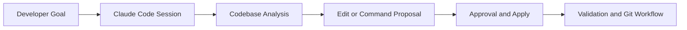

# Claude Code Tutorial: Agentic Coding from Your Terminal

> Learn how to use `anthropics/claude-code` for codebase understanding, multi-file edits, command execution, git workflows, and MCP-based extension.

## Why This Track Matters

Claude Code is one of the highest-usage terminal coding agents. To use it effectively in real repositories, teams need clear control patterns for edits, commands, and tooling.

This track focuses on:

- deterministic task loops in terminal workflows
- safe file-edit and command approval patterns
- git-native review and rollback behavior
- extension through MCP and advanced automation

## Current Snapshot (Verified February 11, 2026)

- repository: [`anthropics/claude-code`](https://github.com/anthropics/claude-code)
- stars: about **66.1k**
- latest release: [`v2.1.39`](https://github.com/anthropics/claude-code/releases/tag/v2.1.39)
- official docs and guides: Claude Code section in Anthropic docs
- focus areas in project docs: terminal agent workflows, approvals, and integration patterns

## Mental Model

## Chapter Guide

| Chapter | Key Question | Outcome |
|:--------|:-------------|:--------|
| [01 - Getting Started](01-getting-started.md) | How do I install and authenticate safely? | Functional Claude Code baseline |
| [02 - Basic Commands](02-basic-commands.md) | How do I drive productive terminal sessions? | Core command workflow mastery |
| [03 - Code Understanding](03-code-understanding.md) | How does Claude build repository context? | Better scoped and grounded tasks |
| [04 - File Editing](04-file-editing.md) | How do I accept/reject edits safely? | Reliable diff and patch practices |
| [05 - Command Execution](05-commands.md) | How do I manage runtime commands responsibly? | Controlled test/build/debug loops |
| [06 - Git Workflows](06-git.md) | How does Claude integrate with version control? | Commit/review/rollback playbook |
| [07 - MCP Integration](07-mcp.md) | How do I extend capabilities with tools? | MCP-based extension model |
| [08 - Advanced Workflows](08-advanced.md) | How do I scale to larger tasks and teams? | Advanced operator patterns |

## What You Will Learn

- how to run Claude Code safely in real engineering repositories
- how to structure prompts and approvals for predictable outcomes
- how to combine edits, commands, and git workflows effectively
- how to extend Claude Code with MCP and team-oriented practices

## Source References

- [Claude Code Repository](https://github.com/anthropics/claude-code)
- [Claude Code Releases](https://github.com/anthropics/claude-code/releases)
- [Claude Code Docs](https://docs.anthropic.com/en/docs/claude-code)

## Related Tutorials

- [Anthropic API Tutorial](../anthropic-code-tutorial/)
- [Cline Tutorial](../cline-tutorial/)
- [Roo Code Tutorial](../roo-code-tutorial/)
- [Aider Tutorial](../aider-tutorial/)

---

Start with [Chapter 1: Getting Started](01-getting-started.md).
