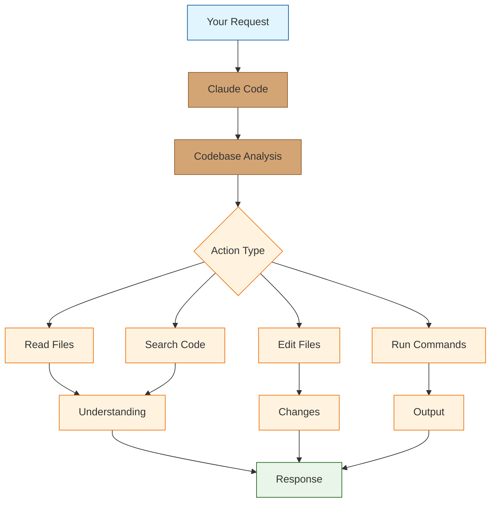

# Claude Code Tutorial: AI-Powered Terminal Coding

> Master Anthropic's agentic coding tool that lives in your terminal.

<div align="center">

**🖥️ Claude That Codes With You**

</div>

---

## 🎯 What is Claude Code?

**Claude Code** is Anthropic's agentic coding tool that operates directly in your terminal. It can understand your codebase, make edits across multiple files, run commands, and help you build software through natural conversation.

### Key Features

| Feature | Description |
|:--------|:------------|
| **Codebase Understanding** | Analyzes your entire project structure |
| **Multi-File Editing** | Makes coordinated changes across files |
| **Command Execution** | Runs tests, builds, and shell commands |
| **Git Integration** | Creates commits with proper messages |
| **Context Awareness** | Maintains conversation history |
| **Tool Use** | Extensible with MCP (Model Context Protocol) |



## Tutorial Chapters

1. **[Chapter 1: Getting Started](01-getting-started.md)** - Installation, authentication, and first session
2. **[Chapter 2: Basic Commands](02-basic-commands.md)** - Essential Claude Code operations
3. **[Chapter 3: Code Understanding](03-code-understanding.md)** - How Claude analyzes your codebase
4. **[Chapter 4: File Editing](04-file-editing.md)** - Making changes across your project
5. **[Chapter 5: Command Execution](05-commands.md)** - Running tests, builds, and scripts
6. **[Chapter 6: Git Workflows](06-git.md)** - Commits, branches, and version control
7. **[Chapter 7: MCP Integration](07-mcp.md)** - Extending with Model Context Protocol
8. **[Chapter 8: Advanced Workflows](08-advanced.md)** - Complex development patterns

## What You'll Learn

- **Navigate Code** with AI-powered understanding
- **Edit Efficiently** across multiple files at once
- **Run Commands** safely with approval workflows
- **Manage Git** with intelligent commits
- **Extend Capabilities** with MCP tools
- **Build Features** through conversation
- **Debug Issues** with context-aware help

## Prerequisites

- macOS, Linux, or Windows (WSL)
- Node.js 18+
- Anthropic API key or Claude Pro subscription
- A code project to work with

## Quick Start

```bash
# Install Claude Code
npm install -g @anthropic-ai/claude-code

# Authenticate
claude auth login

# Start in your project directory
cd your-project
claude

# Or run a one-off command
claude "explain the authentication flow in this codebase"
```

## Basic Usage

```bash
# Start interactive session
$ claude
╭─────────────────────────────────────────────╮
│ Claude Code                                  │
│ Type your request or /help for commands     │
╰─────────────────────────────────────────────╯

> What does this project do?

I'll analyze your codebase to understand its purpose...

[Reads package.json, README.md, src/index.ts]

This is a TypeScript REST API built with Express that provides:
- User authentication with JWT tokens
- CRUD operations for blog posts
- PostgreSQL database with Prisma ORM
...

> Add rate limiting to the API endpoints

I'll add rate limiting using express-rate-limit. Here's my plan:
1. Install express-rate-limit package
2. Create a rate limiter middleware
3. Apply it to the API routes

Shall I proceed? [Y/n]
```

## Key Commands

| Command | Description |
|:--------|:------------|
| `/help` | Show available commands |
| `/clear` | Clear conversation history |
| `/compact` | Reduce context size |
| `/cost` | Show token usage and cost |
| `/quit` | Exit Claude Code |

## Example Workflows

### Bug Fixing
```
> There's a bug where users can't log in after password reset. 
> The error is "Invalid token" but the token looks correct.

Let me investigate the password reset flow...
[Searches for password reset code]
[Reads auth/reset.ts and auth/verify.ts]

I found the issue. The token verification is checking against 
the old password hash instead of the reset token. Here's the fix:
...
```

### Feature Development
```
> Add a webhook system that notifies external services when 
> a new blog post is published

I'll implement a webhook system with the following components:
1. Webhook registration endpoint
2. Webhook storage in the database
3. Event dispatcher for post creation
4. Retry logic for failed deliveries

Let me start by creating the database schema...
```

### Code Review
```
> Review the changes in the last commit for security issues

[Runs git diff HEAD~1]

I found 2 potential security concerns:

1. SQL Injection Risk (src/queries.ts:45)
   The query uses string interpolation instead of parameterized queries.
   
2. Missing Input Validation (src/api/users.ts:23)
   The email field isn't validated before database insertion.

Would you like me to fix these issues?
```

## Safety Features

- **Approval Prompts** - Asks before making changes
- **Diff Preview** - Shows changes before applying
- **Command Confirmation** - Requires approval for shell commands
- **Undo Support** - Can revert recent changes

## Learning Path

### 🟢 Beginner Track
1. Chapters 1-3: Setup and code understanding
2. Let Claude explain and navigate your code

### 🟡 Intermediate Track
1. Chapters 4-6: Editing, commands, and Git
2. Build features with Claude's help

### 🔴 Advanced Track
1. Chapters 7-8: MCP integration and advanced workflows
2. Extend and customize Claude Code

---

**Ready to code with Claude? Let's begin with [Chapter 1: Getting Started](01-getting-started.md)!**

*Generated for [Awesome Code Docs](https://github.com/johnxie/awesome-code-docs)*
