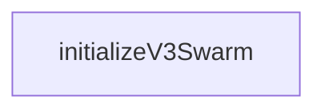

# Chapter 1: Getting Started

Welcome to **Chapter 1: Getting Started**. In this part of **Claude Flow Tutorial: Multi-Agent Orchestration, MCP Tooling, and V3 Module Architecture**, you will build an intuitive mental model first, then move into concrete implementation details and practical production tradeoffs.


This chapter gets Claude Flow running quickly and sets expectations for how it should be used.

## Learning Goals

- install and initialize Claude Flow CLI paths
- understand project positioning around orchestration versus execution
- validate first swarm and memory commands
- establish a safe baseline before scaling complexity

## First-Run Baseline

1. ensure Node.js 18+ (V2) or Node.js 20+ (V3 docs) for the selected flow
2. initialize with `npx claude-flow@alpha init --wizard` or equivalent install path
3. run basic swarm setup and status checks
4. test one memory store/search loop
5. pair with your coding host while keeping execution responsibility explicit in your workflow

## Source References

- [README](https://github.com/ruvnet/claude-flow/blob/main/README.md)
- [V2 README](https://github.com/ruvnet/claude-flow/blob/main/v2/README.md)
- [AGENTS Guide](https://github.com/ruvnet/claude-flow/blob/main/AGENTS.md)

## Summary

You now have a practical bootstrap path and a clearer operating model for early adoption.

Next: [Chapter 2: V3 Architecture and ADRs](02-v3-architecture-and-adrs.md)

## Source Code Walkthrough

### `v3/index.ts`

The `initializeV3Swarm` function in [`v3/index.ts`](https://github.com/ruvnet/claude-flow/blob/HEAD/v3/index.ts) handles a key part of this chapter's functionality:

```ts
 * @example
 * ```typescript
 * import { initializeV3Swarm } from './v3';
 *
 * const swarm = await initializeV3Swarm();
 * await swarm.spawnAllAgents();
 *
 * // Submit a task
 * const task = swarm.submitTask({
 *   type: 'implementation',
 *   title: 'Implement feature X',
 *   description: 'Detailed description...',
 *   domain: 'core',
 *   phase: 'phase-2-core',
 *   priority: 'high'
 * });
 * ```
 */
export async function initializeV3Swarm(config?: Partial<SwarmConfig>): Promise<ISwarmHub> {
  const { createSwarmHub } = await import('./coordination/swarm-hub');
  const swarm = createSwarmHub();
  await swarm.initialize(config);
  return swarm;
}

/**
 * Get the current V3 swarm instance
 * Creates a new one if none exists
 */
export async function getOrCreateSwarm(): Promise<ISwarmHub> {
  const { getSwarmHub } = await import('./coordination/swarm-hub');
  const swarm = getSwarmHub();
```

This function is important because it defines how Claude Flow Tutorial: Multi-Agent Orchestration, MCP Tooling, and V3 Module Architecture implements the patterns covered in this chapter.


## How These Components Connect


