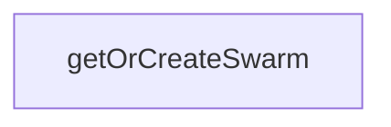

# Chapter 2: V3 Architecture and ADRs

Welcome to **Chapter 2: V3 Architecture and ADRs**. In this part of **Claude Flow Tutorial: Multi-Agent Orchestration, MCP Tooling, and V3 Module Architecture**, you will build an intuitive mental model first, then move into concrete implementation details and practical production tradeoffs.


This chapter explains the V3 module split and ADR-driven architecture decisions.

## Learning Goals

- map core V3 modules to their responsibilities
- understand ADR intent behind architecture choices
- identify where V2 assumptions no longer apply cleanly
- prioritize modules based on your adoption stage

## Architecture Reading Order

Start with the V3 README for module topology, then review the ADR index to understand decision intent, and finally map required modules (swarm, mcp, memory, security, testing) to your own workload constraints.

## Source References

- [V3 README](https://github.com/ruvnet/claude-flow/blob/main/v3/README.md)
- [V3 ADR Index](https://github.com/ruvnet/claude-flow/blob/main/v3/docs/adr/README.md)
- [V3 Implementation Docs](https://github.com/ruvnet/claude-flow/blob/main/v3/implementation/README.md)

## Summary

You now have a grounded model of how V3 is structured and how ADRs shape implementation priorities.

Next: [Chapter 3: Swarm Coordination and Consensus Patterns](03-swarm-coordination-and-consensus-patterns.md)

## Depth Expansion Playbook

## Source Code Walkthrough

### `v3/index.ts`

The `getOrCreateSwarm` function in [`v3/index.ts`](https://github.com/ruvnet/claude-flow/blob/HEAD/v3/index.ts) handles a key part of this chapter's functionality:

```ts
 * Creates a new one if none exists
 */
export async function getOrCreateSwarm(): Promise<ISwarmHub> {
  const { getSwarmHub } = await import('./coordination/swarm-hub');
  const swarm = getSwarmHub();

  if (!swarm.isInitialized()) {
    await swarm.initialize();
  }

  return swarm;
}

// =============================================================================
// Version Info
// =============================================================================

export const V3_VERSION = {
  major: 3,
  minor: 0,
  patch: 0,
  prerelease: 'alpha',
  full: '3.0.0-alpha',
  buildDate: new Date().toISOString()
};

export const V3_INFO = {
  name: 'claude-flow',
  version: V3_VERSION.full,
  description: 'Complete reimagining of Claude-Flow with 15-agent hierarchical mesh swarm',
  repository: 'https://github.com/ruvnet/claude-flow',
  license: 'MIT',
```

This function is important because it defines how Claude Flow Tutorial: Multi-Agent Orchestration, MCP Tooling, and V3 Module Architecture implements the patterns covered in this chapter.


## How These Components Connect


