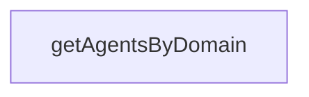

# Chapter 3: Swarm Coordination and Consensus Patterns

Welcome to **Chapter 3: Swarm Coordination and Consensus Patterns**. In this part of **Claude Flow Tutorial: Multi-Agent Orchestration, MCP Tooling, and V3 Module Architecture**, you will build an intuitive mental model first, then move into concrete implementation details and practical production tradeoffs.


This chapter focuses on multi-agent topology, role assignment, and coordination protocols.

## Learning Goals

- choose topology patterns based on scale and latency tradeoffs
- route tasks by domain and capability boundaries
- evaluate consensus mode choices for risk tolerance
- avoid over-coordination overhead on simple workloads

## Coordination Rule of Thumb

Use hierarchical or centralized patterns for clearer control paths, switch to hybrid when scale or domain parallelism increases, and reserve heavier consensus settings for high-risk decisions.

## Source References

- [@claude-flow/swarm](https://github.com/ruvnet/claude-flow/blob/main/v3/@claude-flow/swarm/README.md)
- [README](https://github.com/ruvnet/claude-flow/blob/main/README.md)
- [V3 README](https://github.com/ruvnet/claude-flow/blob/main/v3/README.md)

## Summary

You can now design swarm coordination with clearer topology and consensus tradeoffs.

Next: [Chapter 4: Memory, Learning, and Intelligence Systems](04-memory-learning-and-intelligence-systems.md)

## Source Code Walkthrough

### `v3/swarm.config.ts`

The `getAgentsByDomain` function in [`v3/swarm.config.ts`](https://github.com/ruvnet/claude-flow/blob/HEAD/v3/swarm.config.ts) handles a key part of this chapter's functionality:

```ts
// =============================================================================

export function getAgentsByDomain(domain: AgentDomain): string[] {
  return Object.entries(agentRoleMapping)
    .filter(([_, config]) => config.domain === domain)
    .map(([id, _]) => id);
}

export function getAgentConfig(agentId: string) {
  return agentRoleMapping[agentId as keyof typeof agentRoleMapping];
}

export function getPhaseConfig(phaseId: PhaseId): PhaseConfig | undefined {
  return defaultSwarmConfig.phases.find(p => p.id === phaseId);
}

export function getActiveAgentsForPhase(phaseId: PhaseId): string[] {
  const phase = getPhaseConfig(phaseId);
  if (!phase) return [];

  const agents: string[] = [];
  for (const domain of phase.activeDomains) {
    agents.push(...getAgentsByDomain(domain));
  }

  return [...new Set(agents)];
}

export function createCustomConfig(overrides: Partial<V3SwarmConfig>): V3SwarmConfig {
  return {
    ...defaultSwarmConfig,
    ...overrides,
```

This function is important because it defines how Claude Flow Tutorial: Multi-Agent Orchestration, MCP Tooling, and V3 Module Architecture implements the patterns covered in this chapter.


## How These Components Connect


