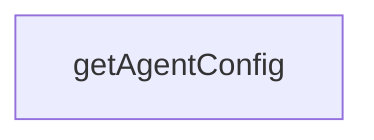

# Chapter 4: Memory, Learning, and Intelligence Systems

Welcome to **Chapter 4: Memory, Learning, and Intelligence Systems**. In this part of **Claude Flow Tutorial: Multi-Agent Orchestration, MCP Tooling, and V3 Module Architecture**, you will build an intuitive mental model first, then move into concrete implementation details and practical production tradeoffs.


This chapter maps memory backends and intelligence components used by Claude Flow.

## Learning Goals

- understand HNSW and hybrid memory backend design claims
- map cache and quantization settings to workload behavior
- evaluate SONA/integration surfaces pragmatically
- separate capability targets from verified production guarantees

## Practical Approach

Treat vector memory and learning features as tunable subsystems. Start with conservative defaults, collect latency/error metrics, then increase complexity only where measurable benefit exists.

## Source References

- [@claude-flow/memory](https://github.com/ruvnet/claude-flow/blob/main/v3/@claude-flow/memory/README.md)
- [@claude-flow/integration](https://github.com/ruvnet/claude-flow/blob/main/v3/@claude-flow/integration/README.md)
- [@claude-flow/performance](https://github.com/ruvnet/claude-flow/blob/main/v3/@claude-flow/performance/README.md)

## Summary

You now have a practical framework for adopting memory and learning features incrementally.

Next: [Chapter 5: MCP Server, CLI, and Runtime Operations](05-mcp-server-cli-and-runtime-operations.md)

## Source Code Walkthrough

### `v3/swarm.config.ts`

The `getAgentConfig` function in [`v3/swarm.config.ts`](https://github.com/ruvnet/claude-flow/blob/HEAD/v3/swarm.config.ts) handles a key part of this chapter's functionality:

```ts
}

export function getAgentConfig(agentId: string) {
  return agentRoleMapping[agentId as keyof typeof agentRoleMapping];
}

export function getPhaseConfig(phaseId: PhaseId): PhaseConfig | undefined {
  return defaultSwarmConfig.phases.find(p => p.id === phaseId);
}

export function getActiveAgentsForPhase(phaseId: PhaseId): string[] {
  const phase = getPhaseConfig(phaseId);
  if (!phase) return [];

  const agents: string[] = [];
  for (const domain of phase.activeDomains) {
    agents.push(...getAgentsByDomain(domain));
  }

  return [...new Set(agents)];
}

export function createCustomConfig(overrides: Partial<V3SwarmConfig>): V3SwarmConfig {
  return {
    ...defaultSwarmConfig,
    ...overrides,
    performance: {
      ...defaultSwarmConfig.performance,
      ...overrides.performance
    },
    github: {
      ...defaultSwarmConfig.github,
```

This function is important because it defines how Claude Flow Tutorial: Multi-Agent Orchestration, MCP Tooling, and V3 Module Architecture implements the patterns covered in this chapter.


## How These Components Connect


