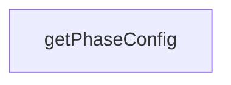

# Chapter 5: MCP Server, CLI, and Runtime Operations

Welcome to **Chapter 5: MCP Server, CLI, and Runtime Operations**. In this part of **Claude Flow Tutorial: Multi-Agent Orchestration, MCP Tooling, and V3 Module Architecture**, you will build an intuitive mental model first, then move into concrete implementation details and practical production tradeoffs.


This chapter explains day-to-day operations across MCP transport, tool registry, sessions, and CLI orchestration.

## Learning Goals

- operate MCP server transports and session controls
- map tool registration and runtime behavior to observability needs
- align CLI patterns with execution ownership in your team workflow
- avoid confusion between coordination commands and actual code execution

## Operating Pattern

Keep Claude Flow as orchestration and state-tracking infrastructure, while your executor (developer, agent, or automation runtime) performs actual code changes and command execution.

## Source References

- [@claude-flow/mcp](https://github.com/ruvnet/claude-flow/blob/main/v3/@claude-flow/mcp/README.md)
- [AGENTS Guide](https://github.com/ruvnet/claude-flow/blob/main/AGENTS.md)
- [README](https://github.com/ruvnet/claude-flow/blob/main/README.md)

## Summary

You now have a clearer mental model for running MCP/CLI surfaces without operational ambiguity.

Next: [Chapter 6: Plugin SDK and Extensibility Patterns](06-plugin-sdk-and-extensibility-patterns.md)

## Depth Expansion Playbook

## Source Code Walkthrough

### `v3/swarm.config.ts`

The `getPhaseConfig` function in [`v3/swarm.config.ts`](https://github.com/ruvnet/claude-flow/blob/HEAD/v3/swarm.config.ts) handles a key part of this chapter's functionality:

```ts
}

export function getPhaseConfig(phaseId: PhaseId): PhaseConfig | undefined {
  return defaultSwarmConfig.phases.find(p => p.id === phaseId);
}

export function getActiveAgentsForPhase(phaseId: PhaseId): string[] {
  const phase = getPhaseConfig(phaseId);
  if (!phase) return [];

  const agents: string[] = [];
  for (const domain of phase.activeDomains) {
    agents.push(...getAgentsByDomain(domain));
  }

  return [...new Set(agents)];
}

export function createCustomConfig(overrides: Partial<V3SwarmConfig>): V3SwarmConfig {
  return {
    ...defaultSwarmConfig,
    ...overrides,
    performance: {
      ...defaultSwarmConfig.performance,
      ...overrides.performance
    },
    github: {
      ...defaultSwarmConfig.github,
      ...overrides.github
    },
    logging: {
      ...defaultSwarmConfig.logging,
```

This function is important because it defines how Claude Flow Tutorial: Multi-Agent Orchestration, MCP Tooling, and V3 Module Architecture implements the patterns covered in this chapter.


## How These Components Connect


