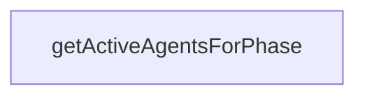

# Chapter 6: Plugin SDK and Extensibility Patterns

Welcome to **Chapter 6: Plugin SDK and Extensibility Patterns**. In this part of **Claude Flow Tutorial: Multi-Agent Orchestration, MCP Tooling, and V3 Module Architecture**, you will build an intuitive mental model first, then move into concrete implementation details and practical production tradeoffs.


This chapter covers plugin-based extension patterns for tools, hooks, workers, providers, and security helpers.

## Learning Goals

- create extension boundaries with plugin builders and registries
- separate tool-only, hook-only, and worker extensions cleanly
- apply security utilities when exposing new commands or paths
- standardize extension review before production rollout

## Extension Baseline

Start with narrow plugin scope, enforce input/path validation, and gate rollout with integration tests. Prefer explicit lifecycle ownership for each plugin to prevent hidden coupling.

## Source References

- [@claude-flow/plugins](https://github.com/ruvnet/claude-flow/blob/main/v3/@claude-flow/plugins/README.md)
- [@claude-flow/security](https://github.com/ruvnet/claude-flow/blob/main/v3/@claude-flow/security/README.md)
- [V3 README](https://github.com/ruvnet/claude-flow/blob/main/v3/README.md)

## Summary

You can now extend Claude Flow with better modularity and lower operational risk.

Next: [Chapter 7: Testing, Migration, and Upgrade Strategy](07-testing-migration-and-upgrade-strategy.md)

## Depth Expansion Playbook

## Source Code Walkthrough

### `v3/swarm.config.ts`

The `getActiveAgentsForPhase` function in [`v3/swarm.config.ts`](https://github.com/ruvnet/claude-flow/blob/HEAD/v3/swarm.config.ts) handles a key part of this chapter's functionality:

```ts
}

export function getActiveAgentsForPhase(phaseId: PhaseId): string[] {
  const phase = getPhaseConfig(phaseId);
  if (!phase) return [];

  const agents: string[] = [];
  for (const domain of phase.activeDomains) {
    agents.push(...getAgentsByDomain(domain));
  }

  return [...new Set(agents)];
}

export function createCustomConfig(overrides: Partial<V3SwarmConfig>): V3SwarmConfig {
  return {
    ...defaultSwarmConfig,
    ...overrides,
    performance: {
      ...defaultSwarmConfig.performance,
      ...overrides.performance
    },
    github: {
      ...defaultSwarmConfig.github,
      ...overrides.github
    },
    logging: {
      ...defaultSwarmConfig.logging,
      ...overrides.logging
    }
  };
}
```

This function is important because it defines how Claude Flow Tutorial: Multi-Agent Orchestration, MCP Tooling, and V3 Module Architecture implements the patterns covered in this chapter.


## How These Components Connect


