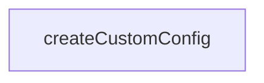

# Chapter 7: Testing, Migration, and Upgrade Strategy

Welcome to **Chapter 7: Testing, Migration, and Upgrade Strategy**. In this part of **Claude Flow Tutorial: Multi-Agent Orchestration, MCP Tooling, and V3 Module Architecture**, you will build an intuitive mental model first, then move into concrete implementation details and practical production tradeoffs.


This chapter focuses on validation discipline across module changes and V2-to-V3 migration planning.

## Learning Goals

- use shared fixtures and mock services for reliable module tests
- evaluate migration gap reports before committing to V3-only assumptions
- stage upgrades with clear fallback paths
- avoid regressions from mixed-version expectations

## Upgrade Rule

Treat migration docs as risk registers, not just checklists. Validate critical workflows in staging with your own workload profile before broad rollout.

## Source References

- [@claude-flow/testing](https://github.com/ruvnet/claude-flow/blob/main/v3/@claude-flow/testing/README.md)
- [V3 Migration Docs](https://github.com/ruvnet/claude-flow/blob/main/v3/implementation/v3-migration/README.md)
- [CHANGELOG](https://github.com/ruvnet/claude-flow/blob/main/CHANGELOG.md)

## Summary

You now have a testing and migration strategy that reduces upgrade surprises.

Next: [Chapter 8: Production Governance, Security, and Performance](08-production-governance-security-and-performance.md)

## Depth Expansion Playbook

## Source Code Walkthrough

### `v3/swarm.config.ts`

The `createCustomConfig` function in [`v3/swarm.config.ts`](https://github.com/ruvnet/claude-flow/blob/HEAD/v3/swarm.config.ts) handles a key part of this chapter's functionality:

```ts
}

export function createCustomConfig(overrides: Partial<V3SwarmConfig>): V3SwarmConfig {
  return {
    ...defaultSwarmConfig,
    ...overrides,
    performance: {
      ...defaultSwarmConfig.performance,
      ...overrides.performance
    },
    github: {
      ...defaultSwarmConfig.github,
      ...overrides.github
    },
    logging: {
      ...defaultSwarmConfig.logging,
      ...overrides.logging
    }
  };
}

// =============================================================================
// Topology Configuration
// =============================================================================

export const topologyConfigs: Record<TopologyType, TopologyConfig> = {
  'hierarchical-mesh': {
    name: 'Hierarchical Mesh',
    description: 'Queen-led hierarchy with mesh communication between domains',
    centralNode: 'agent-1',
    layers: [
      ['agent-1'],
```

This function is important because it defines how Claude Flow Tutorial: Multi-Agent Orchestration, MCP Tooling, and V3 Module Architecture implements the patterns covered in this chapter.


## How These Components Connect


