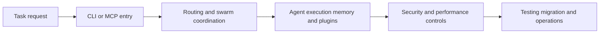

# Claude Flow Tutorial: Multi-Agent Orchestration, MCP Tooling, and V3 Module Architecture

> Learn how to use `ruvnet/claude-flow` to orchestrate multi-agent workflows, operate MCP/CLI surfaces, and reason about V2-to-V3 architecture and migration tradeoffs.

## Why This Track Matters

Claude Flow is a prominent open-source orchestration stack in the coding-agent ecosystem, with broad MCP and multi-agent framing plus active V3 modularization efforts.

This track focuses on:

- understanding core orchestration surfaces across CLI, MCP, and swarm patterns
- mapping V3 module architecture and ADR-driven decisions
- operating memory, security, and performance subsystems with pragmatic expectations
- evaluating migration gaps between V2 and V3 before production rollout

## Current Snapshot (auto-updated)

- repository: [`ruvnet/claude-flow`](https://github.com/ruvnet/claude-flow)
- stars: about **14.0k**
- latest release: [`v2.7.1-agentic-flow-1.7.4`](https://github.com/ruvnet/claude-flow/releases/tag/v2.7.1-agentic-flow-1.7.4)
- license: MIT
- recent activity: repository is actively maintained; verify latest commits for current status
- project positioning: orchestration layer for Claude-centered multi-agent workflows with V3 modular package split

## Mental Model

## Chapter Guide

| Chapter | Key Question | Outcome |
|:--------|:-------------|:--------|
| [01 - Getting Started](01-getting-started.md) | How do I get Claude Flow running quickly and safely? | First-run baseline |
| [02 - V3 Architecture and ADRs](02-v3-architecture-and-adrs.md) | What changed in V3 and why? | Clear architecture model |
| [03 - Swarm Coordination and Consensus Patterns](03-swarm-coordination-and-consensus-patterns.md) | How do agent teams coordinate work reliably? | Better orchestration decisions |
| [04 - Memory, Learning, and Intelligence Systems](04-memory-learning-and-intelligence-systems.md) | How do memory and learning layers shape behavior? | Stronger memory strategy |
| [05 - MCP Server, CLI, and Runtime Operations](05-mcp-server-cli-and-runtime-operations.md) | How should MCP and CLI surfaces be operated? | More predictable tooling usage |
| [06 - Plugin SDK and Extensibility Patterns](06-plugin-sdk-and-extensibility-patterns.md) | How do I add capabilities without breaking core flows? | Safer extension workflow |
| [07 - Testing, Migration, and Upgrade Strategy](07-testing-migration-and-upgrade-strategy.md) | How do I validate changes across V2/V3 realities? | Lower regression risk |
| [08 - Production Governance, Security, and Performance](08-production-governance-security-and-performance.md) | How do teams operationalize Claude Flow with guardrails? | Long-term operations playbook |

## What You Will Learn

- how to reason about Claude Flow as an orchestration ledger versus execution engine
- how V3 modules map to swarm, MCP, memory, security, and performance concerns
- how to apply extension, testing, and migration practices pragmatically
- how to set production controls around security and runtime performance

## Source References

- [Claude Flow Repository](https://github.com/ruvnet/claude-flow)
- [README](https://github.com/ruvnet/claude-flow/blob/main/README.md)
- [V3 README](https://github.com/ruvnet/claude-flow/blob/main/v3/README.md)
- [V2 README](https://github.com/ruvnet/claude-flow/blob/main/v2/README.md)
- [AGENTS Guide](https://github.com/ruvnet/claude-flow/blob/main/AGENTS.md)
- [V3 ADR Index](https://github.com/ruvnet/claude-flow/blob/main/v3/docs/adr/README.md)
- [@claude-flow/swarm](https://github.com/ruvnet/claude-flow/blob/main/v3/@claude-flow/swarm/README.md)
- [@claude-flow/mcp](https://github.com/ruvnet/claude-flow/blob/main/v3/@claude-flow/mcp/README.md)
- [@claude-flow/memory](https://github.com/ruvnet/claude-flow/blob/main/v3/@claude-flow/memory/README.md)
- [@claude-flow/security](https://github.com/ruvnet/claude-flow/blob/main/v3/@claude-flow/security/README.md)
- [@claude-flow/plugins](https://github.com/ruvnet/claude-flow/blob/main/v3/@claude-flow/plugins/README.md)
- [@claude-flow/testing](https://github.com/ruvnet/claude-flow/blob/main/v3/@claude-flow/testing/README.md)
- [V3 Migration Docs](https://github.com/ruvnet/claude-flow/blob/main/v3/implementation/v3-migration/README.md)

## Related Tutorials

- [Claude Code Tutorial](../claude-code-tutorial/)
- [OpenCode Tutorial](../opencode-tutorial/)
- [Daytona Tutorial](../daytona-tutorial/)
- [MCP Python SDK Tutorial](../mcp-python-sdk-tutorial/)

---

Start with [Chapter 1: Getting Started](01-getting-started.md).

## Navigation & Backlinks

- [Start Here: Chapter 1: Getting Started](01-getting-started.md)
- [Back to Main Catalog](../../README.md#-tutorial-catalog)
- [Browse A-Z Tutorial Directory](../../discoverability/tutorial-directory.md)
- [Search by Intent](../../discoverability/query-hub.md)
- [Explore Category Hubs](../../README.md#category-hubs)

## Full Chapter Map

1. [Chapter 1: Getting Started](01-getting-started.md)
2. [Chapter 2: V3 Architecture and ADRs](02-v3-architecture-and-adrs.md)
3. [Chapter 3: Swarm Coordination and Consensus Patterns](03-swarm-coordination-and-consensus-patterns.md)
4. [Chapter 4: Memory, Learning, and Intelligence Systems](04-memory-learning-and-intelligence-systems.md)
5. [Chapter 5: MCP Server, CLI, and Runtime Operations](05-mcp-server-cli-and-runtime-operations.md)
6. [Chapter 6: Plugin SDK and Extensibility Patterns](06-plugin-sdk-and-extensibility-patterns.md)
7. [Chapter 7: Testing, Migration, and Upgrade Strategy](07-testing-migration-and-upgrade-strategy.md)
8. [Chapter 8: Production Governance, Security, and Performance](08-production-governance-security-and-performance.md)

*Generated by [AI Codebase Knowledge Builder](https://github.com/The-Pocket/Tutorial-Codebase-Knowledge)*
