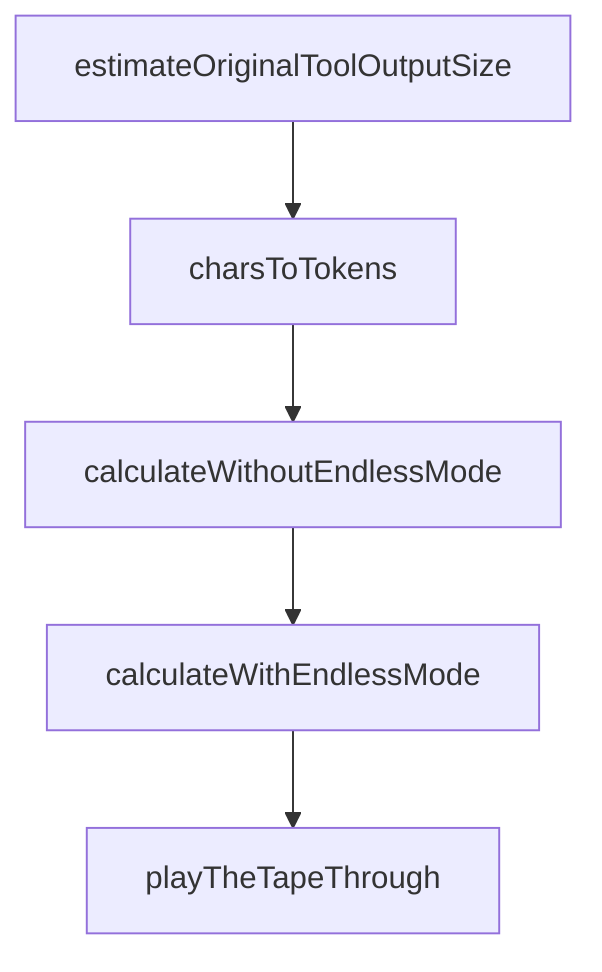

# Chapter 1: Getting Started

Welcome to **Chapter 1: Getting Started**. In this part of **Claude-Mem Tutorial: Persistent Memory Compression for Claude Code**, you will build an intuitive mental model first, then move into concrete implementation details and practical production tradeoffs.


This chapter gets Claude-Mem installed and verifies automatic memory behavior in new sessions.

## Learning Goals

- install Claude-Mem from plugin marketplace
- restart Claude Code and confirm memory hooks are active
- validate baseline context persistence across sessions
- locate primary operating surfaces (viewer, settings, docs)

## Quick Install

Inside Claude Code, run:

```text
/plugin marketplace add thedotmack/claude-mem
/plugin install claude-mem
```

Then restart Claude Code and begin a new session.

## First Validation Loop

- perform a short task with tool usage
- start a new session
- confirm previous context appears via memory priming
- open web viewer (`http://localhost:37777`) to inspect stored activity

## Baseline Checks

- plugin appears in installed plugin list
- worker service responds and logs activity
- context survives session boundary

## Source References

- [README Quick Start](https://github.com/thedotmack/claude-mem/blob/main/README.md#quick-start)
- [Installation Guide](https://docs.claude-mem.ai/installation)
- [Usage Getting Started](https://docs.claude-mem.ai/usage/getting-started)

## Summary

You now have a working Claude-Mem baseline with persistent session memory.

Next: [Chapter 2: Architecture, Hooks, and Worker Flow](02-architecture-hooks-and-worker-flow.md)

## Depth Expansion Playbook

## Source Code Walkthrough

### `scripts/endless-mode-token-calculator.js`

The `estimateOriginalToolOutputSize` function in [`scripts/endless-mode-token-calculator.js`](https://github.com/thedotmack/claude-mem/blob/HEAD/scripts/endless-mode-token-calculator.js) handles a key part of this chapter's functionality:

```js
// Heuristic: discovery_tokens roughly correlates with original content size
// Assumption: If it took 10k tokens to analyze, original was probably 15-30k tokens
function estimateOriginalToolOutputSize(discoveryTokens) {
  // Conservative multiplier: 2x (original content was 2x the discovery cost)
  // This accounts for: reading the tool output + analyzing it + generating observation
  return discoveryTokens * 2;
}

// Convert compressed_size (character count) to approximate token count
// Rough heuristic: 1 token ≈ 4 characters for English text
function charsToTokens(chars) {
  return Math.ceil(chars / 4);
}

/**
 * Simulate session WITHOUT Endless Mode (current behavior)
 * Each continuation carries ALL previous full tool outputs in context
 */
function calculateWithoutEndlessMode(observations) {
  let cumulativeContextTokens = 0;
  let totalDiscoveryTokens = 0;
  let totalContinuationTokens = 0;
  const timeline = [];

  observations.forEach((obs, index) => {
    const toolNumber = index + 1;
    const originalToolSize = estimateOriginalToolOutputSize(obs.discovery_tokens);

    // Discovery cost (creating observation from full tool output)
    const discoveryCost = obs.discovery_tokens;
    totalDiscoveryTokens += discoveryCost;

```

This function is important because it defines how Claude-Mem Tutorial: Persistent Memory Compression for Claude Code implements the patterns covered in this chapter.

### `scripts/endless-mode-token-calculator.js`

The `charsToTokens` function in [`scripts/endless-mode-token-calculator.js`](https://github.com/thedotmack/claude-mem/blob/HEAD/scripts/endless-mode-token-calculator.js) handles a key part of this chapter's functionality:

```js
// Convert compressed_size (character count) to approximate token count
// Rough heuristic: 1 token ≈ 4 characters for English text
function charsToTokens(chars) {
  return Math.ceil(chars / 4);
}

/**
 * Simulate session WITHOUT Endless Mode (current behavior)
 * Each continuation carries ALL previous full tool outputs in context
 */
function calculateWithoutEndlessMode(observations) {
  let cumulativeContextTokens = 0;
  let totalDiscoveryTokens = 0;
  let totalContinuationTokens = 0;
  const timeline = [];

  observations.forEach((obs, index) => {
    const toolNumber = index + 1;
    const originalToolSize = estimateOriginalToolOutputSize(obs.discovery_tokens);

    // Discovery cost (creating observation from full tool output)
    const discoveryCost = obs.discovery_tokens;
    totalDiscoveryTokens += discoveryCost;

    // Continuation cost: Re-process ALL previous tool outputs + current one
    // This is the key recursive cost
    cumulativeContextTokens += originalToolSize;
    const continuationCost = cumulativeContextTokens;
    totalContinuationTokens += continuationCost;

    timeline.push({
      tool: toolNumber,
```

This function is important because it defines how Claude-Mem Tutorial: Persistent Memory Compression for Claude Code implements the patterns covered in this chapter.

### `scripts/endless-mode-token-calculator.js`

The `calculateWithoutEndlessMode` function in [`scripts/endless-mode-token-calculator.js`](https://github.com/thedotmack/claude-mem/blob/HEAD/scripts/endless-mode-token-calculator.js) handles a key part of this chapter's functionality:

```js
 * Each continuation carries ALL previous full tool outputs in context
 */
function calculateWithoutEndlessMode(observations) {
  let cumulativeContextTokens = 0;
  let totalDiscoveryTokens = 0;
  let totalContinuationTokens = 0;
  const timeline = [];

  observations.forEach((obs, index) => {
    const toolNumber = index + 1;
    const originalToolSize = estimateOriginalToolOutputSize(obs.discovery_tokens);

    // Discovery cost (creating observation from full tool output)
    const discoveryCost = obs.discovery_tokens;
    totalDiscoveryTokens += discoveryCost;

    // Continuation cost: Re-process ALL previous tool outputs + current one
    // This is the key recursive cost
    cumulativeContextTokens += originalToolSize;
    const continuationCost = cumulativeContextTokens;
    totalContinuationTokens += continuationCost;

    timeline.push({
      tool: toolNumber,
      obsId: obs.id,
      title: obs.title.substring(0, 60),
      originalSize: originalToolSize,
      discoveryCost,
      contextSize: cumulativeContextTokens,
      continuationCost,
      totalCostSoFar: totalDiscoveryTokens + totalContinuationTokens
    });
```

This function is important because it defines how Claude-Mem Tutorial: Persistent Memory Compression for Claude Code implements the patterns covered in this chapter.

### `scripts/endless-mode-token-calculator.js`

The `calculateWithEndlessMode` function in [`scripts/endless-mode-token-calculator.js`](https://github.com/thedotmack/claude-mem/blob/HEAD/scripts/endless-mode-token-calculator.js) handles a key part of this chapter's functionality:

```js
 * Each continuation carries ALL previous COMPRESSED observations in context
 */
function calculateWithEndlessMode(observations) {
  let cumulativeContextTokens = 0;
  let totalDiscoveryTokens = 0;
  let totalContinuationTokens = 0;
  const timeline = [];

  observations.forEach((obs, index) => {
    const toolNumber = index + 1;
    const originalToolSize = estimateOriginalToolOutputSize(obs.discovery_tokens);
    const compressedSize = charsToTokens(obs.compressed_size);

    // Discovery cost (same as without Endless Mode - still need to create observation)
    const discoveryCost = obs.discovery_tokens;
    totalDiscoveryTokens += discoveryCost;

    // KEY DIFFERENCE: Add COMPRESSED size to context, not original size
    cumulativeContextTokens += compressedSize;
    const continuationCost = cumulativeContextTokens;
    totalContinuationTokens += continuationCost;

    const compressionRatio = ((originalToolSize - compressedSize) / originalToolSize * 100).toFixed(1);

    timeline.push({
      tool: toolNumber,
      obsId: obs.id,
      title: obs.title.substring(0, 60),
      originalSize: originalToolSize,
      compressedSize,
      compressionRatio: `${compressionRatio}%`,
      discoveryCost,
```

This function is important because it defines how Claude-Mem Tutorial: Persistent Memory Compression for Claude Code implements the patterns covered in this chapter.


## How These Components Connect


