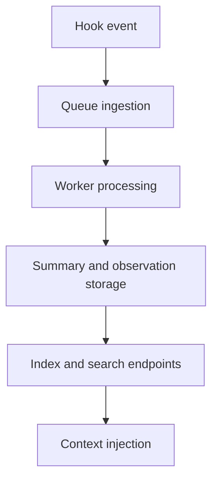

# Chapter 2: Architecture, Hooks, and Worker Flow

This chapter explains how Claude-Mem captures session events and turns them into searchable context.

## Learning Goals

- map lifecycle hooks to memory-capture pipeline stages
- understand worker service responsibilities and queue behavior
- identify storage layers for summaries and observations
- reason about where failures can occur in the pipeline

## Core Components

- lifecycle hooks on Claude Code session events
- worker service for asynchronous processing and API surfaces
- SQLite storage for sessions, observations, and summaries
- vector/semantic layer for richer retrieval modes

## Data Flow

## Architecture Notes

- hook reliability drives memory completeness
- worker resilience drives delayed-processing recovery
- structured storage enables efficient layered search workflows

## Source References

- [README How It Works](https://github.com/thedotmack/claude-mem/blob/main/README.md#how-it-works)
- [Architecture Overview](https://docs.claude-mem.ai/architecture/overview)
- [Worker Service Architecture](https://docs.claude-mem.ai/architecture/worker-service)
- [Database Architecture](https://docs.claude-mem.ai/architecture/database)

## Summary

You now understand how events flow through Claude-Mem from capture to reuse.

Next: [Chapter 3: Installation, Upgrade, and Runtime Environment](03-installation-upgrade-and-runtime-environment.md)
