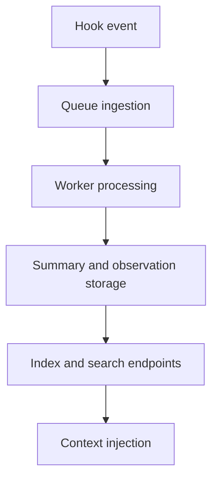
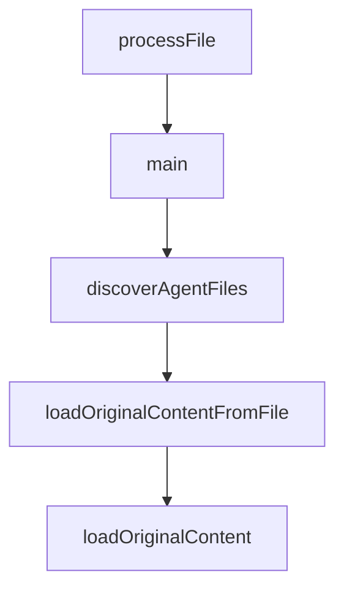

# Chapter 2: Architecture, Hooks, and Worker Flow

Welcome to **Chapter 2: Architecture, Hooks, and Worker Flow**. In this part of **Claude-Mem Tutorial: Persistent Memory Compression for Claude Code**, you will build an intuitive mental model first, then move into concrete implementation details and practical production tradeoffs.


This chapter explains how Claude-Mem captures session events and turns them into searchable context.

## Learning Goals

- map lifecycle hooks to memory-capture pipeline stages
- understand worker service responsibilities and queue behavior
- identify storage layers for summaries and observations
- reason about where failures can occur in the pipeline

## Core Components

- lifecycle hooks on Claude Code session events
- worker service for asynchronous processing and API surfaces
- SQLite storage for sessions, observations, and summaries
- vector/semantic layer for richer retrieval modes

## Data Flow


```mermaid
flowchart TD
    A[Hook event] --> B[Queue ingestion]
    B --> C[Worker processing]
    C --> D[Summary and observation storage]
    D --> E[Index and search endpoints]
    E --> F[Context injection]
```

## Architecture Notes

- hook reliability drives memory completeness
- worker resilience drives delayed-processing recovery
- structured storage enables efficient layered search workflows

## Source References

- [README How It Works](https://github.com/thedotmack/claude-mem/blob/main/README.md#how-it-works)
- [Architecture Overview](https://docs.claude-mem.ai/architecture/overview)
- [Worker Service Architecture](https://docs.claude-mem.ai/architecture/worker-service)
- [Database Architecture](https://docs.claude-mem.ai/architecture/database)

## Summary

You now understand how events flow through Claude-Mem from capture to reuse.

Next: [Chapter 3: Installation, Upgrade, and Runtime Environment](03-installation-upgrade-and-runtime-environment.md)

## Source Code Walkthrough

### `ragtime/ragtime.ts`

The `processFile` function in [`ragtime/ragtime.ts`](https://github.com/thedotmack/claude-mem/blob/HEAD/ragtime/ragtime.ts) handles a key part of this chapter's functionality:

```ts
 * Context is injected by Claude-mem hooks, not conversation continuation
 */
async function processFile(file: string, index: number, total: number): Promise<void> {
  const filename = path.basename(file);
  console.log(`\n[${ index + 1}/${total}] Processing: ${filename}`);

  try {
    for await (const message of query({
      prompt: `Read ${file} and analyze it in the context of the investigation. Look for entities, relationships, timeline events, and any anomalies. Cross-reference with what you know from the injected context above.`,
      options: {
        cwd: CONFIG.corpusPath,
        plugins: [{ type: "local", path: CONFIG.pluginPath }],
      },
    })) {
      // Log assistant responses
      if (message.type === "assistant") {
        const content = message.message.content;
        if (Array.isArray(content)) {
          for (const block of content) {
            if (block.type === "text" && block.text) {
              // Truncate long responses for console
              const text = block.text.length > 500
                ? block.text.substring(0, 500) + "..."
                : block.text;
              console.log("Assistant:", text);
            }
          }
        } else if (typeof content === "string") {
          console.log("Assistant:", content);
        }
      }

```

This function is important because it defines how Claude-Mem Tutorial: Persistent Memory Compression for Claude Code implements the patterns covered in this chapter.

### `ragtime/ragtime.ts`

The `main` function in [`ragtime/ragtime.ts`](https://github.com/thedotmack/claude-mem/blob/HEAD/ragtime/ragtime.ts) handles a key part of this chapter's functionality:

```ts

      // Remove empty project directories
      const remaining = fs.readdirSync(projectPath);
      if (remaining.length === 0) {
        try {
          fs.rmdirSync(projectPath);
        } catch {
          // Ignore - may have race condition
        }
      }
    }

    if (cleaned > 0) {
      console.log(`Cleaned up ${cleaned} old transcript(s)`);
    }
  } catch (err) {
    console.warn("Transcript cleanup error:", err);
  }
}

/**
 * Poll the worker's processing status endpoint until the queue is empty
 */
async function waitForQueueToEmpty(): Promise<void> {
  const maxWaitTimeMs = 5 * 60 * 1000; // 5 minutes maximum
  const pollIntervalMs = 500;
  const startTime = Date.now();

  while (true) {
    try {
      const response = await fetch(
        `http://localhost:${CONFIG.workerPort}/api/processing-status`
```

This function is important because it defines how Claude-Mem Tutorial: Persistent Memory Compression for Claude Code implements the patterns covered in this chapter.

### `scripts/analyze-transformations-smart.js`

The `discoverAgentFiles` function in [`scripts/analyze-transformations-smart.js`](https://github.com/thedotmack/claude-mem/blob/HEAD/scripts/analyze-transformations-smart.js) handles a key part of this chapter's functionality:

```js

// Auto-discover agent transcripts linked to main session
async function discoverAgentFiles(mainTranscriptPath) {
  console.log('Discovering linked agent transcripts...');

  const agentIds = new Set();
  const fileStream = fs.createReadStream(mainTranscriptPath);
  const rl = readline.createInterface({
    input: fileStream,
    crlfDelay: Infinity
  });

  for await (const line of rl) {
    if (!line.includes('agentId')) continue;

    try {
      const obj = JSON.parse(line);

      // Check for agentId in toolUseResult
      if (obj.toolUseResult?.agentId) {
        agentIds.add(obj.toolUseResult.agentId);
      }
    } catch (e) {
      // Skip malformed lines
    }
  }

  // Build agent file paths
  const directory = path.dirname(mainTranscriptPath);
  const agentFiles = Array.from(agentIds).map(id =>
    path.join(directory, `agent-${id}.jsonl`)
  ).filter(filePath => fs.existsSync(filePath));
```

This function is important because it defines how Claude-Mem Tutorial: Persistent Memory Compression for Claude Code implements the patterns covered in this chapter.

### `scripts/analyze-transformations-smart.js`

The `loadOriginalContentFromFile` function in [`scripts/analyze-transformations-smart.js`](https://github.com/thedotmack/claude-mem/blob/HEAD/scripts/analyze-transformations-smart.js) handles a key part of this chapter's functionality:

```js
// Parse transcript to get BOTH tool_use (inputs) and tool_result (outputs) content
// Returns true if transcript is clean, false if contaminated (already transformed)
async function loadOriginalContentFromFile(filePath, fileLabel) {
  const fileStream = fs.createReadStream(filePath);
  const rl = readline.createInterface({
    input: fileStream,
    crlfDelay: Infinity
  });

  let count = 0;
  let isContaminated = false;
  const toolUseIdsFromThisFile = new Set();

  for await (const line of rl) {
    if (!line.includes('toolu_')) continue;

    try {
      const obj = JSON.parse(line);

      if (obj.message?.content) {
        for (const item of obj.message.content) {
          // Capture tool_use (inputs)
          if (item.type === 'tool_use' && item.id) {
            const existing = originalContent.get(item.id) || { input: '', output: '', name: '' };
            existing.input = JSON.stringify(item.input || {});
            existing.name = item.name;
            originalContent.set(item.id, existing);
            toolUseIdsFromThisFile.add(item.id);
            count++;
          }

          // Capture tool_result (outputs)
```

This function is important because it defines how Claude-Mem Tutorial: Persistent Memory Compression for Claude Code implements the patterns covered in this chapter.


## How These Components Connect


```mermaid
flowchart TD
    A[processFile]
    B[main]
    C[discoverAgentFiles]
    D[loadOriginalContentFromFile]
    E[loadOriginalContent]
    A --> B
    B --> C
    C --> D
    D --> E
```
