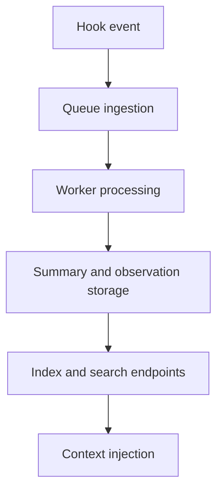
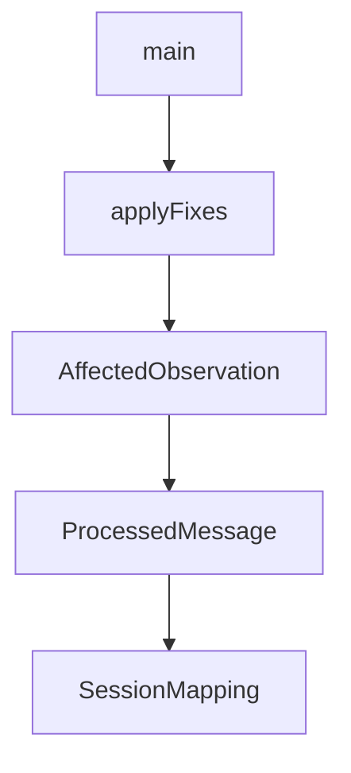

# Chapter 2: Architecture, Hooks, and Worker Flow

Welcome to **Chapter 2: Architecture, Hooks, and Worker Flow**. In this part of **Claude-Mem Tutorial: Persistent Memory Compression for Claude Code**, you will build an intuitive mental model first, then move into concrete implementation details and practical production tradeoffs.


This chapter explains how Claude-Mem captures session events and turns them into searchable context.

## Learning Goals

- map lifecycle hooks to memory-capture pipeline stages
- understand worker service responsibilities and queue behavior
- identify storage layers for summaries and observations
- reason about where failures can occur in the pipeline

## Core Components

- lifecycle hooks on Claude Code session events
- worker service for asynchronous processing and API surfaces
- SQLite storage for sessions, observations, and summaries
- vector/semantic layer for richer retrieval modes

## Data Flow


```mermaid
flowchart TD
    A[Hook event] --> B[Queue ingestion]
    B --> C[Worker processing]
    C --> D[Summary and observation storage]
    D --> E[Index and search endpoints]
    E --> F[Context injection]
```

## Architecture Notes

- hook reliability drives memory completeness
- worker resilience drives delayed-processing recovery
- structured storage enables efficient layered search workflows

## Source References

- [README How It Works](https://github.com/thedotmack/claude-mem/blob/main/README.md#how-it-works)
- [Architecture Overview](https://docs.claude-mem.ai/architecture/overview)
- [Worker Service Architecture](https://docs.claude-mem.ai/architecture/worker-service)
- [Database Architecture](https://docs.claude-mem.ai/architecture/database)

## Summary

You now understand how events flow through Claude-Mem from capture to reuse.

Next: [Chapter 3: Installation, Upgrade, and Runtime Environment](03-installation-upgrade-and-runtime-environment.md)

## Depth Expansion Playbook

## Source Code Walkthrough

### `scripts/fix-corrupted-timestamps.ts`

The `main` function in [`scripts/fix-corrupted-timestamps.ts`](https://github.com/thedotmack/claude-mem/blob/HEAD/scripts/fix-corrupted-timestamps.ts) handles a key part of this chapter's functionality:

```ts
}

function main() {
  const args = process.argv.slice(2);
  const dryRun = args.includes('--dry-run');
  const autoYes = args.includes('--yes') || args.includes('-y');

  console.log('🔍 Analyzing corrupted observation timestamps...\n');
  if (dryRun) {
    console.log('🏃 DRY RUN MODE - No changes will be made\n');
  }

  const db = new Database(DB_PATH);

  try {
    // Step 1: Find affected observations
    console.log('Step 1: Finding observations created during bad window...');
    const affectedObs = db.query<AffectedObservation, []>(`
      SELECT id, memory_session_id, created_at_epoch, title
      FROM observations
      WHERE created_at_epoch >= ${BAD_WINDOW_START}
        AND created_at_epoch <= ${BAD_WINDOW_END}
      ORDER BY id
    `).all();

    console.log(`Found ${affectedObs.length} observations in bad window\n`);

    if (affectedObs.length === 0) {
      console.log('✅ No affected observations found!');
      return;
    }

```

This function is important because it defines how Claude-Mem Tutorial: Persistent Memory Compression for Claude Code implements the patterns covered in this chapter.

### `scripts/fix-corrupted-timestamps.ts`

The `applyFixes` function in [`scripts/fix-corrupted-timestamps.ts`](https://github.com/thedotmack/claude-mem/blob/HEAD/scripts/fix-corrupted-timestamps.ts) handles a key part of this chapter's functionality:

```ts
    if (autoYes) {
      console.log('Auto-confirming with --yes flag...\n');
      applyFixes(db, fixes);
      return;
    }

    console.log('Apply these fixes? (y/n): ');

    const stdin = Bun.stdin.stream();
    const reader = stdin.getReader();

    reader.read().then(({ value }) => {
      const response = new TextDecoder().decode(value).trim().toLowerCase();

      if (response === 'y' || response === 'yes') {
        applyFixes(db, fixes);
      } else {
        console.log('\n❌ Fixes cancelled. No changes made.');
        db.close();
      }
    });

  } catch (error) {
    console.error('❌ Error:', error);
    db.close();
    process.exit(1);
  }
}

function applyFixes(db: Database, fixes: TimestampFix[]) {
  console.log('\n🔧 Applying fixes...\n');

```

This function is important because it defines how Claude-Mem Tutorial: Persistent Memory Compression for Claude Code implements the patterns covered in this chapter.

### `scripts/fix-corrupted-timestamps.ts`

The `AffectedObservation` interface in [`scripts/fix-corrupted-timestamps.ts`](https://github.com/thedotmack/claude-mem/blob/HEAD/scripts/fix-corrupted-timestamps.ts) handles a key part of this chapter's functionality:

```ts
const BAD_WINDOW_END = 1766626260000;   // Dec 24 20:31 PST

interface AffectedObservation {
  id: number;
  memory_session_id: string;
  created_at_epoch: number;
  title: string;
}

interface ProcessedMessage {
  id: number;
  session_db_id: number;
  tool_name: string;
  created_at_epoch: number;
  completed_at_epoch: number;
}

interface SessionMapping {
  session_db_id: number;
  memory_session_id: string;
}

interface TimestampFix {
  observation_id: number;
  observation_title: string;
  wrong_timestamp: number;
  correct_timestamp: number;
  session_db_id: number;
  pending_message_id: number;
}

function formatTimestamp(epoch: number): string {
```

This interface is important because it defines how Claude-Mem Tutorial: Persistent Memory Compression for Claude Code implements the patterns covered in this chapter.

### `scripts/fix-corrupted-timestamps.ts`

The `ProcessedMessage` interface in [`scripts/fix-corrupted-timestamps.ts`](https://github.com/thedotmack/claude-mem/blob/HEAD/scripts/fix-corrupted-timestamps.ts) handles a key part of this chapter's functionality:

```ts
}

interface ProcessedMessage {
  id: number;
  session_db_id: number;
  tool_name: string;
  created_at_epoch: number;
  completed_at_epoch: number;
}

interface SessionMapping {
  session_db_id: number;
  memory_session_id: string;
}

interface TimestampFix {
  observation_id: number;
  observation_title: string;
  wrong_timestamp: number;
  correct_timestamp: number;
  session_db_id: number;
  pending_message_id: number;
}

function formatTimestamp(epoch: number): string {
  return new Date(epoch).toLocaleString('en-US', {
    timeZone: 'America/Los_Angeles',
    year: 'numeric',
    month: 'short',
    day: 'numeric',
    hour: '2-digit',
    minute: '2-digit',
```

This interface is important because it defines how Claude-Mem Tutorial: Persistent Memory Compression for Claude Code implements the patterns covered in this chapter.


## How These Components Connect


```mermaid
flowchart TD
    A[main]
    B[applyFixes]
    C[AffectedObservation]
    D[ProcessedMessage]
    E[SessionMapping]
    A --> B
    B --> C
    C --> D
    D --> E
```
