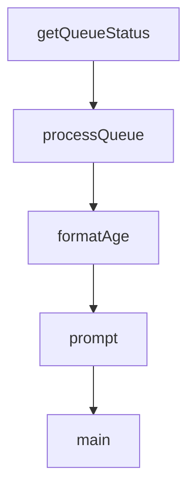

# Chapter 3: Installation, Upgrade, and Runtime Environment

Welcome to **Chapter 3: Installation, Upgrade, and Runtime Environment**. In this part of **Claude-Mem Tutorial: Persistent Memory Compression for Claude Code**, you will build an intuitive mental model first, then move into concrete implementation details and practical production tradeoffs.


This chapter focuses on keeping installation and upgrade workflows repeatable.

## Learning Goals

- run standard and advanced installation paths safely
- verify required runtime dependencies and auto-install behavior
- apply upgrade flow with minimal downtime risk
- understand platform-specific environment differences

## Runtime Dependencies

Claude-Mem relies on a mixed runtime stack, including:

- Node.js runtime baseline
- Bun for worker/service process management
- uv/Python components for vector search pathways
- SQLite for durable storage

## Upgrade Pattern

- snapshot current settings and data directory
- upgrade plugin version/channel deliberately
- verify worker health and context retrieval
- run a small session replay test before full usage

## Platform Notes

- watch Windows PATH/runtime setup carefully
- monitor local port conflicts for viewer/worker services
- keep terminal and shell environment consistent across sessions

## Source References

- [Installation Guide](https://docs.claude-mem.ai/installation)
- [Development Guide](https://docs.claude-mem.ai/development)
- [README System Requirements](https://github.com/thedotmack/claude-mem/blob/main/README.md#system-requirements)

## Summary

You now have a stable install/upgrade pattern for Claude-Mem environments.

Next: [Chapter 4: Configuration, Modes, and Context Injection](04-configuration-modes-and-context-injection.md)

## Depth Expansion Playbook

## Source Code Walkthrough

### `scripts/check-pending-queue.ts`

The `getQueueStatus` function in [`scripts/check-pending-queue.ts`](https://github.com/thedotmack/claude-mem/blob/HEAD/scripts/check-pending-queue.ts) handles a key part of this chapter's functionality:

```ts
}

async function getQueueStatus(): Promise<QueueResponse> {
  const res = await fetch(`${WORKER_URL}/api/pending-queue`);
  if (!res.ok) {
    throw new Error(`Failed to get queue status: ${res.status}`);
  }
  return res.json();
}

async function processQueue(limit: number): Promise<ProcessResponse> {
  const res = await fetch(`${WORKER_URL}/api/pending-queue/process`, {
    method: 'POST',
    headers: { 'Content-Type': 'application/json' },
    body: JSON.stringify({ sessionLimit: limit })
  });
  if (!res.ok) {
    throw new Error(`Failed to process queue: ${res.status}`);
  }
  return res.json();
}

function formatAge(epochMs: number): string {
  const ageMs = Date.now() - epochMs;
  const minutes = Math.floor(ageMs / 60000);
  const hours = Math.floor(minutes / 60);
  const days = Math.floor(hours / 24);

  if (days > 0) return `${days}d ${hours % 24}h ago`;
  if (hours > 0) return `${hours}h ${minutes % 60}m ago`;
  return `${minutes}m ago`;
}
```

This function is important because it defines how Claude-Mem Tutorial: Persistent Memory Compression for Claude Code implements the patterns covered in this chapter.

### `scripts/check-pending-queue.ts`

The `processQueue` function in [`scripts/check-pending-queue.ts`](https://github.com/thedotmack/claude-mem/blob/HEAD/scripts/check-pending-queue.ts) handles a key part of this chapter's functionality:

```ts
}

async function processQueue(limit: number): Promise<ProcessResponse> {
  const res = await fetch(`${WORKER_URL}/api/pending-queue/process`, {
    method: 'POST',
    headers: { 'Content-Type': 'application/json' },
    body: JSON.stringify({ sessionLimit: limit })
  });
  if (!res.ok) {
    throw new Error(`Failed to process queue: ${res.status}`);
  }
  return res.json();
}

function formatAge(epochMs: number): string {
  const ageMs = Date.now() - epochMs;
  const minutes = Math.floor(ageMs / 60000);
  const hours = Math.floor(minutes / 60);
  const days = Math.floor(hours / 24);

  if (days > 0) return `${days}d ${hours % 24}h ago`;
  if (hours > 0) return `${hours}h ${minutes % 60}m ago`;
  return `${minutes}m ago`;
}

async function prompt(question: string): Promise<string> {
  // Check if we have a TTY for interactive input
  if (!process.stdin.isTTY) {
    console.log(question + '(no TTY, use --process flag for non-interactive mode)');
    return 'n';
  }

```

This function is important because it defines how Claude-Mem Tutorial: Persistent Memory Compression for Claude Code implements the patterns covered in this chapter.

### `scripts/check-pending-queue.ts`

The `formatAge` function in [`scripts/check-pending-queue.ts`](https://github.com/thedotmack/claude-mem/blob/HEAD/scripts/check-pending-queue.ts) handles a key part of this chapter's functionality:

```ts
}

function formatAge(epochMs: number): string {
  const ageMs = Date.now() - epochMs;
  const minutes = Math.floor(ageMs / 60000);
  const hours = Math.floor(minutes / 60);
  const days = Math.floor(hours / 24);

  if (days > 0) return `${days}d ${hours % 24}h ago`;
  if (hours > 0) return `${hours}h ${minutes % 60}m ago`;
  return `${minutes}m ago`;
}

async function prompt(question: string): Promise<string> {
  // Check if we have a TTY for interactive input
  if (!process.stdin.isTTY) {
    console.log(question + '(no TTY, use --process flag for non-interactive mode)');
    return 'n';
  }

  return new Promise((resolve) => {
    process.stdout.write(question);
    process.stdin.setRawMode(false);
    process.stdin.resume();
    process.stdin.once('data', (data) => {
      process.stdin.pause();
      resolve(data.toString().trim());
    });
  });
}

async function main() {
```

This function is important because it defines how Claude-Mem Tutorial: Persistent Memory Compression for Claude Code implements the patterns covered in this chapter.

### `scripts/check-pending-queue.ts`

The `prompt` function in [`scripts/check-pending-queue.ts`](https://github.com/thedotmack/claude-mem/blob/HEAD/scripts/check-pending-queue.ts) handles a key part of this chapter's functionality:

```ts
 *
 * Usage:
 *   bun scripts/check-pending-queue.ts           # Check status and prompt to process
 *   bun scripts/check-pending-queue.ts --process # Auto-process without prompting
 *   bun scripts/check-pending-queue.ts --limit 5 # Process up to 5 sessions
 */

const WORKER_URL = 'http://localhost:37777';

interface QueueMessage {
  id: number;
  session_db_id: number;
  message_type: string;
  tool_name: string | null;
  status: 'pending' | 'processing' | 'failed';
  retry_count: number;
  created_at_epoch: number;
  project: string | null;
}

interface QueueResponse {
  queue: {
    messages: QueueMessage[];
    totalPending: number;
    totalProcessing: number;
    totalFailed: number;
    stuckCount: number;
  };
  recentlyProcessed: QueueMessage[];
  sessionsWithPendingWork: number[];
}

```

This function is important because it defines how Claude-Mem Tutorial: Persistent Memory Compression for Claude Code implements the patterns covered in this chapter.


## How These Components Connect


